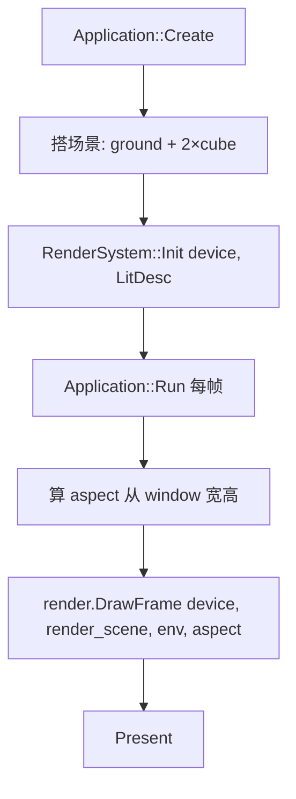

# Learn 03 — Texture + Depth（纹理与深度）

> 用 `RenderSystem::DrawFrame` 画出带 **UV 纹理地面** 与 **深度遮挡** 的多个立方体，理解 lit 管线里颜色采样与 Z 测试如何同时工作。

## 怎么跑

```powershell
cmake --build build --config Debug --target sample_03_texture_depth
build\samples\learn\03_texture_depth\Debug\sample_03_texture_depth.exe
```

Headless 冒烟（验证 `DrawFrame` 路径可退出）：

```powershell
build\samples\learn\03_texture_depth\Debug\sample_03_texture_depth.exe --headless --headless_frames=2
```

着色器由 CMake 目标 `sample_sandbox_shaders` 编译到 `ENGINE_SHADER_DIR_A`（`lit_cube` / `shadow` / `quad` / `post_ssao_taa` / `debug_line` 等 `.cso`）。

## 知识点

1. **从 RHI 直绘到 RenderSystem**：本课不再手写 `DrawLitCube`，而是搭场景后交给 `RenderSystem` 统一提交——这是 CH07 之前「先看完整 lit 帧」的过渡。
2. **mesh_id 驱动资源**：`ground` / `cube` 等字符串 ID 在引擎内映射到 procedural 几何、材质与纹理路径（见 `ResolveMeshMaterial`）。
3. **深度缓冲**：多个物体按相机 Z 前后遮挡；地面 `never_cull = true` 且带 `local_bounds`，避免大地平面被视锥剔除误删。
4. **纹理采样**：地面材质绑定 `textures/ph/brick_diff.jpg` 等 albedo/ORM；立方体默认 procedural 色，重点对比「有 UV 的大平面」与「纯色 mesh」。
5. **Quality 档位**：`QualityTier::Low` 且关闭 SSAO/TAA/阴影，把认知焦点放在「主 lit + 深度」而非后处理。
6. **aspect 与相机**：每帧用窗口宽高算 `aspect`，相机 `position` / `pitch` 在 `main` 里预设，观察透视与遮挡关系。
7. **Environment 占位**：传入默认 `Environment`；太阳/雾/IBL 在本课不展开，后续章节再填。

## 名词解释

| 术语 | 含义 |
|---|---|
| **RenderSystem** | 引擎高层渲染编排：收集 `RenderScene`、驱动 FrameGraph、调用 RHI 绘制。 |
| **RenderSystemDesc** | 初始化参数：各 Pass 着色器路径、是否开阴影、Quality 档等。 |
| **mesh_id** | 场景组件上的逻辑网格名；引擎据此解析几何槽位与材质。 |
| **Depth Buffer / DSV** | 每像素深度附件；开启深度测试后近处片元遮挡远处。 |
| **SRV + 采样器** | 像素着色器读纹理的视图与过滤/寻址模式；地面 brick 贴图走此路径。 |
| **never_cull** | 标记不参与视锥剔除；大地平面常用，防止 bounds 估计不准导致消失。 |
| **local_bounds** | 节点局部 AABB；剔除与阴影裁剪会参考（本课 ground 显式给出）。 |
| **sRGB / 线性** | 贴图往往 sRGB 存储、线性空间光照；转换通常在采样或资源创建时完成。 |

详见 [GLOSSARY.md](../../docs/learn/GLOSSARY.md) 中 FrameGraph、SRV、Environment 等条目。

## 原理

本 demo `main.cpp` 的真实数据流如下（与代码一一对应，不含未实现的开关）：



**逐步说明：**

1. **`LitDesc()`**  
   - 从 `ENGINE_SHADER_DIR_A` 拼出 `lit_cube`、`shadow`、`quad`、`post_ssao_taa`、`debug_line` 的 `.cso` 路径。  
   - `enable_shadows = false`；`QualityTier::Low`；`enable_ssao` / `enable_taa` 均为 `false`。

2. **场景搭建**  
   - 相机：`position = {0, 2.2, 5.5}`，`pitch = -0.28`。  
   - `ground`：`scale = {6,1,6}`，`mesh_id = "ground"`，`never_cull = true`，`local_bounds` 覆盖 ±6 水平范围。  
   - 两个 `cube`：`mesh_id = "cube"`，位置分别在 `(−0.7, 0.5, 0)` 与 `(0.7, 0.5, −1.2)`，形成前后错落。

3. **每帧绘制**  
   - `app_ref.render_scene()` 由 `Application` 从 `World` 收集实例（本课不在回调里手动改场景）。  
   - `render.DrawFrame(...)` 内部走 lit Pass：绑定 RTV+DSV、设置 `FrameLighting`、按实例 draw；地面采样砖墙纹理，立方体按默认 PBR 参数着色。  
   - 深度测试开启时，离相机更近的片元写入颜色并更新深度，远处被 discard。

4. **与 CH04 的分界**  
   - CH03 强调「场景 + RenderSystem + 纹理/深度观感」。  
   - CH04 退回 RHI，显式构造 `FrameLighting` 与 `LitDrawItem`，看清 **CBV 每帧更新**。

## 代码地图

| 符号 / 文件 | 说明 |
|---|---|
| `samples/learn/03_texture_depth/main.cpp` | 入口；`LitDesc`、`ParseHeadless`、场景与 `DrawFrame` |
| `ParseHeadless` | 解析 `--headless` / `--headless_frames`，供 CI 自动退出 |
| `engine::Application` | 窗口、设备、相机、`world()`、`render_scene()` |
| `engine::render::RenderSystem` | `Init` / `DrawFrame` |
| `engine::render::RenderSystemDesc` | 着色器路径与 Quality/阴影开关 |
| `engine::render::Environment` | 环境光/太阳/IBL 配置（本课默认构造） |
| `engine::scene::MeshRenderer` | 节点上的 `mesh_id`、`never_cull`、`local_bounds` |
| `ResolveMeshMaterial("ground")` | `engine/render/local_lights.cpp`；ground 的 albedo/ORM 与 `mesh_slot=4` |
| CMake `sample_03_texture_depth` | 链接 `engine_app` + `engine_d3d12`；依赖 `sample_sandbox_shaders` |

## 必做练习

1. **改 Z 遮挡**：把第二个立方体的 `position.z` 改为 `+1.2`（移到更靠近相机一侧），运行后描述谁遮挡谁、与改之前有何不同。
2. **拉远/拉近相机**：改 `a.camera().position.z` 为 `3.f` 与 `8.f`，观察地面 UV 密度与立方体相对大小（透视变化）。
3. **Headless 退出码**：运行 `--headless --headless_frames=2`，确认进程以 `0` 退出；对照日志里是否有 `DrawFrame` 错误。
4. **PIX / RenderDoc 一帧**：抓帧指出 color RT、depth buffer、ground draw 的 PSO 与纹理 SRV 绑定。
5. **（对比 CH04）**：阅读 `04_lighting_cbv/main.cpp`，用三句话说明 CH03 为何不再直接调用 `SetFrameLighting`。
6. **（口头）**：回答 PATH 中 CH03 两问——「sRGB 与线性谁转换？」「深度测试何时开？」——结合本 demo 所见画面。

## 常见坑

- **Shader 目录未生成**：目标依赖 `sample_sandbox_shaders`；若只编 sample 未编 Sandbox 着色器，`ENGINE_SHADER_DIR_A` 下缺 `.cso` 会导致 `Init` 失败。先完整 `cmake --build build --config Debug` 或显式编 shader 目标。
- **地面消失**：若去掉 `never_cull` 或 `local_bounds` 过小，大地平面可能被视锥剔除；本课 ground 的 bounds 是刻意写宽的。
- **Headless 无「看得见」的纹理**：CPU/Headless stub 可能不真正采样 GPU 纹理，但 `DrawFrame` 仍应成功；验收看退出码与日志，不以肉眼像素为准。
- **误开阴影**：`main.cpp` 里 `enable_shadows = false`；若在 `LitDesc` 擅自改为 `true` 却未配 shadow 场景/调参，会与 CH10 混淆——本课请先保持关闭。
- **与 02_triangle 混淆**：02 是 `SimpleMesh` + 全屏三角；03 是完整 lit + 场景网格 + 深度，着色器是 `lit_cube` 而非 `triangle`。
- **aspect 除零**：代码用 `dh > 0.f` 保护；窗口最小化或 0 高时 aspect 回退 `1.f`，极端情况下投影可能略怪，属防御性写法。

## 与前后章关系

| 章节 | 关系 |
|---|---|
| CH02 | SimpleMesh 三角；无场景、无深度附件 lit |
| **CH03** | 本课：RenderSystem + 纹理 ground + 深度遮挡 |
| CH04 | 退回 RHI，显式 `FrameLighting` / `DrawLitCube` |
| CH07 | 同样 DrawFrame，但强调 `render_scene()` 日志与剔除 |

## 你应能回答（PATH CH03）

1. **sRGB 与线性谁转换？** 贴图资产多为 sRGB；采样或创建 SRV 时转线性，光照在线性空间算，输出/display 再转 sRGB。本 demo ground 的 brick 贴图走引擎材质解析路径。  
2. **深度测试何时开？** Lit 主 pass 绑定 DSV 且 PSO 开启 depth test/write 时；近处片元通过比较写入 color/depth，实现 cube 与 ground 前后遮挡。
