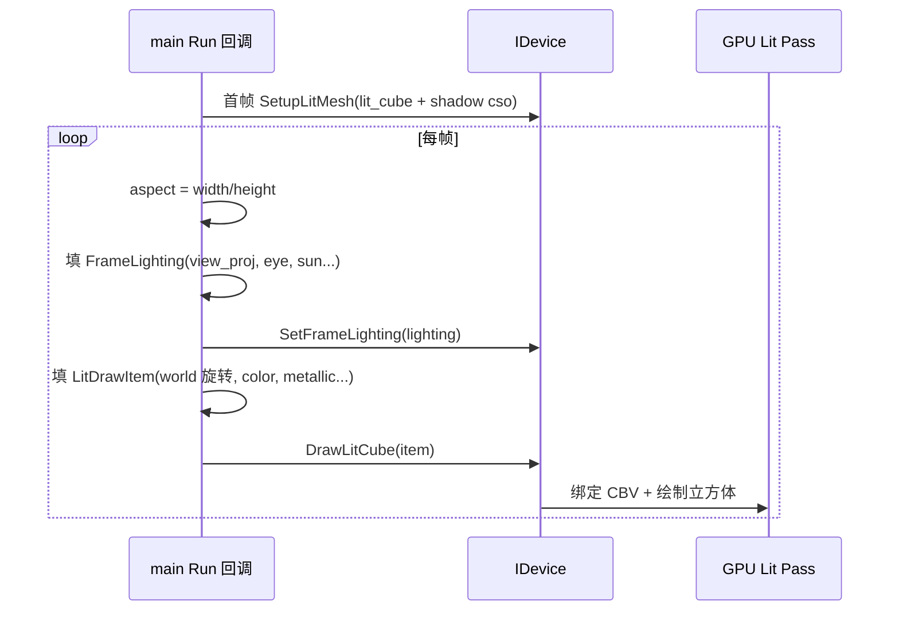

# Learn 04 — Lighting CBV（光照与常量缓冲）

> 绕过 `RenderSystem`，在 `Application::Run` 里直接调用 RHI：**SetupLitMesh → SetFrameLighting → DrawLitCube**，看清每帧如何通过 **常量缓冲（CBV）** 把视图投影、太阳与材质参数送进着色器。

## 怎么跑

```powershell
cmake --build build --config Debug --target sample_04_lighting_cbv
build\samples\learn\04_lighting_cbv\Debug\sample_04_lighting_cbv.exe
```

Headless：

```powershell
build\samples\learn\04_lighting_cbv\Debug\sample_04_lighting_cbv.exe --headless --headless_frames=2
```

## 知识点

1. **FrameLighting 即「帧级 CB 载荷」**：`view_proj`、`eye`、`sun_direction`、`ambient`、`sun_color`、`specular_power` 等每帧写入 GPU 常量缓冲，供 VS/PS 读取。
2. **LitDrawItem 即「物体级参数」**：`world` 矩阵、`color`、`metallic`、`roughness`、`use_albedo` 等随 draw call 变化；与帧级 lighting 分工明确。
3. **懒加载 SetupLitMesh**：首帧回调里 `lit_ready` 为 false 时创建 PSO/根签名/默认立方体 VB；失败则打日志并跳过后续绘制。
4. **简单 Blinn-Phong 风格项**：`specular_power = 48`、固定太阳方向 `Normalize({0.35, -1, 0.25})`；`enable_shadows = false`，先不管 shadow map。
5. **动画来自 CPU**：`world` 用 `Quat::FromEulerYxz(0.25f * frame_index(), 0.15f, 0)` 每帧更新，证明 CB/物体数据「每帧刷新」。
6. **use_albedo = false**：刻意关闭纹理采样，用 `item.color` 纯色，避免与 CH03 纹理认知混在一起。
7. **aspect 来自 device**：`width/height` 算投影，与 CH03 用 window 略有不同，但数学等价。

## 名词解释

| 术语 | 含义 |
|---|---|
| **CBV（Constant Buffer View）** | D3D12 常量缓冲视图；HLSL 中 `cbuffer`，注意 256 字节对齐规则。 |
| **FrameLighting** | RHI 结构体，打包相机、太阳、级联阴影矩阵等帧常量；见 `engine/rhi/i_device.h`。 |
| **LitDrawItem** | 单次 lit 绘制所需的 world 矩阵与材质字段。 |
| **SetupLitMesh** | 加载 `lit_cube` + `shadow` 着色器字节码，创建 lit PSO 与默认几何。 |
| **SetFrameLighting** | 把 `FrameLighting` 上传到当前帧 CB 槽位。 |
| **DrawLitCube** | 绑定 PSO、更新 per-draw 常量/描述符，绘制一个 lit 立方体实例。 |
| **Root Signature** | 着色器可见的资源绑定布局；CBV 槽位在设备实现里封装。 |

详见 [GLOSSARY.md](../../docs/learn/GLOSSARY.md) 中 CBV/SRV 与 Upload Ring 条目。

## 原理



**与 `main.cpp` 对齐的步骤：**

1. **Application::Create**  
   窗口标题 `Learn 04 — Lighting CBV`，1280×720；支持 `ParseHeadless`。

2. **首帧初始化（`lit_ready`）**  
   ```text
   LitMeshShaders:
     vs_dxil  = lit_cube.vs.cso
     ps_dxil  = lit_cube.ps.cso
     shadow_* = shadow.vs/ps.cso  （本课 enable_shadows=false，shadow PSO 仍随 Setup 创建）
   device().SetupLitMesh(shaders)
   ```

3. **每帧 FrameLighting**  
   - `view_proj = camera().view_proj_matrix(aspect)`  
   - `eye = camera().position`  
   - `sun_direction = Normalize({0.35, -1, 0.25})`，`sun_intensity = 2.4`  
   - `ambient = {0.10, 0.11, 0.14, 1}`，`sun_color = {1, 0.96, 0.9, 1}`  
   - `specular_power = 48`，`enable_shadows = false`  
   - `SetFrameLighting(lighting)`

4. **每帧 LitDrawItem**  
   - `world = Mat4::TRS({0,0.5,0}, 随 frame_index 旋转, {1,1,1})`  
   - `color = {0.82, 0.58, 0.38, 1}`，`metallic = 0.05`，`roughness = 0.42`  
   - `use_albedo = false`  
   - `DrawLitCube(item)`

5. **着色器侧（概念）**  
   VS 用 `view_proj * world` 变换顶点；PS 用 `sun_direction`、`eye` 算 N·L、镜面高光；常量来自 CBV，不是全局变量。

## 代码地图

| 符号 / 文件 | 说明 |
|---|---|
| `samples/learn/04_lighting_cbv/main.cpp` | 唯一业务文件；RHI 直绘路径 |
| `ParseHeadless` | `--headless` / `--headless_frames` |
| `engine::rhi::LitMeshShaders` | VS/PS 与 shadow 着色器路径 |
| `engine::rhi::FrameLighting` | 帧级光照 CB 字段 |
| `engine::rhi::LitDrawItem` | 单物体 draw 参数 |
| `IDevice::SetupLitMesh` | 创建设备侧 lit 管线 |
| `IDevice::SetFrameLighting` | 上传帧常量 |
| `IDevice::DrawLitCube` | 提交一次立方体 draw |
| `engine::Mat4::TRS` / `Quat::FromEulerYxz` | 世界矩阵与每帧旋转 |
| `ENGINE_SHADER_DIR_A` | CMake 注入的 `.cso` 目录 |

## 必做练习

1. **改太阳方向**：把 `sun_direction` 改成 `{0, -1, 0}` 与 `{1, -0.2, 0}`，描述高光落在立方体哪几个面上。
2. **关镜面**：将 `specular_power` 设为 `0` 或极小，对比纯漫反射外观（若引擎 clamp 则改 `roughness` 到 `1` 观察变化）。
3. **开 albedo**：设 `use_albedo = true`，对比 CH03 纹理立方体——理解 CB 里还有哪些字段不变。
4. **PIX 看 CBV**：抓一帧，找到 lit PS 绑定的 constant buffer，对照 `FrameLighting` 字段顺序（以 HLSL cbuffer 为准）。
5. **（口头）**：说明 D3D12 常量缓冲 256 字节对齐对「一个 FrameLighting 结构」意味着什么；若将来加字段为什么要 padding。
6. **对比 CH05**：CH05 在同一 RHI 路径上增加 `UploadLitGeometry`；本课 `mesh_slot` 默认 0（内置立方体）。

## 常见坑

- **SetupLitMesh 失败仍每帧重试**：本 demo 用 `lit_ready` 避免重复 Setup；若你改成失败也置 true，会每帧刷错——保持「失败则 return」模式。
- **忘记 aspect**：投影矩阵错会导致立方体拉伸；确认 `device().height() > 0` 分支。
- **shadow 着色器路径必填**：即使 `enable_shadows = false`，`LitMeshShaders` 仍提供 shadow `.cso`；缺文件会导致 Setup 失败，不是「不开阴影就不需要文件」。
- **与 CH03 混用**：CH03 用 `RenderSystem::DrawFrame` 自动填 lighting；本课必须自己 `SetFrameLighting`，否则看不到预期光照变化。
- **Headless 旋转**：`frame_index` 仍递增，headless 下立方体逻辑上仍在转；只是可能没有可见窗口。
- **use_albedo 与 color**：`use_albedo = false` 时改 `color` 才明显；误以为改 metallic 就能换「贴图色」。
