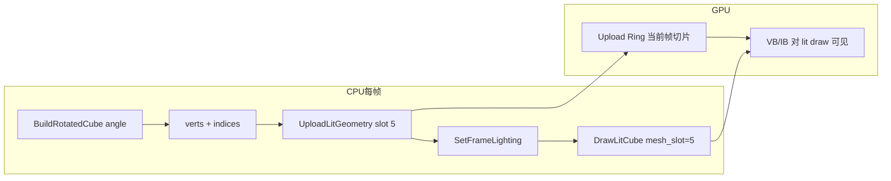

# Learn 05 — Upload Ring（上传环与动态几何）

> 每帧在 CPU 上 **重建旋转立方体顶点**，经 `UploadLitGeometry(5, ...)` 写入 **上传环（Upload Ring）** 槽位，再用 `DrawLitCube(mesh_slot=5)` 绘制——理解多帧 in-flight 下「暂存上传」为何不能每帧 `new` 一块 staging 又立刻释放。

## 怎么跑

```powershell
cmake --build build --config Debug --target sample_05_upload_ring
build\samples\learn\05_upload_ring\Debug\sample_05_upload_ring.exe
```

Headless：

```powershell
build\samples\learn\05_upload_ring\Debug\sample_05_upload_ring.exe --headless --headless_frames=2
```

## 知识点

1. **UploadLitGeometry**：把 CPU 侧 `LitVertex` + index 拷贝到设备管理的 **mesh_slot**；`0` 为内置单位立方体，本课使用 **slot 5** 自定义网格。
2. **Upload Ring 语义**：环形缓冲按帧推进写入；GPU 仍可能读取上一帧提交的 VB，因此不能假设「Upload 完立刻 CPU 释放即安全」。
3. **CPU 动态网格**：`BuildRotatedCube(angle, verts, indices)` 每帧重算 8 顶点 × 12 三角面，带法线与 UV；`angle = frame_index * 0.12`。
4. **RenderSystem + RHI 混用**：`RenderSystem::Init` 负责 lit 管线初始化；绘制仍走 `device().SetFrameLighting` + `DrawLitCube`（与 CH04 相同 RHI 入口）。
5. **日志验证**：每帧 `LogInfo("UploadLitGeometry slot5 frame N")`，便于 CI/Headless 确认上传路径被执行。
6. **mesh_slot 与 DrawLitItem**：`item.mesh_slot = 5` 必须与 Upload 槽位一致；否则 draw 仍用默认 cube 几何。
7. **in-flight 帧数**：通常与 swapchain 缓冲数量相关（2–3）；Upload Ring 按帧索引选择子区间，避免覆盖 GPU 未消费的数据。

## 名词解释

| 术语 | 含义 |
|---|---|
| **Upload Ring** | 环形 CPU→GPU 上传区；按帧轮转，避免每帧 CreateCommittedResource。 |
| **Staging Buffer** | CPU 可写、GPU 可读（或经 Copy）的中间缓冲；Upload 常经 staging 或 upload heap。 |
| **mesh_slot** | 逻辑网格槽编号；`UploadLitGeometry(slot, ...)` 与 `LitDrawItem::mesh_slot` 对应。 |
| **LitVertex** | 位置、法线、UV 等顶点布局；须与 lit VS input layout 一致。 |
| **in-flight** | GPU 尚未完成执行的帧；CPU 不能回收其仍引用的资源。 |
| **Copy vs Map** | 持久 Map 的 Ring 适合小量每帧更新；大 mesh 可能用显式 CopySubresource。 |

详见 [GLOSSARY.md](../../docs/learn/GLOSSARY.md) 中 Upload Ring 条目。

## 原理



**逐步（对应 `main.cpp`）：**

1. **Init**  
   - `RenderSystem render; render.Init(device, LitDesc())`  
   - `LitDesc`：`lit_cube` + `shadow` 路径，`enable_shadows = false`，Low quality。

2. **每帧 Run 回调**  
   - `angle = frame_index * 0.12f`  
   - `BuildRotatedCube`：8 角点绕 Y 旋转，12 面各 3 顶点，算法线，UV `(0,0)(1,0)(0,1)`  
   - `UploadLitGeometry(5, verts, indices)` — 失败则 `LogError` 并 return  
   - 打日志确认 slot 5 与帧号  

3. **光照与绘制**  
   - `FrameLighting`：`view_proj`、`eye`、太阳 `{0.3,-1,0.2}`、`sun_intensity=2`、`ambient` 略亮、`enable_shadows=false`  
   - `LitDrawItem`：位置 `{0,0.5,0}`，identity 旋转（几何已在 CPU 转过），`color` 冷灰，`mesh_slot=5`，`use_albedo=false`  
   - `DrawLitCube(item)`

4. **BuildRotatedCube 要点**  
   - 每面独立 3 顶点（非索引共享顶点），法线按面计算——教学用简单，非最优顶点缓存。  
   - 旋转只改 XZ，Y 不变，便于观察「网格每帧变、world 矩阵不变」的分工。

5. **与 CH04 差异**  
   - CH04：`mesh_slot` 默认 0，world 矩阵转。  
   - CH05：world 单位，**几何在 Upload 里转**——两种动画策略，Upload Ring 对两种都适用。

## 代码地图

| 符号 / 文件 | 说明 |
|---|---|
| `samples/learn/05_upload_ring/main.cpp` | `BuildRotatedCube`、`UploadLitGeometry`、Draw 循环 |
| `BuildRotatedCube` | 本地函数；生成 12×3 顶点与 36 索引 |
| `engine::rhi::LitVertex` | 上传顶点类型 |
| `IDevice::UploadLitGeometry` | 写入指定 mesh_slot；见 `i_device.h` |
| `RenderSystem::Init` | 初始化 lit/shadow 等着色器与内部状态 |
| `LitDrawItem::mesh_slot` | 绘制时选取哪套 VB/IB |
| `engine/render/render_system.cpp` | 产品路径也会 Upload 地形/ground 等 slot |
| D3D12 设备实现 | `d3d12_device.cpp` 内 Upload Ring 具体分配 |

## 必做练习

1. **错 slot 实验**：Upload 到 slot 5 但 `DrawLitCube` 仍用 `mesh_slot=0`，描述画面与日志差异。
2. **停转几何**：固定 `angle=0`，改回 CH04 式 `world` 旋转；对比 CPU 改顶点 vs GPU 改矩阵的代价（口头即可）。
3. **加大面数**：在 `BuildRotatedCube` 里细分每个面为 2×2 四边形（需改索引循环），观察 Upload 日志仍每帧成功。
4. **Headless 帧数**：`--headless_frames=10`，确认日志里 frame 0..9 均有 slot5 上传且无 error。
5. **（口头）**：解释「为何 GPU 还在读第 N 帧 VB 时，CPU 不能覆盖 Ring 里同一块」——用 triple buffering 类比。
6. **读设备代码**：在 `d3d12_device.cpp` 搜索 `UploadLitGeometry`，指出 Ring 索引如何与 `frame_index` 关联（若实现如此）。

## 常见坑

- **每帧 vector 分配**：`verts`/`indices` 每帧 clear+push；学习 OK，产品里可复用 buffer 容量避免堆分配——别与 Upload Ring 混淆。
- **slot 冲突**：Sandbox 里 ground 用 slot 4、terrain 用 2 等；本课用 5 是为避免与内置/产品槽撞车；随意改 slot 需确认设备支持范围。
- **顶点布局不匹配**：`LitVertex` 字段顺序错会导致法线/UV 乱飞；改 layout 必须同步 HLSL input 与 PSO input layout。
- **Upload 失败仍 Draw**：本 demo Upload 失败会 return；若删掉检查可能 draw 旧几何或空 VB。
- **RenderSystem 未 Init**：只 Upload 不 Init 会缺 PSO；本课顺序是 Init 一次再每帧 Upload+Draw。
- **与 CH03 混淆**：CH03 不动态 Upload；ground/cube 来自引擎 procedural/ResolveMeshMaterial，不是本课 CPU 构网格。
