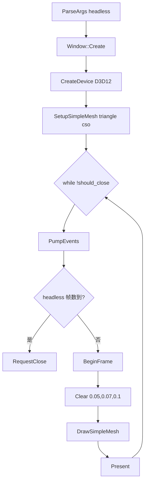

# Learn 06 — RHI Triangle（RHI 抽象动机）

> **不用 `Application`**，只保留 `Window` + `CreateDevice(D3D12)` + 手写帧循环，用与 CH02 相同的 **SimpleMesh** 路径画纹理三角，理解业务为何要依赖 **RHI（`IDevice`）** 而不是直接 `#include <d3d12.h>`。

## 怎么跑

```powershell
cmake --build build --config Debug --target sample_06_rhi_triangle
build\samples\learn\06_rhi_triangle\Debug\sample_06_rhi_triangle.exe
```

Headless：

```powershell
build\samples\learn\06_rhi_triangle\Debug\sample_06_rhi_triangle.exe --headless --headless_frames=2
```

着色器使用 CH02 同款：`triangle.vs.cso` / `triangle.ps.cso`（CMake 目标 `sample_02_triangle_shaders`）。

## 知识点

1. **最薄渲染壳**：本课只有 `BeginFrame → Clear → DrawSimpleMesh → Present`，没有相机、场景、RenderSystem——对应「RHI 最小闭环」。
2. **CreateDevice 工厂**：`engine::rhi::CreateDevice(Backend::D3D12, DeviceDesc)` 隐藏 DXGI/D3D12 设备创建细节。
3. **与 CH02 对照**：CH02 走 `Application` + `PathResolver`；CH06 自己拼 `WindowDesc` / `DeviceDesc`，证明 **同一 IDevice API** 可被不同壳调用。
4. **Backend 枚举**：本 demo 硬编码 `Backend::D3D12`；M17 Vulkan 路径在 `01_clear --backend=vulkan` 与 `32_vulkan_backend` 展开，此处强调「接口稳定、实现可换」。
5. **事件泵**：`window->PumpEvents()` + `should_close()` 驱动循环；Headless 用 `headless_frames` 计数后 `RequestClose`。
6. **SetupSimpleMesh 一次性**：启动时加载 triangle 着色器并建 PSO；循环内只 Draw，不再 Setup。
7. **错误即退出**：任一步 `Status` 失败则 `LogError` 并 `return 1`，与 learn 轨「可诊断失败」一致。

## 名词解释

| 术语 | 含义 |
|---|---|
| **RHI** | Render Hardware Interface；`IDevice` 抽象 D3D12/Vulkan/Headless。 |
| **IDevice** | 统一设备接口：帧、清屏、SimpleMesh、Lit、Present 等。 |
| **Backend::D3D12** | 运行时选择 D3D12 实现；工厂在 `engine/rhi/backend.h`。 |
| **DeviceDesc** | 原生窗口句柄、宽高、是否 headless。 |
| **SimpleMeshShaders** | `vs_dxil` / `ps_dxil` 路径；全屏三角演示用。 |
| **Native Window Handle** | Win32 HWND 等；swapchain 创建所需。 |

详见 [GLOSSARY.md](../../docs/learn/GLOSSARY.md)。

## 原理



**与 `main.cpp` 逐步对齐：**

1. **参数**  
   - `ParseArgs`：`--headless`、`--headless_frames`（与 Application 系列语法一致）。  
   - 默认窗口 1280×720，标题 `Learn 06 — RHI Triangle`。

2. **Window + Device**  
   ```text
   WindowDesc: native 创建
   DeviceDesc.native_window = window->native_handle()
   DeviceDesc.width/height/headless 同步
   CreateDevice(Backend::D3D12, ddesc)
   ```

3. **着色器**  
   - `shader_dir = ENGINE_SHADER_DIR_A`  
   - `triangle.vs.cso` / `triangle.ps.cso`  
   - `SetupSimpleMesh(shaders)` — 失败直接 return 1（不在循环里）

4. **主循环**  
   - `clear = {0.05, 0.07, 0.1, 1}`  
   - 每帧：`BeginFrame` → `Clear` → `DrawSimpleMesh` → `Present`  
   - `frame++`；若 `headless_frames > 0 && frame >= headless_frames` 则 break  
   - 正常退出 return 0

5. **业务不碰 D3D12 的原因（本课结论）**  
   - 换 Vulkan 时只需换 `CreateDevice` 与后端 `.cpp`；本文件 **零** `ID3D12Device` 引用。  
   - Sandbox / RenderSystem 建立在同一 `IDevice` 上，避免 N 份 swapchain 代码。

## 代码地图

| 符号 / 文件 | 说明 |
|---|---|
| `samples/learn/06_rhi_triangle/main.cpp` | 无 Application 的完整入口 |
| `ParseArgs` | headless 参数（局部，非 ApplicationDesc） |
| `engine::Window` / `WindowDesc` | 平台窗口与事件 |
| `engine::rhi::CreateDevice` | 后端工厂 |
| `engine::rhi::Backend::D3D12` | 本 demo 固定后端 |
| `engine::rhi::DeviceDesc` | 设备创建描述 |
| `IDevice::SetupSimpleMesh` / `DrawSimpleMesh` | 与 CH02 相同 API |
| `ENGINE_SHADER_DIR_A` | triangle `.cso` 目录 |
| CMake `sample_06_rhi_triangle` | 链接 `engine_rhi` + `engine_d3d12` + `engine_platform` |

## 必做练习

1. **对照 CH02**：并排打开 `02_triangle/main.cpp` 与本文件，列一张表：哪些行被 Application 替代、哪些仍相同。
2. **改清屏色**：把 `clear` 改成 `{0.2, 0, 0.2, 1}`，确认只有 Clear 影响背景、三角仍覆盖在上面。
3. **缺 cso 实验**：临时改错 `triangle.vs.cso` 路径，确认 Setup 失败且退出码非 0。
4. **Headless 两帧**：`--headless --headless_frames=2`，确认自动退出且无窗口仍走 Present 路径（stub 允许）。
5. **（口头）**：若新增 Metal 后端，本 `main.cpp` 理论上改哪一行？业务回调还要改吗？
6. **（选修预告）**：说明为何产品仍用 `Application` 而不是每个 sample 复制 while 循环——输入、相机、render_scene 归属。

## 常见坑

- **不用 Application 就没有 ParseHeadless 统一行为**：本课自己实现 `ParseArgs`；与 `ApplicationDesc` 字段名一致但结构不同，复制粘贴时注意。
- **triangle 着色器目标**：依赖 `sample_02_triangle_shaders`，不是 Sandbox 的 `lit_cube`；编错 target 会缺 cso。
- **忘记 PumpEvents**：Windows 消息不泵可能「未响应」或关窗无效。
- **Setup 放循环内**：每帧 Setup 会泄漏 PSO/极慢；本 demo 正确地在循环外 Setup 一次。
- **与 CH04/05 混淆**：SimpleMesh ≠ LitMesh；本课没有 `SetFrameLighting`。
- **Vulkan**：本 demo 未暴露 `--backend`；要练 Vulkan 三角请见 `01_clear` 或后续 Vulkan sample，勿在此硬改 unless 你愿自己接 `CreateDevice(Vulkan)`。
