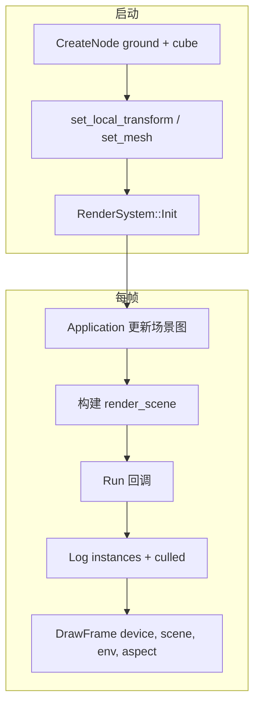

# Learn 07 — Scene + Camera（场景与相机）

> 用 **`World` 节点 + `MeshRenderer` + 预设相机** 搭地面与立方体，每帧读取 **`render_scene()`** 并交给 `RenderSystem::DrawFrame`，理解 **RenderScene 收集、实例列表与剔除计数** 在绘制前如何就绪。

## 怎么跑

```powershell
cmake --build build --config Debug --target sample_07_scene_camera
build\samples\learn\07_scene_camera\Debug\sample_07_scene_camera.exe
```

Headless：

```powershell
build\samples\learn\07_scene_camera\Debug\sample_07_scene_camera.exe --headless --headless_frames=2
```

## 知识点

1. **场景图入口**：`a.world().CreateNode` + `set_local_transform` + `set_mesh` 是 M4 标准搭法；逻辑名 `"ground"` / `"cube"` 便于调试。
2. **render_scene()**：`Application` 每帧从 World 收集可绘制实例（含 world 矩阵、mesh_id、材质解析结果等），供 RenderSystem 消费。
3. **日志可观测性**：每帧 `LogInfo("RenderScene instances: N culled=M")`，Headless 也能验证收集与剔除路径执行。
4. **相机预设**：`position = {0, 1.8, 4.5}`，`pitch = -0.2`；不在本 demo 改 yaw/输入——CH07b 再接 Action。
5. **与 CH03 差异**：CH03 同样 DrawFrame，但 **不打印 RenderScene**；本课焦点是「提交物里有什么」。
6. **剔除字段**：`scene.culled` 由引擎根据视锥/bounds 统计；ground 设 `never_cull` 与 bounds，cube 默认可剔除。
7. **RenderSystem 配置**：与 CH03 类似 Low quality、无 SSAO/TAA/阴影，避免 pass 过多干扰阅读日志。

## 名词解释

| 术语 | 含义 |
|---|---|
| **World / Scene Graph** | 节点树 + 组件；Transform、MeshRenderer 等挂在节点上。 |
| **RenderScene** | 一帧的绘制实例快照：`instances`、`culled` 等。 |
| **MeshRenderer** | 组件：`mesh_id`、可选 `never_cull`、`local_bounds`。 |
| **Camera** | `Application::camera()`；提供 `view_proj_matrix(aspect)` 与位置。 |
| **Frustum Culling** | 视锥外实例不进 draw 列表或标记 culled；bounds 不准会误剔。 |
| **Application::Run** | 内部 Sync 场景 → 构建 RenderScene → 用户回调 → Present。 |

详见 [GLOSSARY.md](../../docs/learn/GLOSSARY.md) 与 [BASICS.md](../../docs/learn/BASICS.md) 矩阵章节。

## 原理



**逐步（`main.cpp`）：**

1. **Application**  
   - 标题 `Learn 07 — Scene + Camera`；`ParseHeadless` 可选。

2. **相机**  
   - `a.camera().position = {0, 1.8, 4.5}`  
   - `a.camera().pitch = -0.2`

3. **ground 节点**  
   - `scale = {5, 1, 5}`  
   - `mesh_id = "ground"`，`never_cull = true`  
   - `local_bounds = {{-5,-0.05,-5}, {5,0.05,5}}`

4. **cube 节点**  
   - `position = {0, 0.5, 0}`  
   - `mesh_id = "cube"`

5. **RenderSystem**  
   - `LitDesc()`：`lit_cube` + `shadow`，`enable_shadows=false`，Low quality，SSAO/TAA off  
   - `render.Init(a.device(), LitDesc())`

6. **每帧回调**  
   - `aspect` 从 `window().width/height`  
   - `const auto& scene = app_ref.render_scene()`  
   - 日志 instances 数量与 culled  
   - `render.DrawFrame(device, scene, env, aspect)`

7. **instances 内容（概念）**  
   - 至少 2 条：ground + cube（具体字段在 `render_scene.h` / 收集代码）；DrawFrame 再 Resolve 材质与 mesh_slot。

## 代码地图

| 符号 / 文件 | 说明 |
|---|---|
| `samples/learn/07_scene_camera/main.cpp` | 场景搭建 + 日志 + DrawFrame |
| `engine::scene::Transform` | 位置/旋转/缩放 |
| `engine::scene::MeshRenderer` | mesh_id、剔除相关字段 |
| `Application::world()` | 场景图 API |
| `Application::render_scene()` | 每帧只读快照 |
| `Application::camera()` | 视图投影来源 |
| `engine/render/render_system.h` | DrawFrame 签名 |
| `engine/render/render_scene.h` | instances / culled 定义 |
| 场景收集实现 | `engine/app/` 或 render 模块内 Sync 逻辑 |

## 必做练习

1. **删 cube 节点**：注释 cube 创建，运行后 instances 是否变为 1？culled 如何变？
2. **去掉 ground never_cull**：仅保留 bounds，拉远相机或缩小 bounds，观察 ground 是否消失及 culled 增量。
3. **改 cube 位置到相机背后**：`position.z = 10`，对照 culled 与画面（若仍可见说明 bounds/剔除策略差异，查日志）。
4. **对比 CH03**：两文件 diff，列出 CH07 多出的三处：`render_scene` 日志、相机预设差异、ground bounds 数值。
5. **（口头）**：谁负责 world 矩阵乘父节点？子节点 Transform 变时 instances 何时更新？
6. **读 RenderScene 类型**：打开头文件，写出 `instances` 里至少 4 个字段名及其含义。

## 常见坑

- **在 Run 里改 World 却不刷新**：若 API 要求标记 dirty，直接改 Transform 可能延迟一帧；本 demo 静态场景无此问题，动态练习时注意。
- **render_scene 每帧引用**：应用 `const auto& scene = app_ref.render_scene()` 取的是当帧快照；缓存到下一帧可能 stale。
- **日志刷屏**：每帧 LogInfo 在 60fps 下很多；学习 OK，产品应降频或仅 debug 开关。
- **与 CH07b 顺序**：本课无输入；相机默认不动，别期待 WASD——除非 Application 默认绑了 fly cam（以引擎为准）。
- **Headless culled**：stub 可能不真剔除；仍看 instances 数量是否合理、DrawFrame 是否成功。
- **LitDesc 缺 post**：本课 LitDesc 未列 quad/post（比 CH03 少）；足够 lit ground+cube，勿与 CH11 全 pass 混淆。
