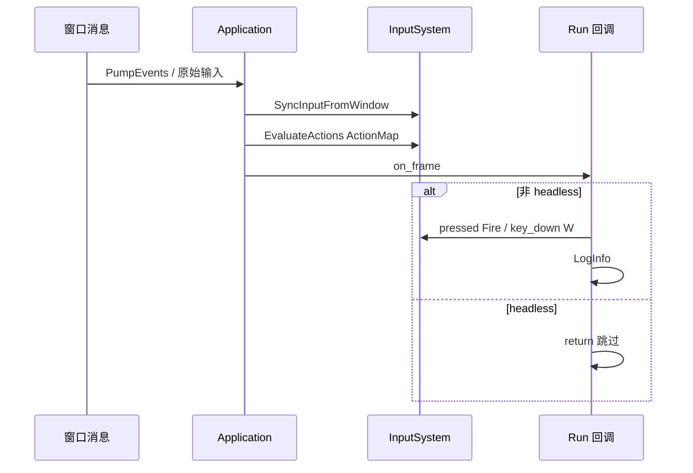

# Learn 07b — Input Actions（输入与动作映射）

> 在 **无 3D 绘制** 的最小窗口里演示 **`ActionMap::Bind`** 把 Space/Shift 映射为逻辑动作 **Fire/Sprint**，并在回调里用 **`pressed("Fire")`** 与 **`key_down(W)`** 打日志——理解业务应绑 **Action 名** 而非裸 VK 码（本课为 CH07 的输入侧补充，与相机 sample 并列）。

## 怎么跑

```powershell
cmake --build build --config Debug --target sample_07b_input_actions
build\samples\learn\07b_input_actions\Debug\sample_07b_input_actions.exe
```

Headless（仅验证主循环退出，**不**测按键）：

```powershell
build\samples\learn\07b_input_actions\Debug\sample_07b_input_actions.exe --headless --headless_frames=2
```

## 知识点

1. **ActionMap 抽象**：`Bind("Fire", "Button:Space")` 把物理键映射为逻辑名；改键位只改 Bind，不改业务 `pressed("Fire")`。
2. **InputSystem 生命周期**：`Application::Run` 内会先 `SyncInputFromWindow` / `EvaluateActions`，再进入用户回调——按键状态在回调里可读。
3. **pressed vs key_down**：`pressed("Fire")` 通常表示本帧刚按下；`key_down(Key::W)` 表示 W 按住，演示「Action 与原始键混用」时的边界。
4. **Headless 跳过交互**：`is_headless()` 时回调直接 return，避免无窗口仍读输入；CI 只验循环与退出码。
5. **无 RenderSystem**：本 demo 不 Init 着色器、不 DrawFrame——刻意隔离「输入」认知，避免与 CH07 场景渲染纠缠。
6. **Binding 语法契约**：字符串须与 `input_system.cpp` 解析器一致：`Button:` 前缀、键名 token（如 `Space`、`KeyShift`）。
7. **与产品 Sandbox**：Sandbox 同样通过 ActionMap 驱动移动/开火；本课是极简可运行切片。

## 名词解释

| 术语 | 含义 |
|---|---|
| **InputSystem** | 聚合键盘/鼠标/手柄状态；提供 `pressed`、轴、`key_down` 等。 |
| **ActionMap** | 逻辑动作名 → 物理绑定；可 Save/Load 配置文件。 |
| **DeviceHub** | 多设备输入汇聚（M4）；ActionMap 在其上评估。 |
| **Button:Space** | 绑定语法：类型 `Button` + 键名 `Space`。 |
| **pressed** | 缘触发（本帧按下）；适合开火、跳跃。 |
| **key_down** | 电平触发（按住）；适合移动。 |

详见 [GLOSSARY.md](../../docs/learn/GLOSSARY.md)。

## 原理



**与 `main.cpp` 对齐：**

1. **Create**  
   - 标题 `Learn 07b — Input Actions`  
   - `ParseHeadless` 支持 `--headless` / `--headless_frames`

2. **绑定（启动一次）**  
   ```text
   input().action_map().Bind("Fire", "Button:Space")
   input().action_map().Bind("Sprint", "Button:KeyShift")
   LogInfo 提示 Fire=Space, Sprint=Shift
   ```
   - 本 demo **未**在回调里读 `Sprint`——Bind 供练习扩展；Fire 与 W 在回调里演示。

3. **每帧 Run**  
   - 若 `app_ref.is_headless()` → `return`  
   - 若 `input().pressed("Fire")` → `LogInfo("Action Fire pressed")`  
   - 若 `input().key_down(Key::W)` → `LogInfo("Move forward (W held)")`  
   - 无绘制、无 camera 修改

4. **为何需要 Action**  
   - 手柄 A 键、键盘 Space、触摸按钮可绑同一 `"Fire"`  
   - 本地化/重绑不需要搜全项目 `VK_SPACE`

## 代码地图

| 符号 / 文件 | 说明 |
|---|---|
| `samples/learn/07b_input_actions/main.cpp` | Bind + 回调日志 |
| `engine/input/input_system.h` | InputSystem、Key 枚举 |
| `ActionMap::Bind` | 逻辑名 → 绑定串 |
| `InputSystem::pressed` | 按动作名缘触发 |
| `InputSystem::key_down` | 按 Key 电平 |
| `Application::input()` | 访问 InputSystem |
| `Application::is_headless()` | Headless 分支 |
| `Application::Run` | 内部输入 Sync 顺序 |
| `engine/input/input_system.cpp` | Binding 解析实现 |
| CMake `sample_07b_input_actions` | 仅 `engine_app` + `engine_d3d12`，无 shader 依赖 |

## 必做练习

1. **窗口模式按 Space**：运行 exe，点窗口焦点后按 Space，控制台应出现 `Action Fire pressed`（每按一次一条，取决于 pressed 语义）。
2. **按住 W**：观察 `Move forward (W held)` 是否每帧刷屏——理解 key_down 与 pressed 差异。
3. **改绑 Fire**：改为 `"Button:Mouse0"`，用鼠标左键触发 Fire 日志。
4. **读 Sprint**：在回调加 `if (input().pressed("Sprint"))` 或等价 API（以头文件为准），按住 Shift 验证。
5. **持久化**：参考 unit test 调用 `ActionMap::SaveToFile` / `LoadFromFile`，换绑后 reload 验证。
6. **（口头）**：回答 PATH——「为何业务应绑 Action 而非 VK 码？」举两个改键场景。

## 常见坑

- **Headless 无输入**：故意设计；不要用 headless 验 Space 日志。
- **窗口无焦点**：按键不进引擎；先点 client 区再测。
- **Binding 拼写**：`Button:Space` 大小写/前缀错会静默不触发——对照 `input_system.cpp` 支持的 token 列表。
- **Sprint 未读**：main 只 Bind 未用；不是 bug，练习 4 自行补上。
- **与 CH07 合并**：若你想 WASD 动相机，应在 CH07 或 Sandbox 改 Application 相机逻辑，不是本课范围。
- **Log 洪水**：W 按住每帧 Log；学习时可接受，调试时改沿 pressed 缘触发或节流。
