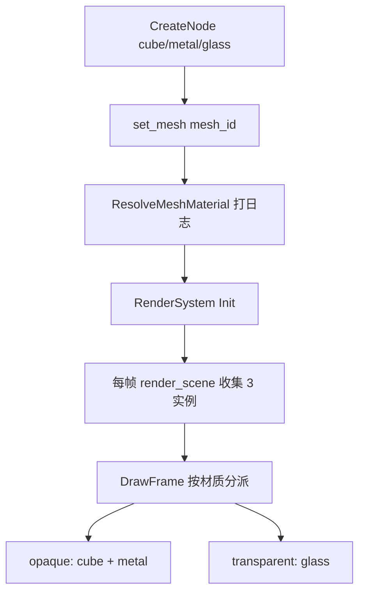

# Learn 08 — Material Variants（材质变体）

> 在场景中并排放置 **`cube` / `metal` / `glass`** 三个 `mesh_id`，启动时 **`ResolveMeshMaterial`** 打印 metallic/roughness，再 **`RenderSystem::DrawFrame`** 展示不同 PBR 变体（含透明 glass）——理解 **mesh_id → 材质实例** 如何驱动着色与混合状态。

## 怎么跑

```powershell
cmake --build build --config Debug --target sample_08_material_variants
build\samples\learn\08_material_variants\Debug\sample_08_material_variants.exe
```

Headless：

```powershell
build\samples\learn\08_material_variants\Debug\sample_08_material_variants.exe --headless --headless_frames=2
```

## 知识点

1. **ResolveMeshMaterial**：根据 `mesh_id` 返回 `PbrMaterial`（base_color、metallic、roughness、albedo_tex、transparent 等）；本 demo 在搭场景时 Log 一次。
2. **三变体对比**：默认 `cube`、高金属 `metal`、低 roughness + alpha 的 `glass`——同一 lit 着色器，不同常量/keyword/混合路径。
3. **mesh_id 即变体键**：不必每物体挂完整 Material 资产；引擎内置表适合 learn 与单元测试（见 `local_lights.cpp`）。
4. **透明物体**：`glass` 设 `transparent = true`；DrawFrame 内通常 **opaque 先、透明后** 排序绘制（具体在 RenderSystem/设备实现）。
5. **相机 framing**：`position = {0, 2, 5}`，`pitch = -0.25`，便于同时看到三个并排立方体。
6. **无阴影/后处理**：Low quality、SSAO/TAA off、`enable_shadows=false`，突出材质差异而非 lighting 复杂度。
7. **Keyword→PSO（概念）**：产品里 shader variant 可能换 PSO；本课主要是 **参数变体**，为 CH08 PATH 问题「改 Keyword 为何卡顿」打基础。

## 名词解释

| 术语 | 含义 |
|---|---|
| **PbrMaterial** | 金属度/粗糙度/基色/纹理路径/透明标记等打包结构。 |
| **ResolveMeshMaterial** | `mesh_id` → 默认或注册材质；`engine/render/local_lights.h`。 |
| **metallic / roughness** | PBR 核心参数；0=电介质，1=金属；roughness 控制高光展宽。 |
| **transparent** | 是否走 alpha blend pass；glass 为 true。 |
| **Shader Variant / Keyword** | 编译期或运行时 shader 分支；可能触发 PSO 重建。 |
| **mesh_slot / tex_slot** | 几何与纹理槽；ground 等复杂 id 会指定非 0 槽。 |

详见 [GLOSSARY.md](../../docs/learn/GLOSSARY.md)。

## 原理



**与 `main.cpp` 逐步对齐：**

1. **相机**  
   - `{0, 2, 5}`，pitch `-0.25`

2. **三个节点**（循环 `variants[] = {"cube","metal","glass"}`）  
   - 位置 x：`i * 1.8 - 1.8` → −1.8, 0, +1.8  
   - y = 0.5  
   - `mesh_id = variants[i]`  
   - `ResolveMeshMaterial(variants[i])` → Log metallic/roughness

3. **引擎内材质表（参考实现）**  
   - `cube`：默认 PBR 参数（未在 Resolve 特殊分支则走 default）  
   - `metal`：`metallic ≈ 0.95`，`roughness ≈ 0.18`，偏镜面  
   - `glass`：`transparent=true`，`base_color.a ≈ 0.35`，低 roughness

4. **每帧**  
   - `aspect` 从窗口  
   - `render.DrawFrame(device, render_scene(), env, aspect)`  
   - RenderSystem 内部对每个 instance 再 Resolve（或与收集阶段合并），绑定 albedo/常量，选择 opaque/transparent PSO

5. **与 CH09 衔接**  
   - CH08 变体主要是 **参数+透明**；CH09 的 `metal` 同样 mesh_id，但叠加 **IBL 环境**（本课 env 默认，无 IBL 路径）。

## 代码地图

| 符号 / 文件 | 说明 |
|---|---|
| `samples/learn/08_material_variants/main.cpp` | 三节点 + Resolve 日志 + DrawFrame |
| `engine::render::ResolveMeshMaterial` | `local_lights.cpp` 实现 |
| `material::PbrMaterial` | 材质字段定义 |
| `engine::scene::MeshRenderer::mesh_id` | 变体选择键 |
| `RenderSystem::DrawFrame` | 收集实例→lit draws |
| `DrawTransparentLitCubes` | RHI 透明 pass（设备层） |
| `tests/unit/test_m4_m19.cpp` | ground/metal/glass Resolve 单测 |
| CMake `sample_08_material_variants` | sandbox shaders 依赖 |

## 必做练习

1. **读日志**：启动时三条 Log 的 metallic/roughness 是否与 `local_lights.cpp` 一致？
2. **改 glass alpha**：在 Resolve 表或 duplicate 逻辑里把 `base_color.a` 改为 0.1 与 0.9，描述透明感变化（需重编引擎若改 cpp）。
3. **只留 metal**：注释两个节点，观察单金属球环境反射（仍无 IBL 时主要是 specular lobe）。
4. **PIX 抓帧**：对比 metal 与 cube 同一 lit PS 的常量缓冲或 root 参数差异。
5. **（口头）**：若新增 shader keyword `USE_CLEARCOAT`，改 keyword 为何可能造成卡顿？（PSO 编译/缓存 miss）
6. **加第四个 mesh_id**：用 `"ground"` 作 mesh_id 放一个缩放平面，看 brick 纹理与三 cube 并存。

## 常见坑

- **以为 main 里 Resolve 影响运行时**：Log 用的 Resolve 与 DrawFrame 内 Resolve 应一致；若只改 Log 处自定义对象而不改 mesh_id，画面不变。
- **glass 排序**：透明需背面排序；相机绕到玻璃后可能看到排序 artifact——本课并排摆放减轻问题。
- **cube 默认参数**：若 default 分支与预期色不符，以 `local_lights.cpp` 为准，不要凭记忆写 README。
- **与 CH03 ground 纹理**：CH03 显式 ground 节点；本课未放 ground，专注三 cube 变体。
- **Headless 透明**：stub 可能不真 blend；看 DrawFrame 成功与 Log，不以像素为准。
- **Enable shadows**：本课 false；开阴影会引入 CH10 话题，偏离材质对比。

## 内置 mesh_id 速查（ResolveMeshMaterial）

| mesh_id | metallic | roughness | 备注 |
|---|---|---|---|
| `cube` | 默认 | 默认 | 标准 opaque PBR |
| `metal` | ≈0.95 | ≈0.18 | 强镜面高光 |
| `glass` | 0 | ≈0.08 | `transparent=true`，alpha≈0.35 |

表值以 `engine/render/local_lights.cpp` 为准；改表后需重编引擎。

## 与 CH09 关系

CH08 三个并排 cube 展示 **参数/透明变体**；CH09 改用单个 `metal` 并接 **Environment/IBL 契约**。先掌握 mesh_id→材质，再学环境反射资源。
