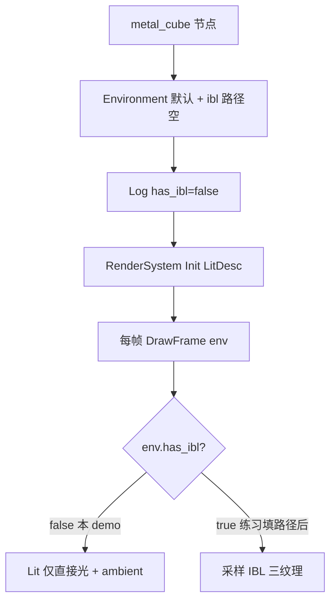

# Learn 09 — PBR + IBL（基于图像的光照）

> 放置 **`metal` 立方体**，构造 **`Environment`** 并故意将 **IBL 三件套路径留空**，启动时 Log **`has_ibl=false`**，再 `DrawFrame`——理解 **IBL 资源契约**（irradiance / prefilter / BRDF LUT）与 `FrameLighting::enable_ibl` 如何衔接，为后续填真实烘焙贴图做准备。

## 怎么跑

```powershell
cmake --build build --config Debug --target sample_09_pbr_ibl
build\samples\learn\09_pbr_ibl\Debug\sample_09_pbr_ibl.exe
```

Headless：

```powershell
build\samples\learn\09_pbr_ibl\Debug\sample_09_pbr_ibl.exe --headless --headless_frames=2
```

## 知识点

1. **Environment::has_ibl()**：当 `ibl_irradiance` 非空才视为配置 IBL；本 demo 三路径均为 `""`，故 `has_ibl=false`。
2. **PBR 金属体**：`mesh_id = "metal"` 高 metallic、低 roughness，最适合观察 **镜面项 +（将来）环境反射**。
3. **IBL 三件套（概念）**：Irradiance（漫反射环境）、Prefiltered（镜面 mip 链）、BRDF LUT（分割和积分）——详见 GLOSSARY 与 baker 工具链。
4. **无 IBL 时的表现**：仍应有 **直接光 specular**（太阳）与环境 ambient；缺少的是 **间接环境镜面/漫射采样**。
5. **RenderSystem 与 env**：`DrawFrame(..., env, aspect)` 把 Environment 传入；内部设置 `FrameLighting.enable_ibl` 等与 env 同步。
6. **相机**：`{0, 1.6, 4}`，pitch `-0.18`，略俯看金属 cube。
7. **完整 IBL 学习路径**：本 sample 代码侧是 **接线演示**；贴图烘焙与路径填写见文档 baker 章节与 Sandbox（本 README 不虚构未在 main 出现的 API）。

## 名词解释

| 术语 | 含义 |
|---|---|
| **PBR** | Physically Based Rendering；metal/roughness 工作流。 |
| **IBL** | Image Based Lighting；用环境贴图近似间接光。 |
| **Irradiance Map** | 低分辨率 diffuse 环境卷积结果。 |
| **Prefiltered Env Map** | 按 roughness 预滤的 specular 环境 mip。 |
| **BRDF LUT** | 2D 查找表，Split-Sum 近似 Fresnel × Geometry。 |
| **Environment** | `ambient`、`sun_*`、`ibl_*` 路径一体配置。 |
| **has_ibl()** | 是否至少配置 irradiance 路径。 |

详见 [GLOSSARY.md](../../docs/learn/GLOSSARY.md) 中 IBL 相关行。

## 原理



**与 `main.cpp` 逐步对齐：**

1. **场景**  
   - 单节点 `metal_cube`，`mesh_id = "metal"`，位置 `{0, 0.5, 0}`

2. **Environment**  
   ```text
   env.ibl_irradiance = ""
   env.ibl_prefilter = ""
   env.ibl_brdf_lut = ""
   LogInfo("IBL configured: has_ibl=" + false)
   ```
   - 太阳/ambient 仍用 `Environment` 结构体默认值（未在 main 覆盖 sun 字段）

3. **RenderSystem**  
   - 与 CH08 类似：`LitDesc` Low、无 shadow/SSAO/TAA  
   - `Init` → `Run` 里 `DrawFrame(device, render_scene(), env, aspect)`

4. **DrawFrame 内部（概念，以 render_system 实现为准）**  
   - 解析 `env.has_ibl()` → 若 false，不绑定 IBL SRV，`enable_ibl=false`  
   - 对 metal 网格仍应用 `ResolveMeshMaterial("metal")` 参数  
   - 直接光：太阳方向来自 env 默认 + 收集的 FrameLighting

5. **填 IBL 后的预期（练习扩展，非当前 main 行为）**  
   - 将 baker 产出路径赋给三字段  
   - `has_ibl=true` 后，PS 采样 irradiance/prefilter/LUT，金属表面出现环境反射色

## 代码地图

| 符号 / 文件 | 说明 |
|---|---|
| `samples/learn/09_pbr_ibl/main.cpp` | metal 场景 + 空 IBL + DrawFrame |
| `engine/render/environment.h` | `Environment`、`has_ibl()` |
| `engine/render/render_system.cpp` | env → FrameLighting / IBL 绑定 |
| `ResolveMeshMaterial("metal")` | 高金属参数来源 |
| `FrameLighting::enable_ibl` | GPU 侧 IBL 开关 |
| IBL baker / 资产 | 文档与 Sandbox 资产目录（本 demo 未引用路径） |
| `lit_cube.ps` | 含 IBL 采样分支的 lit 像素着色器 |

## 必做练习

1. **确认日志**：运行后第一条 IBL Log 是否为 `has_ibl=false`。
2. **对比 CH08 metal**：同一 mesh_id，并排运行，描述无 env IBL 与 CH08 画面是否同类（应有强 specular 太阳高光）。
3. **填一条假路径**：仅设 `ibl_irradiance = "nonexistent.dds"`，观察 Init/DrawFrame 是否 **可诊断失败**（引擎应 Log 错误而非静默）；勿提交假路径到主分支。
4. **（文档）**：读 GLOSSARY 三件套定义，用一句话各说明 irradiance / prefilter / LUT 分工。
5. **（Sandbox）**：在 Sandbox 找已配置 IBL 的 env 初始化，列出真实路径格式，复制到本 demo 做「真 IBL」实验（本地练习）。
6. **（口头）**：BRDF LUT 解决的是积分里哪一部分不可实时算？

## 常见坑

- **以为空路径会 crash**：设计是 `has_ibl=false` 走降级 lit；不应因未配 IBL 而无法运行。
- **只填 irradiance 不填其余**：实现可能要求三件套齐全才 enable；以 RenderSystem 代码为准，半配置可能仍 false 或 Load 失败。
- **用 cube 测 IBL**：metal 更明显；cube 默认偏漫反射，环境镜面不显著。
- **与 CH10 阴影混淆**：本课 `enable_shadows=false`；阴影与 IBL 是不同资源/pass。
- **sRGB 环境贴图**：baker 输出格式错会导致反射发灰/过曝——属资产坑，填真路径时再验。
- **Headless**：不验证反射观感；看 has_ibl Log 与 DrawFrame 状态即可。

## IBL 三件套分工（PATH CH09）

| 纹理 | 作用 |
|---|---|
| **Irradiance** | 漫反射间接光：法线方向查预卷积环境 |
| **Prefilter** | 镜面间接光：按 roughness 选 mip，近似模糊反射 |
| **BRDF LUT** | Split-Sum：预积分 Fresnel×Geometry，运行时只查表 |

本 demo 路径为空故三步皆未启用；填路径后 `has_ibl()` 为 true，DrawFrame 才会绑定相应 SRV 并置 `enable_ibl`。

## 与 CH08 关系

同一 `mesh_id="metal"`；CH08 并排对比 cube/metal/glass，CH09 聚焦 **Environment 与 IBL 开关**。建议先跑 CH08 再跑本课，便于分离「材质参数」与「环境贴图」效应。
