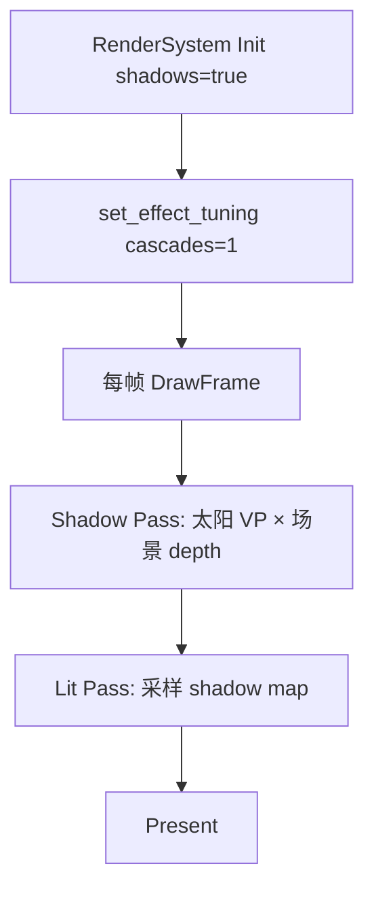

# Learn 10 — Shadow Map（方向光阴影）

> 开启 **`enable_shadows`**，用 **单级联（cascade=1）** 渲染地面 + 立方体，并在 **`Environment`** 里配置太阳方向——理解 **Shadow Pass → Lit Pass 采样 shadow map** 的最小闭环，以及 `effect_tuning` 与 `RenderSystemDesc` 如何一致打开阴影。

## 怎么跑

```powershell
cmake --build build --config Debug --target sample_10_shadow_map
build\samples\learn\10_shadow_map\Debug\sample_10_shadow_map.exe
```

Headless：

```powershell
build\samples\learn\10_shadow_map\Debug\sample_10_shadow_map.exe --headless --headless_frames=2
```

## 知识点

1. **双 Pass 阴影**：先 `BeginShadowPass` / `DrawShadowCubes` 写 depth atlas，再 lit pass 用 `light_view_proj` 比较深度。
2. **单 Cascade**：`fx.shadow_cascades = 1` 与 `LitDesc.enable_shadows = true`；日志 `cascade_count=1`，适合先学硬阴影不带级联分割。
3. **Environment 太阳**：`sun_direction = {0.4, -1, 0.3}`，`sun_intensity = 2.2`；与默认 FrameLighting 合并进 DrawFrame。
4. **场景布局**：`AddScene`：5×5 ground + cube 在 `{0, 0.5, -0.5}`，相机 `{0, 2.5, 6}` pitch `-0.3`，便于看见地面上的阴影。
5. **完整 shader 集**：LitDesc 含 `quad` / `post_ssao_taa` 路径（与 Sandbox 对齐）；本课 quality 仍 Low 且 SSAO/TAA off。
6. **effect_tuning**：`render.effect_tuning()` → 改 `enable_shadows` / `shadow_cascades` → `set_effect_tuning`，运行时与 Init desc 对齐。
7. **shadow acne / bias**：PATH 核心问；调节在 `FrameLighting::shadow_bias`（RenderSystem 填），本 demo 用引擎默认。

## 名词解释

| 术语 | 含义 |
|---|---|
| **Shadow Map** | 从光源视角渲染的深度图；lit 时比较当前深度。 |
| **Shadow Pass** | 深度-only pass；本引擎用 `shadow.vs/ps` + `DrawShadowCubes`。 |
| **light_view_proj** | 光源视图投影矩阵；单 cascade 时常用 cascade 0。 |
| **Cascade** | 视锥分割多级 shadow map；本课为 1。 |
| **shadow bias** | 深度比较微偏移，减轻 acne（自阴影条纹）。 |
| **effect_tuning** | RenderSystem 运行时效果开关（阴影级联数等）。 |

详见 [GLOSSARY.md](../../docs/learn/GLOSSARY.md) 与 CSM（CH12）条目。

## 原理



**与 `main.cpp` 逐步对齐：**

1. **LitDesc**  
   - `enable_shadows = true`  
   - lit + shadow + quad + post cso 路径  
   - Low quality，SSAO/TAA false

2. **AddScene**  
   - ground：scale 5×1×5，`never_cull`，bounds ±5  
   - cube：`{0, 0.5, -0.5}`，`mesh_id=cube`

3. **Environment**  
   - `sun_direction = {0.4, -1, 0.3}`  
   - `sun_intensity = 2.2`

4. **Init 后 tuning**  
   ```text
   fx = render.effect_tuning()
   fx.enable_shadows = true
   fx.shadow_cascades = 1
   render.set_effect_tuning(fx)
   Log cascade_count
   ```

5. **每帧**  
   - `DrawFrame(device, render_scene(), env, aspect)`  
   - 内部：算 cascade0 矩阵 → shadow pass 渲染 ground+cube → lit pass 带 `enable_shadows`

6. **视觉预期**  
   - 立方体在 ground 上投下软/硬边阴影（过滤取决于 shader）  
   - 无 CH12 多级联时，远距可能分辨率不足——为 CH12 铺垫

## 代码地图

| 符号 / 文件 | 说明 |
|---|---|
| `samples/learn/10_shadow_map/main.cpp` | `AddScene`、env 太阳、tuning、DrawFrame |
| `AddScene` | 本地函数；ground + cube |
| `RenderSystemDesc::enable_shadows` | Init 级阴影开关 |
| `RenderSystem::effect_tuning` / `set_effect_tuning` | 运行时级联数 |
| `RenderSystem::cascade_count()` | 日志验证 |
| `engine/render/environment.h` | 太阳方向/强度 |
| `IDevice::BeginShadowPass` 等 | RHI 阴影 pass |
| `shadow.vs/ps.cso` | 深度 pass 着色器 |

## 必做练习

1. **关阴影对比**：Init 后设 `fx.enable_shadows=false` 再 DrawFrame，描述地面 contact shadow 消失。
2. **改太阳方向**：`sun_direction = {-0.4, -1, 0}`，阴影投到 cube 哪一侧？
3. **PIX 两 Pass**：抓帧标出 shadow depth RT 与 lit 中 shadow SRV 绑定。
4. **故意 cascade 0 分辨率**：若引擎暴露 shadow map 尺寸设置，改小看清 texel 块状（可选，视 API 而定）。
5. **（口头）**：shadow acne 是什么？bias 过大又会怎样（peter panning）？
6. **对比 CH03**：CH03 `enable_shadows=false`；列出打开阴影多出的 pass 名（从 FrameGraph 日志或 CH11）。

## 常见坑

- **Init false 但 tuning true**：应两者一致；只改一处可能 DrawFrame 仍不走 shadow pass。
- **无 ground**：只有 cube 难看见投影；本课 ground 必留。
- **太阳平行光方向**：需 Normalize 的方向；env 字段在 RenderSystem 内会归一化（以实现为准），勿给零向量。
- **与 CH12 混淆**：本课 **1** cascade；CH12 为 **4** cascade + Medium quality。
- **post pass 路径必填**：LitDesc 列了 post/quad cso；缺文件 Init 失败——即使 SSAO/TAA off。
- **Headless**：可能无阴影可视化；看 `cascade_count` Log 与 DrawFrame 成功。
