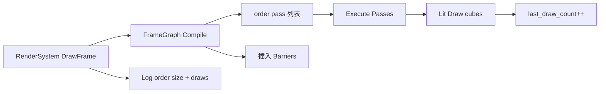

# Learn 11 — Frame Graph（帧图与 Pass 编排）

> 单立方体场景下每帧 **`DrawFrame` 后打印 `frame_graph().order().size()` 与 `last_draw_count()`**，理解 **RenderSystem 内部 FrameGraph** 如何把 Shadow/Lit/Post 等 pass 排成有序列表，以及默认 **headless 至少 2 帧** 便于 CI 观察日志。

## 怎么跑

```powershell
cmake --build build --config Debug --target sample_11_frame_graph
build\samples\learn\11_frame_graph\Debug\sample_11_frame_graph.exe
```

Headless（main 若未指定则默认 `headless_frames=2`；也可显式传参）：

```powershell
build\samples\learn\11_frame_graph\Debug\sample_11_frame_graph.exe --headless --headless_frames=2
```

## 知识点

1. **FrameGraph 声明式 Pass**：用 pass 读写资源描述一帧，编译出 **执行顺序** 与 **资源屏障** 插入点——业务 sample 只调 `DrawFrame`，读 `render.frame_graph()` 观测。
2. **order().size()**：当前帧编译后的 pass 数量；随 quality、阴影、后处理开关变化（本课 shadows off、SSAO/TAA off，列表较短）。
3. **last_draw_count()**：上一帧（或本帧）lit 侧 draw 次数统计；单 cube 通常为 small integer。
4. **全 shader 路径 LitDesc**：含 lit、shadow、quad、post、**debug_line**——与 Sandbox 对齐，FrameGraph 可挂载 debug pass 而本 demo 场景未用 debug 几何。
5. **默认 headless 帧数**：`ParseHeadless` 后若 `headless_frames <= 0` 则置 `2`，保证无参 headless 也能跑通并打两次 FG 日志。
6. **与 CH10 差异**：本课 **`enable_shadows=false`**，pass 列表应 **不含** shadow pass（或数量为 0 的 shadow 相关——以实现为准，对比 CH10 日志）。
7. **手动屏障 vs FG**：D3D12 需 UAV/RT/DS 屏障；FrameGraph 在 pass 边界自动插入——PATH 核心对比点。

## 名词解释

| 术语 | 含义 |
|---|---|
| **FrameGraph** | Pass 节点 + 资源依赖 DAG；编译后线性执行。 |
| **Pass** | 一次 GPU 工作段（Shadow、Lit、Post 等）。 |
| **Resource Barrier** | D3D12/Vulkan 资源状态转换；FG 编译产物。 |
| **order()** | 编译后 pass 名/顺序列表。 |
| **last_draw_count** | Draw call 统计，验证场景提交。 |
| **RenderSystem::frame_graph()** | 访问当前帧图对象（只读观测）。 |

详见 [GLOSSARY.md](../../docs/learn/GLOSSARY.md) 中 FrameGraph 条目。

## 原理



**与 `main.cpp` 逐步对齐：**

1. **Headless 默认**  
   - `ParseHeadless` 后：`if (desc.headless_frames <= 0) desc.headless_frames = 2`  
   - 注意：仅当 ApplicationDesc 走 headless 分支时生效；窗口模式不受影响

2. **场景**  
   - 单 `cube` 节点 `{0, 0.5, 0}`，`mesh_id=cube`

3. **LitDesc**  
   - shadows **false**  
   - lit + shadow + quad + post + **debug_line** cso  
   - Low quality，SSAO/TAA off

4. **每帧 Run**  
   - `DrawFrame(...)` — 失败 LogError return  
   - 成功则：  
     ```text
     LogInfo("FrameGraph passes this frame: " + order().size() +
             " draws=" + last_draw_count())
     ```

5. **解读日志（典型）**  
   - pass 数 > 0：至少含 Clear/Lit/Present 或等价内部 pass  
   - draws ≥ 1：cube 被提交  
   - 与 CH10 并排跑，pass 数 CH10 ≥ CH11（多 shadow pass）

6. **FG 不负责游戏逻辑**  
   - 本 demo 不手动 `AddPass`；全在 RenderSystem 内根据 desc/tuning/scene 构建

## 代码地图

| 符号 / 文件 | 说明 |
|---|---|
| `samples/learn/11_frame_graph/main.cpp` | DrawFrame + FG 日志 |
| `RenderSystem::frame_graph()` | 返回帧图引用 |
| `FrameGraph::order()` | pass 顺序容器 |
| `RenderSystem::last_draw_count()` | draw 统计 |
| `engine/render/frame_graph*.cpp` | 编译与执行实现 |
| `RenderSystem::DrawFrame` | 构建 scene → 编译 FG → 执行 |
| `debug_line.*.cso` | LitDesc 列出；FG 可能注册 debug pass |
| CMake `sample_11_frame_graph` | sandbox shaders |

## 必做练习

1. **记录 baseline**：窗口模式运行，抄下 pass 数与 draws，作为无 shadow 基线。
2. **对比 CH10**：复制 CH10 的 `enable_shadows=true` 到本 demo LitDesc（本地实验），pass 数如何变？
3. **开 SSAO（若 API）**：在 `LitDesc.quality.enable_ssao=true` 试跑，pass 是否增加 post 相关节点？
4. **读 frame_graph 源码**：找一个 pass 注册点，写出其读写的 RT 资源名（以代码为准）。
5. **（口头）**：手动 D3D12 在 lit→post 间要插什么 barrier？FG 如何知道要插？
6. **Headless 两帧 Log**：确认两行 pass 日志 draws 稳定为 1（单 cube）。

## 常见坑

- **以为 main 里构建 FG**：本课只 **观测** `frame_graph()`；改 pass 要去 RenderSystem/Resolve 函数。
- **order().size()=0**：DrawFrame 失败或 FG 未编译；先查 DrawFrame 返回值与 Init。
- **shadow cso 路径仍必填**：shadows false 仍列 shadow shader；缺 cso Init 失败。
- **日志每帧刷屏**：学习目的；可加 `frame_index % 60` 节流做练习。
- **与 CH11 PATH「全屏 Post」**：必修结束标准提到加 Post Pass；本 demo 未教手写 AddPass，见 CH16 post_stack。
- **headless_frames 默认 2 仅 main 设置**：无 `--headless` 时窗口模式不会强制 2 帧退出。
