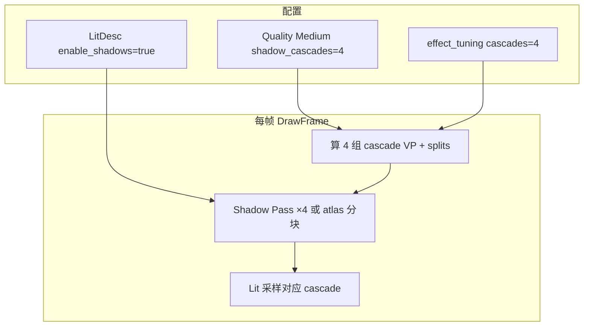

# Learn 12 — CSM（级联阴影）【选修】

> 在大地面 + 立方体场景上开启 **4 级联 CSM**（`QualityTier::Medium`、`shadow_cascades=4`），配置 **`Environment` 太阳方向**，用 **`RenderSystem::DrawFrame`** 观察远近距离阴影分辨率改善——选修章，**需先完成 CH10 单 cascade 阴影**。

## 怎么跑

```powershell
cmake --build build --config Debug --target sample_12_csm
build\samples\learn\12_csm\Debug\sample_12_csm.exe
```

Headless（main 默认 `headless_frames=2` 若未指定）：

```powershell
build\samples\learn\12_csm\Debug\sample_12_csm.exe --headless --headless_frames=2
```

## 知识点

1. **CSM（Cascaded Shadow Maps）**：把视锥沿深度分成多级，每级独立 shadow map，近处 texel 密度高、远处覆盖大。
2. **本 demo 固定 4 级联**：`LitDesc.quality.shadow_cascades = 4` 且 `effect_tuning.shadow_cascades = 4`；日志 `CSM cascades=4`。
3. **Medium Quality**：比 CH10/11 的 Low 档高一级，对齐产品 Medium 阴影配置入口。
4. **大场景 ground**：scale **12×12**（CH10 为 5×5），相机 `{0, 3, 10}` pitch `-0.25`，更容易看出远距 cascade 差异。
5. **Environment 太阳**：`sun_direction = {0.35, -1, 0.25}`；与 shadow pass 光源矩阵一致来源。
6. **enable_shadows 双处 true**：`LitDesc.enable_shadows` + `fx.enable_shadows`，与 CH10 相同模式。
7. **级联调试（概念）**：产品可能用 debug 色染 cascade index；本 main 未开 debug 线，练习可接 CH11 debug pass 或引擎 tuning。

## 名词解释

| 术语 | 含义 |
|---|---|
| **CSM** | Cascaded Shadow Maps；方向光多级联阴影。 |
| **Cascade Split** | 视锥深度分割距离；写入 `FrameLighting::cascade_splits`。 |
| **cascade_view_proj** | 每级联光源 VP 数组；最多 4 组（本 demo）。 |
| **shadow_cascades** | 级联数量；Quality 与 effect_tuning 均应一致。 |
| **QualityTier::Medium** | 质量档；影响 shadow 分辨率/级联等默认值。 |
| **Texel density** | 每世界单位 shadow 像素数；CSM 缓解远距糊影。 |

详见 [GLOSSARY.md](../../docs/learn/GLOSSARY.md) 中 CSM 条目。

## 原理



**与 `main.cpp` 逐步对齐：**

1. **Headless**  
   - 同 CH11：`headless_frames <= 0` → 置 2

2. **相机**  
   - `{0, 3, 10}`，pitch `-0.25`

3. **场景**  
   - ground：scale `{12, 1, 12}`，`mesh_id=ground`，`never_cull=true`（**未**写 local_bounds，与 CH10 ground 略异——大平面仍靠 never_cull）  
   - cube：`{0, 0.5, 0}`

4. **Environment**  
   - `sun_direction = {0.35, -1, 0.25}`

5. **LitDesc**  
   - `enable_shadows = true`  
   - `QualityTier::Medium`  
   - `quality.shadow_cascades = 4`  
   - SSAO/TAA false  
   - lit + shadow + quad + post cso

6. **Init 后**  
   ```text
   fx.enable_shadows = true
   fx.shadow_cascades = 4
   set_effect_tuning(fx)
   Log "CSM cascades=" + cascade_count()
   ```

7. **每帧**  
   - `DrawFrame(device, render_scene(), env, aspect)`  
   - GPU：按 splits 选 cascade 采样；近 cube 与远 ground 交界可能出现 cascade seam（练习观察）

8. **与 CH10 对比**  
   | 项 | CH10 | CH12 |
   |---|---|---|
   | cascades | 1 | 4 |
   | quality | Low | Medium |
   | ground scale | 5 | 12 |
   | 相机 z | 6 | 10 |

## 代码地图

| 符号 / 文件 | 说明 |
|---|---|
| `samples/learn/12_csm/main.cpp` | 大 ground、4 CSM、tuning、DrawFrame |
| `QualitySettings::FromTier(Medium)` | 默认 Medium 阴影参数 |
| `quality.shadow_cascades` | Init 级联数 |
| `RenderSystem::cascade_count()` | 日志验证为 4 |
| `FrameLighting::cascade_view_proj` | GPU 四级联矩阵 |
| `FrameLighting::cascade_splits` | 分割距离 |
| `BindShadowCascade` | RHI 选级联 tile（设备层） |
| CH10 `10_shadow_map/main.cpp` | 单 cascade 前置课 |

## 必做练习

1. **并排 CH10**：同机运行 10 与 12，拉远相机看 ground 远距阴影边缘 CH12 是否更清晰。
2. **改 cascades=1**：仅本地把 tuning 改为 1，对比 pass 时间与视觉（验证 cascade_count Log）。
3. **walk 级联缝**：在地面上找 cascade 边界 shimmer/seam，口头解释 split 计算不准时的表现。
4. **PIX**：shadow atlas 是否 2×2 tile 或类似布局；标 4 个 cascade 区域。
5. **（口头）**：为何不用一张超大 shadow map 代替 CSM？
6. **（选修）**：若引擎有 cascade debug 染色，打开并截图说明色块含义。

## 常见坑

- **未学 CH10 直接学 CSM**：单 cascade 阴影 pass 与 bias 都不熟时，CSM 调试难度陡增——按 PATH 顺序来。
- **Init 与 tuning 级联数不一致**：例如 quality=4 但 fx=1，行为以 RenderSystem 合并规则为准，可能只跑 1 级——保持都为 4。
- **ground 无 local_bounds**：大平面依赖 `never_cull`；若剔除异常，对比 CH10 给 bounds 的写法。
- **Medium 更重**：4 cascade shadow 比 CH10 贵；笔记本风扇响属正常，Headless 不衡量 GPU 时间。
- **post/quad cso 仍需要**：与 CH10 相同依赖 sandbox shaders 全量路径。
- **选修标记**：本章在产品完整度轨；必修结束标准（CH11 + Post）不强制 CSM，但引擎岗位常需。
