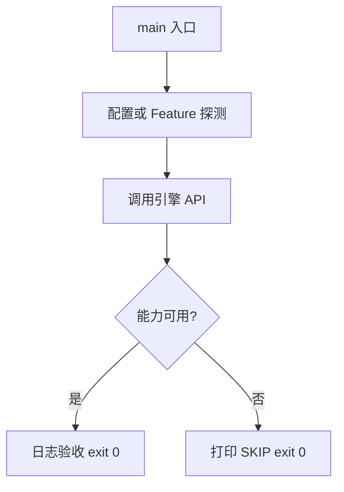

# Learn 13 — Environment 雾与质量档（选修）

> 配置 Environment 雾/曝光，对比 QualityTier 三档差异，并以 Medium 档 DrawFrame 冒烟。

**前提**：CH07 场景与 RenderSystem；建议已读 CH10/CH16 对阴影与 Post 有印象。  
**对齐里程碑**：M5–M6

## 怎么跑

```powershell
cmake -B build -DENGINE_BUILD_LEARN_SAMPLES=ON
cmake --build build --config Debug --target sample_13_environment_quality
build\samples\learn\13_environment_quality\Debug\sample_13_environment_quality.exe --headless --headless_frames=2
```

CMake target：**`sample_13_environment_quality`**。依赖 `sample_sandbox_shaders`（lit/shadow/quad/post）。

| 参数 | 作用 |
|---|---|
| `--headless` | 无窗口 / 冒烟模式 |
| `--headless_frames=N` | Application 路径下限制帧数 |

## 知识点

1. **Environment 是场景默认旋钮集合**：ambient/clear/sun/fog/IBL 路径与大气开关集中在一个 hub。
2. **QualityTier 是模板**：`FromTier` 填 cascades、vegetation_cap、bloom/ssao/taa 等。
3. **雾与质量档解耦**：雾在 Environment；SSAO/Bloom 在 QualitySettings。
4. **ApplyEnvironmentDefaults**：把 Environment 拷进 EffectTuning，避免开关不同步。
5. **教学日志**：启动打印三档关键字段，便于 headless grep。
6. **本 demo 关阴影**：认知焦点在雾与档位。
7. **大气/体积云默认关**：`enable_atmosphere` 才会走 CoupleFog 染色。
8. **曝光**：`env.exposure` 与 CH16 tonemap 联动。
9. **Sandbox 同源**：F1 质量档使用同一 `FromTier`。
10. **改档要重新 Apply**：不要假设 RenderSystem 自动感知全局变量。
11. **清屏色也属 Environment**：`clear_color` 与雾色常一起调。
12. **IBL 路径字段**：本章未填 IBL 三件套，避免与 CH09 混淆。

## 名词解释

| 术语 | 含义 |
|---|---|
| **Environment** | 天空/雾/IBL/曝光默认值容器 |
| **QualityTier** | Low/Medium/High 质量模板 |
| **QualitySettings** | 档位展开后的开关与数值 |
| **fog_density** | 指数雾密度近似 |
| **EffectTuning** | 运行时 FX 旋钮 |
| **vegetation_cap** | 植被实例上限 |
| **ApplyEnvironmentDefaults** | env→tuning 同步 |
| **sun_intensity** | 方向光强度默认 |

详见 [GLOSSARY.md](../../docs/learn/GLOSSARY.md)。

## 原理

### 启动数据流

1. 打印 Low/Medium/High 的 cascades、veg_cap、bloom、ssao。
2. 创建 Application 与 cube 节点。
3. 开启雾并设置 density/start/color。
4. `RenderSystem::Init(Medium)` → `ApplyEnvironmentDefaults` → 每帧 `DrawFrame`。

### 分层动机

艺术向默认（Environment）与性能向档位（Quality）分开，UI 可切档而不重写场景资产。



本 demo 的 README 与 `main.cpp` 路径一致；未实现的能力只写 SKIP，不假装画质。

## 代码地图

| 符号 / 文件 | 说明 |
|---|---|
| `main.cpp` | 档位日志 + 雾 + DrawFrame |
| `LitDesc` | Medium 档着色器路径 |
| `engine/render/environment.h` | Environment 字段 |
| `engine/render/quality.cpp` | FromTier 实现 |
| `RenderSystem::ApplyEnvironmentDefaults` | 同步雾/曝光 |
| CMake `sample_13_environment_quality` | 本 sample 目标 |

## 必做练习

1. ★ 把 `fog_density` 从 0.035 改到 0.1，观察远景。
2. ★★ 切到 High 档 Init，确认日志 `veg_cap=48`。
3. ★★★（选做）打开 `enable_atmosphere` 并阅读 CoupleFog。

## 常见坑

- 忘记 `ApplyEnvironmentDefaults` 导致雾开关不同步。
- Headless 下看不到雾，只信日志与 Init 成功。
- 把 QualityTier 当每帧必改对象——应缓存 Settings。
- 误以为关阴影等于关雾。

## 延伸阅读

- 章节：[docs/learn/chapters/](../../docs/learn/chapters/)
- 路径：[PATH.md](../../docs/learn/PATH.md)
- 规范：[SAMPLES.md](../../docs/learn/SAMPLES.md)
