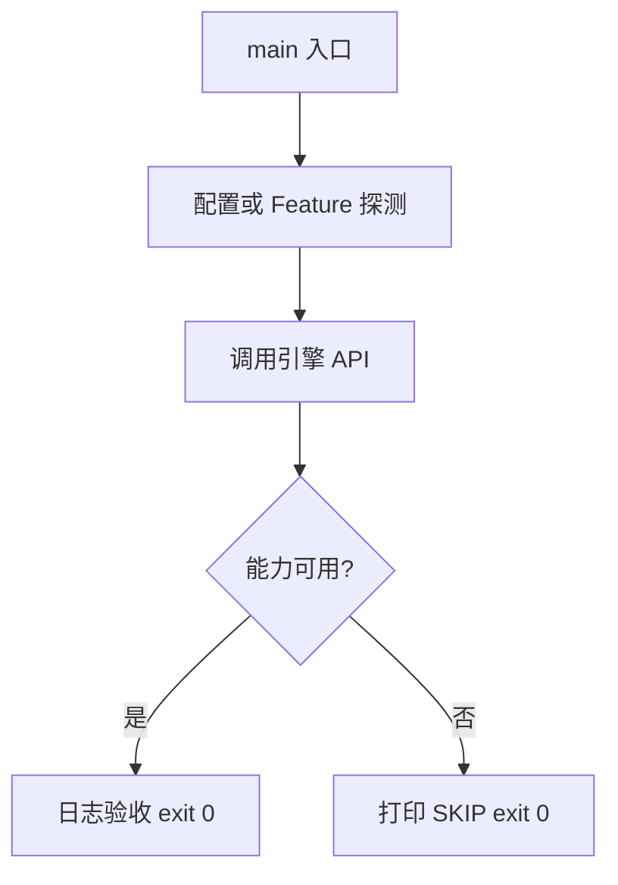

# Learn 14 — 蒙皮与 SkinPose（选修）

> 用最小 Skeleton/AnimationClip 采样 SkinPose，CPU 蒙皮一点，并探测 GpuSkinningAvailable。

**前提**：线性代数基础；CH04 变换矩阵。  
**对齐里程碑**：M6

## 怎么跑

```powershell
cmake -B build -DENGINE_BUILD_LEARN_SAMPLES=ON
cmake --build build --config Debug --target sample_14_skinning
build\samples\learn\14_skinning\Debug\sample_14_skinning.exe --headless --headless_frames=2
```

CMake target：**`sample_14_skinning`**。纯 CPU/契约冒烟，无窗口依赖。

| 参数 | 作用 |
|---|---|
| `--headless` | 无窗口 / 冒烟模式 |
| `--headless_frames=N` | Application 路径下限制帧数 |

## 知识点

1. **Skeleton + InverseBind**：关节层次与绑定姿势逆矩阵。
2. **AnimationClip 按轨采样**：每关节一组 key（t/rot/trans）。
3. **SkinPose.bone_matrices**：采样后的骨矩阵，供 VS 或 CS 使用。
4. **SkinVertexCpu**：最多 4 骨加权，教学用参考实现。
5. **GpuSkinningAvailable**：Feature/着色器就绪探测；假则走 stub。
6. **SkinVerticesGpuDispatchStub**：与 GPU CS 同契约的 CPU 参考。
7. **本 sample 不加载 glTF**：聚焦数据结构，skinned 资产在 cook/Sandbox。
8. **Morph 另见 CH27**：`ApplyMorphTargets` 与蒙皮可组合。
9. **跨后端**：W8/W9 加深 VK 蒙皮；缺 SPIR-V 则 Unavailable。
10. **权重归一**：生产路径应保证 bone weights 和为 1。
11. **不要在 in-flight 中释放骨骼 CB**：与 CH05 同理。
12. **教学开关**：可强制 CPU 路径对比 GPU。

## 名词解释

| 术语 | 含义 |
|---|---|
| **Skeleton** | 关节层次与 inverse bind |
| **SkinPose** | 某时刻骨矩阵数组 |
| **AnimationClip** | 按关节分轨的关键帧动画 |
| **Inverse bind** | 绑定姿势到模型空间的逆变换 |
| **GPU skinning** | Compute/VS 蒙皮热路径 |
| **Feature gpu_skinning** | 运行时开关/能力位 |
| **4-bone blend** | 常见顶点蒙皮上限 |

详见 [GLOSSARY.md](../../docs/learn/GLOSSARY.md)。

## 原理

### 步骤

1. 构造 2 关节骨架与一段 clip。
2. `SampleClip(..., 0.5)` 得 SkinPose。
3. `SkinVertexCpu` 验证单点。
4. `SkinVerticesGpuDispatchStub` + `GpuSkinningAvailable` 日志。

### 与产品路径

产品 glTF skinned mesh 最终写入同一 SkinPose 契约；GPU CS（`skin_cs`）在 Feature 开启且着色器存在时替换 stub。



本 demo 的 README 与 `main.cpp` 路径一致；未实现的能力只写 SKIP，不假装画质。

## 代码地图

| 符号 / 文件 | 说明 |
|---|---|
| `main.cpp` | 骨架/clip/采样/蒙皮 |
| `engine/animation/skeleton.h` | API 声明 |
| `SampleClip` | 关键帧采样 |
| `SkinVertexCpu` | 单顶点 CPU 蒙皮 |
| `GpuSkinningAvailable` | GPU 路径探测 |
| CMake `sample_14_skinning` | 本 sample 目标 |

## 必做练习

1. ★ 改 clip 在 t=0.5 的平移，观察 SkinVertexCpu y 变化。
2. ★★ 加第三关节并扩展 tracks。
3. ★★★（选做）对比 stub 与 `SkinVerticesComputeCpuReference` 输出。

## 常见坑

- tracks 数量必须等于 joints。
- 忘记 inverse bind 会导致「漂」。
- 权重未归一造成缩放漂移。
- 把 GpuSkinningAvailable=false 当成错误——应 SKIP/降级。

## 延伸阅读

- 章节：[docs/learn/chapters/](../../docs/learn/chapters/)
- 路径：[PATH.md](../../docs/learn/PATH.md)
- 规范：[SAMPLES.md](../../docs/learn/SAMPLES.md)
