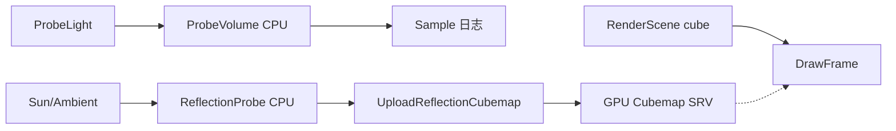

# Learn 15 — 反射探针与简化 GI

> 在 CPU 侧配置 **ProbeVolume（漫反射 GI 占位）** 与 **ReflectionProbe（动态 cubemap 占位）**，并把反射数据上传到 GPU，理解 M6/M8 全局光照的数据契约与渲染路径衔接。

**前提**：已完成 CH09 PBR/IBL 概念（可空路径）、CH07 场景与 `RenderSystem::DrawFrame`。  
**对齐里程碑**：M6/M8（GI 数据面，非最终画质）。

## 怎么跑

```powershell
# 配置时打开学习 Sample（若尚未）
cmake -B build -DENGINE_BUILD_LEARN_SAMPLES=ON
cmake --build build --config Debug --target sample_15_probes_gi
build\samples\learn\15_probes_gi\Debug\sample_15_probes_gi.exe --headless --headless_frames=2
```

窗口模式直接双击或省略 `--headless` 亦可；日志会打印 `Probe GI sample r=...` 供 headless 冒烟。

| 参数 | 作用 |
|---|---|
| `--headless` | 无窗口；默认 2 帧后退出 |
| `--headless_frames=N` | 指定 headless 帧数 |

着色器依赖 `sample_sandbox_shaders` 产物（`lit_cube`、`shadow`、`quad`、`post_ssao_taa` 等 `.cso`）。CMake target 名：**`sample_15_probes_gi`**。

## 知识点

1. **ProbeVolume 是 CPU stub**：在规则网格上放置探针，用点光源反算 irradiance，再对 world 位置做近似采样——不是 Lumen/RTX GI。
2. **ReflectionProbe 是环境占位**：`UpdateFromEnvironment` 用太阳方向 + 环境色生成 6 面 RGBA8 cubemap，直到有完整场景 capture 管线。
3. **GPU 上传契约**：`IDevice::UploadReflectionCubemap` 接收 face-major 字节流；与 IBL 三件套路径不同，本章走「单探针动态 cubemap」。
4. **与 RenderSystem 的关系**：本 demo 仍走 `DrawFrame` 画 lit cube；GI 数据在帧外准备，着色器侧完整 SH/IBL 混合视 Feature 与质量档而定。
5. **质量档 Low + 关阴影**：`LitDesc()` 故意简化，把认知焦点放在 probe 数据流而非 CSM/TAA。
6. **Probe 网格参数**：`Configure(origin, spacing, nx, ny, nz)` 决定 probe 世界位置；本 demo 为 2×2×2、spacing 2m。
7. **采样点与日志**：`Sample({0.4,0.4,0.4})` 在启动时执行一次，用于验证 CPU 路径无需 GPU 即可观测。
8. **Reflection face_size**：本 demo 为 32；上传字节数 = 6 × 32 × 32 × 4。
9. **Lightmap SKIP**：PATH 标题含 Lightmap，本 sample **未实现** 烘焙 lightmap，仅 probe + reflection。
10. **模块边界**：`engine_gi` 提供数据结构；RHI 负责 upload；RenderSystem 负责最终 composite（CH26 更完整）。

## 名词解释

| 术语 | 含义 |
|---|---|
| **ProbeVolume** | 规则 3D 网格上的 irradiance 探针集合；CPU 更新、CPU 采样。 |
| **ProbeLight** | 驱动 probe 更新的简化点光（位置、颜色、强度、范围）。 |
| **ReflectionProbe** | 局部反射 cubemap；本引擎用 CPU 生成 6 面再上传 GPU。 |
| **Irradiance** | 漫反射间接光近似；probe 存 per-probe RGBA 占位值。 |
| **Cubemap upload** | 6 × face_size² × 4 字节 RGBA8，按 face 顺序排列。 |
| **GI stub** | 教学/契约层：数据结构正确、效果可观察，算法可后续替换。 |
| **face-major** | 六面顺序 +x,-x,+y,-y,+z,-z 各自一块连续 RGBA8。 |
| **dirty 标志** | ReflectionProbe 更新后标记，直到 GPU 消费/upload。 |
| **Environment** | 天空/雾/IBL 一体配置；本章未填 IBL 三路径。 |
| **RenderScene** | 从场景树抽取的可提交快照；cube 节点进入 lit pass。 |

详见 [GLOSSARY.md](../../docs/learn/GLOSSARY.md) 中 IBL、Environment、RenderScene 等条目。

## 原理

### 启动阶段（帧外）

```text
ProbeVolume.Configure({0,0,0}, {2,2,2}, 2, 2, 2)
ProbeLight @ (0.5,0.5,0.5), intensity=6, range=4
ProbeVolume.UpdateFromLights({light})
gi = ProbeVolume.Sample({0.4,0.4,0.4})  → LogInfo

ReflectionProbe.Configure({0,1,0}, face_size=32)
ReflectionProbe.UpdateFromEnvironment(sun_dir, sun_color, sun_intensity, ambient)
device.UploadReflectionCubemap(rgba_faces, 32)

RenderSystem.Init(LitDesc)  // Low, shadows off
Application.Run → DrawFrame(cube)
```

### Probe 更新算法（CPU）

1. 对每个 probe 中心 `P`，初始化 irradiance 为环境底噪（实现相关）。
2. 对每个 `ProbeLight`：计算 `d = |P - L|`，若 `d > range` 跳过。
3. 衰减：`contrib = color * intensity * saturate(1 - d/range)`（示意；以 `probe_volume.cpp` 为准）。
4. 累加到 `Probe::irradiance`。

### Probe 采样

- `Sample(world_pos)`：将 world 映射到网格 cell，取最近 probe 或简化插值。
- 本 demo 采样一次写日志；游戏运行时可在 lit PS 或 CPU 顶点色实验性读取。

### Reflection 占位 cubemap

- `UpdateFromEnvironment` 不 re-render 场景；按 sun/ambient 填充六面渐变色。
- 产品路径应替换为 **capture pass**（6 面 RT 或 geometry shader / compute）。

### 渲染帧

- `Application` 创建 `cube` 节点，`mesh_id="cube"`。
- `DrawFrame` 走标准 shadow（关）→ lit → post（Low 档可能简化 post）。



## 代码地图

| 符号 / 文件 | 说明 |
|---|---|
| `samples/learn/15_probes_gi/main.cpp` | 入口；probe 配置、上传、主循环 |
| `ParseHeadless` | 与其他 learn sample 统一的 headless CLI |
| `LitDesc()` | Low tier、`enable_shadows=false`、post 着色器路径 |
| `engine/gi/probe_volume.h` | `ProbeVolume` / `ProbeLight` / `Probe` |
| `engine/gi/probe_volume.cpp` | CPU 更新与 `Sample` |
| `engine/gi/reflection_probe.h` | `UpdateFromEnvironment`、`rgba_faces()` |
| `engine/gi/reflection_probe.cpp` | 六面 RGBA 生成 |
| `IDevice::UploadReflectionCubemap` | RHI 上传（D3D12 主路径） |
| `RenderSystem::Init` / `DrawFrame` | 标准 lit 帧 |
| `Application::world()` | 场景节点 `CreateNode` / `set_mesh` |
| CMake `sample_15_probes_gi` | `engine_app` + `engine_d3d12` + `engine_gi` |

## 必做练习

1. 修改 `ProbeLight` 的 `position` / `color`，重新运行，确认日志中 `Probe GI sample r=` 变化。
2. 把 `ProbeVolume` 网格改为 `4×4×4`，打印 `probes().size()`，解释与 2×2×2 的关系。
3. 对比本章 `ReflectionProbe` 与 CH09 `Environment` IBL 三件套：各自解决什么问题？能否同时存在？
4. 在 `reflection_probe.cpp` 找到 `UpdateFromEnvironment`，口头解释为何是「占位 cubemap」而非场景 re-render。
5. 把 `face_size` 改为 64，计算上传字节数是否 = 6×64×64×4；若 Init/upload 失败，读 Status 消息。
6. 打开 `probe.set_enabled(false)`（若 API 可用），观察 `Sample` 是否仍返回默认值。
7. （可选）PIX 抓帧：lit pass 与 upload/copy pass 的 resource barrier 顺序。
8. （口头）若 probe 每帧随光动，应放在 `Run` 内还是 async job？对 in-flight 有何要求？

## 常见坑

- **把 CPU GI 当成最终画质**：本章重点是 **数据契约**；真实动态 GI 在 CH35 / Sandbox 开关。
- **Lightmap 未实现**：勿假设烘焙 lightmap 已接入；练习中只讨论 probe/reflection。
- **未先编 shader**：缺 `.cso` 时 `RenderSystem::Init` 失败；需 build target 触发 `sample_sandbox_shaders`。
- **Vulkan parity**：反射 upload 在 Vulkan 可能是 stub；D3D12 为学习默认路径。
- **Headless 看不到 cubemap 视觉**：靠日志；视觉验证需窗口 + CH26 `enable_reflection_probe`。
- **Sample 与 shading 脱节**：启动时 CPU Sample 不等于像素里已用 probe；需后续 effect 打开。
- **Probe 网格 spacing 误解**：spacing 是格点间距，不是包围盒尺寸；Configure 第三参起是 **数量** nx,ny,nz。
- **忘记链 engine_gi**：CMake 已处理；若复制 sample 模板勿漏 `target_link_libraries`。
