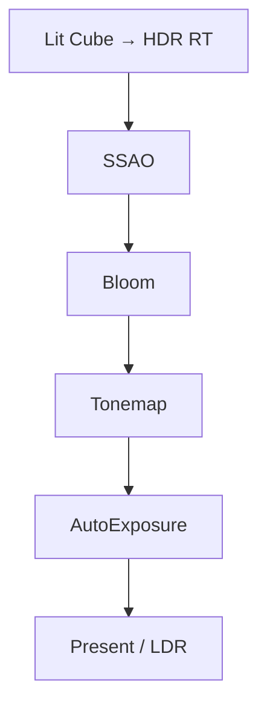

# Learn 16 — 后处理栈（Post Stack）

> 通过 **QualitySettings + EffectTuning + PostStack** 组合开启 Bloom、Tonemap、AutoExposure 与 SSAO，理解 M6–M7 后处理「配置 → Pass 列表 → 帧末全屏链」的分层方式。

**前提**：CH11 FrameGraph 概念、CH07 `RenderSystem::DrawFrame`。  
**对齐里程碑**：M6–M7。

## 怎么跑

```powershell
cmake --build build --config Debug --target sample_16_post_stack
build\samples\learn\16_post_stack\Debug\sample_16_post_stack.exe --headless --headless_frames=2
```

窗口模式下可观察 bloom 光晕与 tonemap 对比度；headless 验证 `DrawFrame` 与 `Post passes: N` 日志。

| 验收日志 | 含义 |
|---|---|
| `Post passes: N` | `EnabledPassNames().size()`，N>0 表示栈非空 |
| 无 `LogError` | Init 与每帧 Draw 成功 |

CMake target：**`sample_16_post_stack`**。着色器：`post_ssao_taa.vs/ps.cso` + lit/shadow/quad。

## 知识点

1. **两层开关**：`QualitySettings` 决定栈里有哪些 Pass；`EffectTuning` 调参数；`set_post_enabled(name, on)` 按名字启停。
2. **Bloom 链**：Medium 档 + `enable_bloom`；阈值与强度在 `bloom_threshold`、`bloom_intensity`。
3. **Tonemap + 曝光**：`enable_tonemap`、`enable_auto_exposure`、`exposure=1.25f` 控制 HDR→LDR。
4. **本章 TAA 关闭**：`enable_taa=false`，避免与 bloom/tonemap 学习目标混淆；CH24 再开 TAA。
5. **SSAO 在本栈**：quality 开 SSAO，使用 depth/normal 近似 AO；与 GTAO 产品路径可能不同。
6. **ApplyEffectToQuality**：`set_effect_tuning` 后 RenderSystem 同步 quality 布尔，减少「旋钮开了 Pass 未进栈」。
7. **Post 全屏 draw**：共用 `quad.vs/ps` 或专用 post VS + post PS；输入为 offscreen HDR RT。
8. **阴影关闭**：`enable_shadows=false` 减少变量；post 仍可通过 SSAO 产生 contact darkening。
9. **日志驱动验收**：headless CI 读 pass 数量，不依赖 golden 图像。
10. **Sandbox 同源**：Sandbox UI 写的也是 `EffectTuning`；本章是编程式等价操作。

## 名词解释

| 术语 | 含义 |
|---|---|
| **PostStack** | 按名字管理的后处理 Pass 列表；由 quality 初始化。 |
| **EffectTuning** | 运行时 FX 旋钮（曝光、bloom、雾、SSR 等）。 |
| **QualitySettings** | 质量档模板：SSAO/TAA/Bloom 等布尔与数值。 |
| **Bloom** | 高亮提取 → 模糊 → 加回，模拟镜头溢光。 |
| **Tonemap** | HDR 映射到显示范围；`tonemap_mode` 0/1/2。 |
| **Auto Exposure** | 根据场景亮度自动调整曝光；`auto_exposure_key` 等。 |
| **SSAO** | 屏幕空间环境光遮蔽。 |
| **HDR 中间 RT** | Lit 输出常为 float 格式，post 再 tonemap 到 swapchain。 |
| **Full-screen triangle** | 常用 quad/triangle 覆盖屏幕绘制 post。 |
| **Pass 名** | 字符串键，如 `"Bloom"`、`"Tonemap"`；大小写敏感。 |

详见 [GLOSSARY.md](../../docs/learn/GLOSSARY.md) 中 FrameGraph、TAA、GTAO/SSAO。

## 原理

### LitDesc 配置

```text
quality = QualityTier::Medium
quality.enable_ssao = true
quality.enable_taa = false
quality.enable_bloom = true
enable_shadows = false
post_vs/ps = post_ssao_taa.*
```

### 启动后 FX 写入

```text
fx = render.effect_tuning()
fx.enable_bloom / enable_tonemap / enable_auto_exposure = true
fx.exposure = 1.25f
render.set_effect_tuning(fx)

render.set_post_enabled("Bloom", true)
render.set_post_enabled("Tonemap", true)
render.set_post_enabled("AutoExposure", true)

Log: Post passes: EnabledPassNames().size()
```

### 每帧 DrawFrame

1. 从 `RenderScene` 收集 cube draw。
2. Lit pass 写入 HDR color + depth。
3. PostStack 按序执行 enabled pass（SSAO → Bloom → Tonemap → AutoExposure 等，以代码注册为准）。
4. 最终 blit/present 到 swapchain。



### 与 CH24 分界

| 特性 | CH16 | CH24 |
|---|---|---|
| TAA | 关 | 开 |
| 局部光阴影 | 无 | 有 |
| Bloom/Tonemap | 重点 | 可能仍开 |

## 代码地图

| 符号 / 文件 | 说明 |
|---|---|
| `samples/learn/16_post_stack/main.cpp` | LitDesc、effect、post 启停 |
| `engine/render/render_system.h` | `EffectTuning`、`set_post_enabled` |
| `engine/render/render_system.cpp` | `ApplyEffectToQuality`、`DrawFrame` |
| `engine/post/post_stack.h` | Pass 列表 API |
| `engine/post/post_stack.cpp` | `Configure`、`EnabledPassNames` |
| `engine/render/quality.h` | `QualityTier::Medium` |
| `engine/render/frame_graph.h` | Pass 节点与资源 lifetime |
| `post_ssao_taa.vs/ps.cso` | 组合 post 着色器 |
| CMake `sample_16_post_stack` | engine_app + d3d12 |

## 必做练习

1. 关 `set_post_enabled("Bloom", false)`，对比光晕；再只关 Tonemap，观察过曝。
2. 把 `exposure` 改为 `0.5` 与 `2.5`，理解手动曝光与 auto exposure 分工。
3. 打印 `EnabledPassNames()` 每一项，对照 `post_stack.cpp` 注册顺序。
4. 临时打开 TAA（quality + effect），观察与 bloom 叠加的亮度变化。
5. PIX 抓帧：标 lit RT → SSAO → Bloom → backbuffer 的资源与 barrier。
6. 把 `QualityTier` 改为 Low，看 pass 数是否减少；解释 Medium 模板多了什么。
7. 设 `enable_auto_exposure=false` 但 pass 仍 enabled，观察行为（应无统计或固定曝光）。
8. （口头）为何 post 要在 lit **之后**？若在 lit 之前做 SSAO 会怎样？

## 常见坑

- **只改 EffectTuning 不调 PostStack**：部分 Pass 需 `set_post_enabled` 或 quality 布尔同时为 true。
- **TAA 与 bloom 顺序**：时域效果改变亮度；本章故意关 TAA。
- **Headless 无视觉**：只验证不崩溃； bloom/tonemap 需窗口。
- **Pass 名拼写**：须与 `PostStack` 注册名完全一致（如 `"AutoExposure"`）。
- **shadow shader 路径仍必填**：`enable_shadows=false` 但 Desc 仍填 shadow `.cso`；缺文件 Init 失败。
- **以为 FXAA 在本课**：PATH 提 FXAA；本 demo 用 SSAO+bloom+tonemap 组合，FXAA 可能在其他 tier。
- **exposure 与 tonemap 重复调**：两者都影响亮度；练习时一次只改一个变量。
- **Medium 不等于全开**：仍有关闭的 TAA、阴影等；读 `LitDesc()` 全文。
