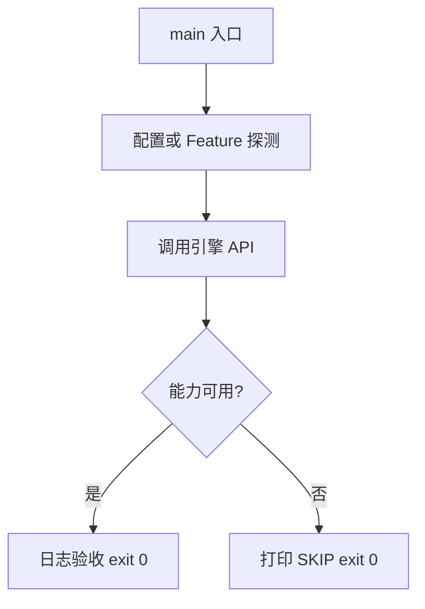

# Learn 17 — 粒子 / Trail（选修）

> 驱动 CPU ParticleEmitter 与 TrailRibbon，理解 VFX 数据面与 DebugDraw 代理显示。

**前提**：CH07 场景概念；DebugDraw 可选。  
**对齐里程碑**：M7

## 怎么跑

```powershell
cmake -B build -DENGINE_BUILD_LEARN_SAMPLES=ON
cmake --build build --config Debug --target sample_17_vfx
build\samples\learn\17_vfx\Debug\sample_17_vfx.exe --headless --headless_frames=2
```

CMake target：**`sample_17_vfx`**。链接 `engine_vfx` + `engine_debug`。

| 参数 | 作用 |
|---|---|
| `--headless` | 无窗口 / 冒烟模式 |
| `--headless_frames=N` | Application 路径下限制帧数 |

## 知识点

1. **ParticleEmitter 是 CPU stub**：EmitBurst/Step 更新 life/velocity。
2. **TrailRibbon**：点环缓冲 → 线段 → DebugDraw。
3. **与 GPU 粒子分离**：本章不宣称 GPU particle buffer。
4. **Decal**：本 sample 明确不做 GPU Decal，避免假能力。
5. **Weather 可配置同一 Emitter**：见 CH36 / WeatherSystem。
6. **rate 与 lifetime**：Configure(origin, rate, lifetime)。
7. **教学验收看日志**：particles/segments 计数。
8. **渲染接入**：Sandbox 可用 screen-proxy quad；本 demo 只到数据。
9. **不要在模拟线程乱改容器**：主线程 Step。
10. **Trail max_points**：环形上限，防无限增长。
11. **颜色与 size**：Particle 字段供后续实例化绘制。
12. **可失败得漂亮**：无 GPU 路径时仍 exit 0。

## 名词解释

| 术语 | 含义 |
|---|---|
| **ParticleEmitter** | CPU 粒子发射器 |
| **TrailRibbon** | 拖尾点环与线段 |
| **EmitBurst** | 瞬时喷发 |
| **DebugDraw** | 调试线/点叠加 |
| **screen-proxy** | 用屏幕四边形近似粒子 |
| **Decal** | 投影贴花；本章未实现 GPU 路径 |

详见 [GLOSSARY.md](../../docs/learn/GLOSSARY.md)。

## 原理

### 帧外

配置 Emitter 与 Trail → Burst → 多帧 Step → 统计数量 → Trail AppendDebugLines。

### 产品扩展

GPU 粒子应另开 buffer + 间接绘制；Trail 可升级为 ribbon VS。契约先稳再换实现。



本 demo 的 README 与 `main.cpp` 路径一致；未实现的能力只写 SKIP，不假装画质。

## 代码地图

| 符号 / 文件 | 说明 |
|---|---|
| `main.cpp` | Emitter + Trail 冒烟 |
| `engine/vfx/particles.h` | ParticleEmitter |
| `engine/vfx/trail_ribbon.h` | TrailRibbon |
| `AppendDebugLines` | 拖尾代理到 DebugDraw |
| CMake `sample_17_vfx` | 本 sample 目标 |

## 必做练习

1. ★ 提高 rate，观察 alive 粒子数。
2. ★★ 改 Trail lifetime，看 segments 变化。
3. ★★★（选做）把粒子位置喂给 DebugDraw 点。

## 常见坑

- Step 之前不 Emit 会得到空列表。
- 误以为日志粒子已上屏。
- Trail 未 Configure 就 Push。
- 在 README 写「GPU Decal 已完成」——与代码不符。

## 延伸阅读

- 章节：[docs/learn/chapters/](../../docs/learn/chapters/)
- 路径：[PATH.md](../../docs/learn/PATH.md)
- 规范：[SAMPLES.md](../../docs/learn/SAMPLES.md)
