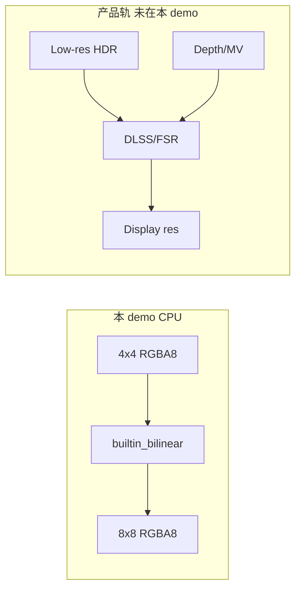

# Learn 18 — 超分接入（选修）

> 通过 **IUpscaler** 抽象把 4×4 RGBA 图像放大到 8×8，理解 M7 超分（DLSS/FSR）的 **接入契约**；当前实现为 CPU 双线性占位，不含厂商 SDK。

**选修说明**：厂商 API 为黑盒；本章重在 **接口、Status、尺寸契约**，非画质对标。  
**对齐里程碑**：M7（与 Motion Vector / Jitter 课配合阅读 PATH CH18）。

## 怎么跑

```powershell
cmake --build build --config Debug --target sample_18_upscale
build\samples\learn\18_upscale\Debug\sample_18_upscale.exe
build\samples\learn\18_upscale\Debug\sample_18_upscale.exe --headless --headless_frames=2
```

本课 **无窗口、无 GPU 绘制**；成功标志：

```text
Upscaler: builtin_bilinear
Upscaled 4x4 -> 8x8 bytes=256
```

退出码 0。CMake target：**`sample_18_upscale`**（仅 `engine_media` + `engine_core`）。

## 知识点

1. **接口优先于实现**：`IUpscaler::Upscale` 定义 RGBA8 输入输出与尺寸；DLSS/FSR 以后换实现不改调用方。
2. **CreateUpscaler 工厂**：当前返回 `BuiltinBilinearUpscaler`；ADR 0008 预留厂商适配器。
3. **与渲染分辨率解耦**：真实超分在 **低分辨率渲染 + jitter + motion vectors** 之后；本章仅 CPU 验证尺寸变换。
4. **测试图案可诊断**：角点 `(0,0)` 与 `(3,3)` 颜色不同，便于断言插值是否正确。
5. **Status 传播**：失败时 `LogError` + `return 1`；符合 learn「可失败得漂亮」。
6. **headless 参数**：与其他 sample CLI 统一；本进程不循环帧，`headless_frames` 无实际帧循环。
7. **dst 内存**：实现负责 `dst` resize；调用方不传预分配 buffer 大小（除非接口扩展）。
8. **DLSS/FSR SKIP**：本 repo 未接 NVIDIA/AMD SDK；练习只讨论契约扩展点。
9. **GPU Upscale 路径 SKIP**：无 `IDevice`、无 copy queue；后续在 media + rhi 交界接入。
10. **与 TAA 关系**：TAA 也做历史复用；超分是 **重建到显示分辨率**，输入需求更多。

## 名词解释

| 术语 | 含义 |
|---|---|
| **IUpscaler** | 超分策略抽象；`name()` + `Upscale()`。 |
| **BuiltinBilinearUpscaler** | CPU 双线性占位；名 `builtin_bilinear`。 |
| **Upscale** | src 与 dst 分辨率不同；输出 tightly packed RGBA8。 |
| **Jitter** | 投影亚像素抖动；TAA/超分重建输入。 |
| **Motion Vectors** | 屏幕空间运动向量；DLSS/FSR 关键输入。 |
| **Render Scale** | 3D 以低于显示分辨率渲染再超分。 |
| **Sharpening** | FSR 等常带锐化；双线性占位无此阶段。 |
| **Mvec / Depth** | 超分质量输入；本章 **SKIP**。 |
| **Status** | 引擎统一结果类型；失败带 message。 |
| **ADR 0008** | 超分/媒体抽象决策（若仓库存在）。 |

详见 [GLOSSARY.md](../../docs/learn/GLOSSARY.md) 中 Upscaler、Jitter、Motion Vectors。

## 原理

### main 流程

```text
ParseHeadless(argc, argv)   // 统一 CLI，本 demo 不建 Application
upscaler = CreateUpscaler()
Log: Upscaler: <name>

构造 src[4*4*4]:
  每像素 (x*60, y*60, 180, 255)

Upscale(src, 4, 4, dst, 8, 8)
Log: Upscaled 4x4 -> 8x8 bytes=256
return 0
```

### 双线性（示意）

对 dst 像素 `(dx,dy)`：

1. `fx = dx * (src_w-1) / (dst_w-1)`，`fy` 同理。
2. 取 `src` 四邻域整数坐标，双线性 lerp RGBA 各通道。
3. 边界 clamp 到 `[0, src_w-1]`。

### 未来 GPU 帧内位置（未实现）

```text
Low-res Color RT + Depth + MV
  → Vendor Upscaler (same IDevice)
  → Display-res → Present
```

### 降级策略（设计）

| 条件 | 行为 |
|---|---|
| 无 vendor SDK | 使用 `builtin_bilinear` 或 native res |
| Upscale 失败 | LogError；产品可 stretch 或跳帧 |



## 代码地图

| 符号 / 文件 | 说明 |
|---|---|
| `samples/learn/18_upscale/main.cpp` | 图案构造、Upscale、日志 |
| `ParseHeadless` | `--headless` / `--headless_frames` |
| `engine/media/upscaler.h` | `IUpscaler`、`CreateUpscaler` |
| `engine/media/upscaler.cpp` | `BuiltinBilinearUpscaler` |
| `engine/core/log.h` | `LogInfo` / `LogError` |
| CMake `sample_18_upscale` | 无 shader、无 d3d12 依赖 |

## 必做练习

1. 目标改为 `16×16`，手算 `(dx,dy)=(7,7)` 对应 src 浮点坐标与权重。
2. 传 `src_w=0` 或空 span，确认 Fail 与退出码 1。
3. 读 `upscaler.cpp` 双线性实现，指出与 GPU bilinear sampler 的差异。
4. 列接入 DLSS 还需哪些 **每帧** 输入（jitter 矩阵、mv buffer、reset flag…）。
5. 对比 CH24 TAA：两者都需要运动信息，但超分 **输出分辨率** 不同。
6. 设计 `IUpscaler::Upscale` 的 GPU 重载签名（伪代码），说明 who owns dst texture。
7. 若 `dst_w==src_w`，读接口注释「尺寸不变返回 false」是否触发；验证行为。
8. （口头）为何超分必须与渲染 **共享 Device**（CH18b 视频纹理同理）？

## 常见坑

- **期待窗口画面**：无 `Application`；设计如此。
- **把 bilinear 当成 DLSS**：占位只验证契约。
- **RGBA stride**：tightly packed；不是 RGB24 或 float16 HDR。
- **headless_frames 无效**：单 shot 进程，不跑帧循环。
- **误加 GPU 依赖**：复制 CMake 时不要链 `engine_d3d12` 除非真做 GPU upscale。
- **忽略 exit code**：CI 应用例检查 `Upscaled` 日志 + exit 0。
- **Motion Vector SKIP**：练习里写 MV 接入时，勿假设本 demo 已生成 MV。
- **放大倍数过小**：4→8 只见插值；大图更利于肉眼查 artifact，但 CI 用小图更快。
