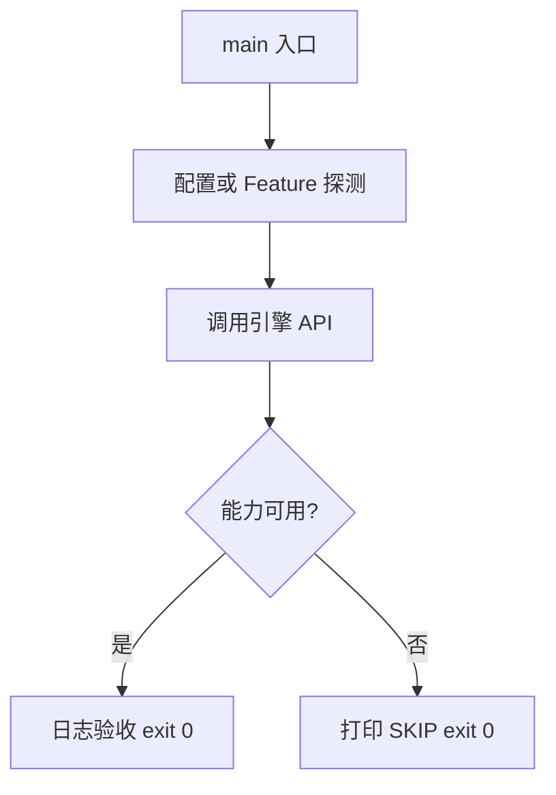

# Learn 18b — 视频纹理（硬解）（选修）

> 探测视频硬解能力；可用则尝试 Open/Decode，否则 SKIP（无软解回退）。

**前提**：CH03 纹理；理解共享 GPU Device 的动机。  
**对齐里程碑**：M7 / M17

## 怎么跑

```powershell
cmake -B build -DENGINE_BUILD_LEARN_SAMPLES=ON
cmake --build build --config Debug --target sample_18b_video_texture
build\samples\learn\18b_video_texture\Debug\sample_18b_video_texture.exe --headless --headless_frames=2
```

CMake target：**`sample_18b_video_texture`**。无 Application；可能打印 SKIP 后 exit 0。

| 参数 | 作用 |
|---|---|
| `--headless` | 无窗口 / 冒烟模式 |
| `--headless_frames=N` | Application 路径下限制帧数 |

## 知识点

1. **禁止静默软解**：无硬解必须可诊断 SKIP。
2. **QueryVideoDecodeAvailable**：构建/设备级探测。
3. **CreateD3D12VaDecoderOrStub**：工厂；stub 的 feature_available=false。
4. **必须与渲染共享 Device**：零拷贝纹理进 SRV。
5. **D3D12VA vs Vulkan Video**：后端不同，契约同为 DecodeNextFrame→RGBA。
6. **Feature video_decode**：可 SetFeatureOverride 对齐探测。
7. **缺资产也 SKIP**：Open 失败不算崩溃。
8. **帧格式**：教学路径输出 RGBA8 CPU buffer；产品可直接 GPU texture。
9. **线程模型**：解码回调勿直接碰 RHI；回主线程上传。
10. **与超分无关**：CH18 是 upscaler；视频是媒体源。
11. **Linux/VK**：另见 CH32/CH33；本章默认 D3D12VA 契约。
12. **验收**：日志含 backend 名与 available 位。

## 名词解释

| 术语 | 含义 |
|---|---|
| **D3D12VA** | D3D12 Video Acceleration |
| **Vulkan Video** | VK 视频扩展硬解 |
| **硬解** | GPU/专用块解码 |
| **软解** | CPU 解码；本引擎教学路径禁止静默使用 |
| **共享 Device** | 解码与渲染同一 GPU 设备 |
| **DecodeNextFrame** | 取下一帧像素 |

详见 [GLOSSARY.md](../../docs/learn/GLOSSARY.md)。

## 原理

### 决策树

Probe → 创建 Decoder → feature_available? → Open → DecodeNextFrame → 日志尺寸。  
任一步失败：打印 SKIP，return 0。

### 为何共享 Device

跨设备拷贝昂贵且同步复杂；硬解输出应直接可作着色器纹理。



本 demo 的 README 与 `main.cpp` 路径一致；未实现的能力只写 SKIP，不假装画质。

## 代码地图

| 符号 / 文件 | 说明 |
|---|---|
| `main.cpp` | 探测/Open/Decode 或 SKIP |
| `engine/media/media.h` | IVideoDecoder API |
| `QueryVideoDecodeAvailable` | 能力探测 |
| `CreateD3D12VaDecoderOrStub` | 工厂 |
| CMake `sample_18b_video_texture` | 本 sample 目标 |

## 必做练习

1. ★ 阅读日志中的 backend_name 与 feature_available。
2. ★★ 若有 mp4，改 Open 路径验证解码。
3. ★★★（选做）对照 Vulkan Video 文档列差异表。

## 常见坑

- 缺硬解却自己链 FFmpeg 软解——违反规范。
- 在非主线程调 RHI 上传。
- 把 stub 当成功路径。
- 忽略 Feature 与真实硬件不一致。

## 延伸阅读

- 章节：[docs/learn/chapters/](../../docs/learn/chapters/)
- 路径：[PATH.md](../../docs/learn/PATH.md)
- 规范：[SAMPLES.md](../../docs/learn/SAMPLES.md)
