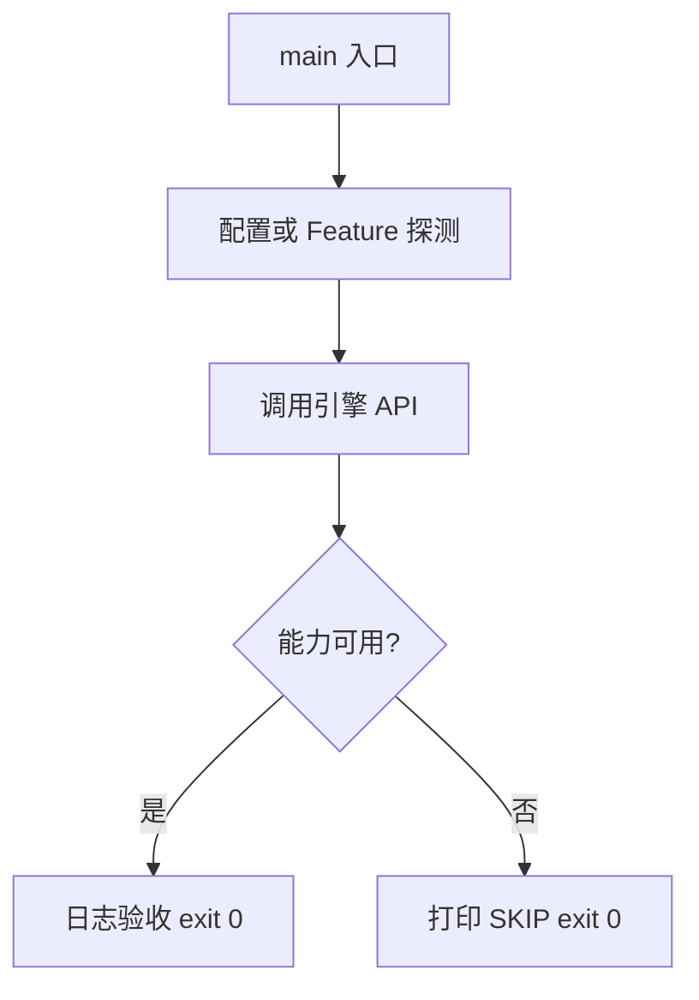

# Learn 18c — 音频播放（无特效）（选修）

> 构造 AudioClip，经 NullAudio 与 DefaultAudio 验证 Clip/Source/Output 契约（不做效果器）。

**前提**：无图形前提。  
**对齐里程碑**：M7

## 怎么跑

```powershell
cmake -B build -DENGINE_BUILD_LEARN_SAMPLES=ON
cmake --build build --config Debug --target sample_18c_audio_playback
build\samples\learn\18c_audio_playback\Debug\sample_18c_audio_playback.exe --headless --headless_frames=2
```

CMake target：**`sample_18c_audio_playback`**。合成 PCM；无 wav 资产亦可。

| 参数 | 作用 |
|---|---|
| `--headless` | 无窗口 / 冒烟模式 |
| `--headless_frames=N` | Application 路径下限制帧数 |

## 知识点

1. **Clip / Device 分工**：Clip 是数据；IAudioDevice 是输出。
2. **NullAudio**：CI/无声卡可测契约。
3. **CreateDefaultAudioDevice**：Windows 可用 PlaySound 等短音路径。
4. **不做效果器**：引擎定位输出渲染，DSP 留给中间件。
5. **LoadWavPcm16**：产品加载入口；本章用合成正弦。
6. **PlayWavFile**：UI/SFX 即发即弃辅助。
7. **增益 gain**：Play(clip, gain)。
8. **StopAll**：停止所有源。
9. **与视频时钟**：音视频同步不在本章范围。
10. **线程**：播放回调勿阻塞渲染主循环过久。
11. **失败可 SKIP**：Default 播放失败时 Null 路径已验收。
12. **采样率/声道**：AudioClip 元数据必须正确。

## 名词解释

| 术语 | 含义 |
|---|---|
| **AudioClip** | PCM 样本 + 采样率/声道 |
| **IAudioDevice** | 输出后端抽象 |
| **NullAudio** | 空后端 |
| **gain** | 线性增益 |
| **PCM16** | 常见 wav 整数格式 |

详见 [GLOSSARY.md](../../docs/learn/GLOSSARY.md)。

## 原理

合成 440Hz 短 clip → NullAudio.Play → StopAll → DefaultAudio（可能 SKIP）→ exit 0。

产品游戏应：异步加载 wav → 保留 Clip 句柄 → 按需 Play；不做混响/均衡器。



本 demo 的 README 与 `main.cpp` 路径一致；未实现的能力只写 SKIP，不假装画质。

## 代码地图

| 符号 / 文件 | 说明 |
|---|---|
| `main.cpp` | 合成 clip + 双设备 |
| `engine/media/media.h` | 音频 API |
| `CreateNullAudioDevice` | 空输出 |
| `CreateDefaultAudioDevice` | 平台默认 |
| CMake `sample_18c_audio_playback` | 本 sample 目标 |

## 必做练习

1. ★ 改频率为 880Hz（听感或日志仍成功）。
2. ★★ 用 LoadWavPcm16 加载真实 wav（若有）。
3. ★★★（选做）列一张「引擎不做的音频特效」清单。

## 常见坑

- 把引擎当 DAW。
- Default 失败当成进程错误——应 SKIP。
- 忘记 StopAll 导致测试悬挂（视后端）。
- 声道数与样本交错格式搞错。

## 延伸阅读

- 章节：[docs/learn/chapters/](../../docs/learn/chapters/)
- 路径：[PATH.md](../../docs/learn/PATH.md)
- 规范：[SAMPLES.md](../../docs/learn/SAMPLES.md)
