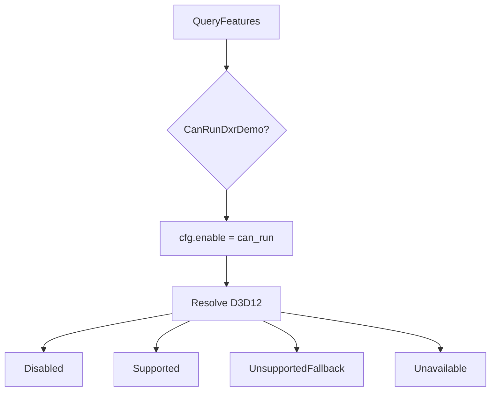

# Learn 19 — DXR 入门与降级（选修）

> 在无窗口环境下探测 **ProbeDxrHardwareSupport + FeatureSet + CanRunDxrDemo + RtStatus::Resolve**，理解 M8/M25 光追能力的 **特性门控与降级策略**；本课不录制 AS/SBT 也不发射 rays（见 ADR 0030）。

**选修说明**：无 DXR 硬件须 **跑通降级**（日志 `SKIP` + exit 0），非报红。  
**对齐里程碑**：M8 / M25 deepen。完整 AS/raygen **SKIP**，见 ADR 0030 / CH35。

## 怎么跑

```powershell
cmake --build build --config Debug --target sample_19_dxr_intro
build\samples\learn\19_dxr_intro\Debug\sample_19_dxr_intro.exe
```

典型日志（因机器而异）：

```text
ProbeDxrHardwareSupport=true|false CanRunDxrDemo=true|false raytracing=... d3d12=...
RtStatus=0|1|2|3
SKIP sample_19_dxr_intro (...)   # 无 DXR 时
```

`RtStatus` 整数值对应 `RtStatus` 枚举序（0=Disabled …，以 `raytracing.h` 为准）。

CMake target：**`sample_19_dxr_intro`**。无 shader、无 Application。

## 知识点

1. **ProbeDxrHardwareSupport**：临时建 D3D12 device，查 `OPTIONS5.RaytracingTier`；结果写入 `SetFeatureOverride("raytracing", …)`。
2. **CanRunDxrDemo 门控**：需 `raytracing && d3d12`，且 demo 至少开 reflections 或 shadows。
3. **Resolve 四级状态**：Disabled / Supported / UnsupportedFallback / Unavailable。
4. **allow_fallback=true**：无 HW RT 时走 Fallback 而非 Unavailable（本 demo 配置）。
5. **cfg.enable = can_run**：只有门控通过才 enable RT；否则 Resolve 直接 Disabled。
6. **EnsureSafe 产品路径**：Unavailable + 不允许 fallback → `Status::Fail`；本 sample 只 Resolve 日志。
7. **DxrDemoConfig.max_bounces**：字段预留；当前 Resolve **不读取** bounces。
8. **硬编码 D3D12**：`Resolve(Backend::D3D12, ...)`；Vulkan RT 在 Resolve 内也支持但未在本 main 测。
9. **无窗口探测**：适合 CI 矩阵：有 RT 机器 vs 无 RT 机器都应 exit 0。
10. **与 SSR 对比**：CH26 SSR 是光栅近似；DXR 是可选升级路径，需 Feature 门控。

## 名词解释

| 术语 | 含义 |
|---|---|
| **DXR** | DirectX Raytracing；D3D12 光追扩展。 |
| **BLAS** | Bottom-Level AS；单 mesh 几何加速结构。 |
| **TLAS** | Top-Level AS；实例化场景加速结构。 |
| **SBT** | Shader Binding Table；ray 类型 → 着色器映射。 |
| **FeatureSet** | `QueryFeatures()` 快照。 |
| **DxrDemoConfig** | 示范：reflections、shadows、max_bounces。 |
| **RtStatus** | Resolve 结果枚举。 |
| **allow_fallback** | 无 RT 时允许光栅回退。 |
| **raygen** | DXR 入口着色器；**本 demo SKIP**。 |
| **Feature 门控** | 能力不满足时不静默启用 HW 路径。 |

详见 [GLOSSARY.md](../../docs/learn/GLOSSARY.md) 中 BLAS/TLAS/SBT。

## 原理

### main 流程

```text
features = QueryFeatures()
demo = { enable_reflections=true, enable_shadows=false, max_bounces=1 }
can_run = CanRunDxrDemo(features, demo)
Log: CanRunDxrDemo, raytracing, d3d12

cfg = { enable=can_run, allow_fallback=true }
rt = Resolve(Backend::D3D12, features, cfg)
Log: RtStatus=<int>
return 0
```

### CanRunDxrDemo 逻辑

```text
if !features.raytracing || !features.d3d12 → false
return demo.enable_reflections || demo.enable_shadows
```

本 demo reflections=true → 若硬件支持则 can_run=true。

### Resolve 决策树

```text
if !cfg.enable → Disabled
if backend∈{D3D12,Vulkan} && features.raytracing → Supported
if cfg.allow_fallback → UnsupportedFallback
else → Unavailable
```

### 完整 DXR 帧（SKIP 清单）

| 阶段 | 本 demo |
|---|---|
| BLAS/TLAS build | SKIP |
| SBT 绑定 | SKIP |
| raygen/miss/closesthit | SKIP |
| Composite 到 swapchain | SKIP |



## 代码地图

| 符号 / 文件 | 说明 |
|---|---|
| `samples/learn/19_dxr_intro/main.cpp` | 探测与日志 |
| `engine/rt/raytracing.h` | 类型与 API 声明 |
| `engine/rt/raytracing.cpp` | `ProbeDxrHardwareSupport`、`CanRunDxrDemo`、`Resolve`、`EnsureSafe` |
| ADR 0030 | M25 DXR demo 范围（门控优先） |
| `engine/core/feature.h` | `FeatureSet`、`QueryFeatures()` |
| `engine/rhi/backend.h` | `Backend::D3D12` |
| CMake `sample_19_dxr_intro` | engine_rt + engine_core |

## 必做练习

1. 设 `enable_reflections=false` 且 `enable_shadows=false`，验证 `CanRunDxrDemo` 必 false。
2. 设 `allow_fallback=false` 且无 RT，调用 `EnsureSafe`，记录 ErrorCode 与 message。
3. 列出 `FeatureSet` 中与渲染相关的其它布尔（如 `gpu_instancing`）。
4. 画完整 DXR 帧 Pass 图，标注 **SKIP** 部分与 CH26 SSR 回退点。
5. 若 `features.raytracing=true` 但驱动禁 DXR，观察 Resolve 实际返回值（Supported vs Fallback）。
6. 阅读 `EnsureSafe` 与 `Resolve` 分工：何时产品应 Fail fast？
7. 改 `Resolve(Backend::Vulkan, ...)` 做对比实验（需 Vulkan RT feature）。
8. （口头）为何 CI 要求无 RT 机器 exit 0 而非 skip build？

## 常见坑

- **以为有光追画面**：仅探测；AS/SBT/raygen 未实现于本 sample。
- **无 RT 显卡 exit 非 0**：应 false + Fallback/Disabled + exit 0。
- **误判 RtStatus 整数**：应对照枚举名，勿当 bool。
- **max_bounces 无效**：配置预留；Resolve 不看。
- **Vulkan 混淆**：main 硬编码 D3D12；Vulkan RT 需另写 sample 或改 backend 参数。
- **enable=true 但 can_run=false**：cfg.enable 跟随 can_run；不会强行开 HW RT。
- **把 Fallback 当 Supported**：UnsupportedFallback 仍是无 HW 路径，需光栅替代。
- **缺少 engine_rt 链接**：复制 sample 时 CMake 须链 `engine_rt`。
