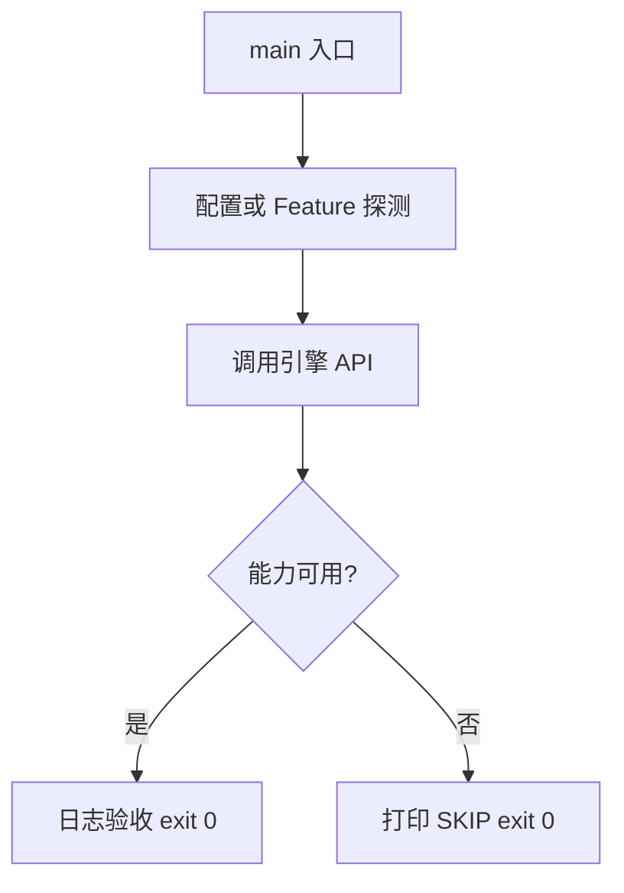

# Learn 20 — 异步加载 / 控制台 / 引用寿命（选修）

> 注册 Console 命令，RequestLoad + PumpAsync 演示回调进主线程与 AssetHandle 寿命。

**前提**：CH05 in-flight；理解主循环。  
**对齐里程碑**：M3/M8

## 怎么跑

```powershell
cmake -B build -DENGINE_BUILD_LEARN_SAMPLES=ON
cmake --build build --config Debug --target sample_20_engine_ops
build\samples\learn\20_engine_ops\Debug\sample_20_engine_ops.exe --headless --headless_frames=2
```

CMake target：**`sample_20_engine_ops`**。故意请求缺失资产以观察回调失败路径。

| 参数 | 作用 |
|---|---|
| `--headless` | 无窗口 / 冒烟模式 |
| `--headless_frames=N` | Application 路径下限制帧数 |

## 知识点

1. **Pump 回调**：完成通知只在 PumpAsync（主线程）触发。
2. **AssetHandle 引用计数**：持有期间记录不过早销毁。
3. **与 GPU Fence**：真正释放 GPU 资源还需 fence 退休（骨架阶段点明）。
4. **Console**：字符串命令→handler，便于教学与作弊码。
5. **Cancel**：可取消未完成任务。
6. **Manifest**：逻辑 id→路径；空表导致失败回调。
7. **learn.disable_async_load**：可强制同步（产品开关约定）。
8. **不要在 worker 碰 RHI**。
9. **日志驱动验收**：callback_fired。
10. **模块边界**：assets / debug / app 主循环协作。
11. **失败也是成功教学**：缺失文件应 Status 失败而非崩溃。
12. **序列化**：本章点到；完整存档见产品文档。

## 名词解释

| 术语 | 含义 |
|---|---|
| **AssetSystem** | 异步加载与 Pump |
| **AssetHandle** | 引用计数句柄 |
| **PumpAsync** | 主线程排空完成队列 |
| **Console** | 调试命令台 |
| **Manifest** | 资产清单 |
| **Fence** | GPU 进度栅栏 |

详见 [GLOSSARY.md](../../docs/learn/GLOSSARY.md)。

## 原理

Register echo → SetManifest → RequestLoad(缺失 id) → 循环 PumpAsync → 回调日志。

引用寿命：CPU 字节可随 Handle；绑定到 GPU 的视图必须等 Fence。



本 demo 的 README 与 `main.cpp` 路径一致；未实现的能力只写 SKIP，不假装画质。

## 代码地图

| 符号 / 文件 | 说明 |
|---|---|
| `main.cpp` | Console + AssetSystem 冒烟 |
| `engine/assets/asset_system.h` | RequestLoad/PumpAsync |
| `engine/debug/console.h` | Register/Execute |
| `AssetHandle` | 引用计数 |
| CMake `sample_20_engine_ops` | 本 sample 目标 |

## 必做练习

1. ★ 改 echo 参数看日志。
2. ★★ 提供真实 Manifest 条目使回调成功。
3. ★★★（选做）Cancel 后观察回调状态。

## 常见坑

- 从不 Pump → 回调永不执行。
- 在回调里再死锁式 Request+同步等。
- Handle 提前析构导致 use-after-free。
- worker 线程创建 D3D 资源。

## 延伸阅读

- 章节：[docs/learn/chapters/](../../docs/learn/chapters/)
- 路径：[PATH.md](../../docs/learn/PATH.md)
- 规范：[SAMPLES.md](../../docs/learn/SAMPLES.md)
