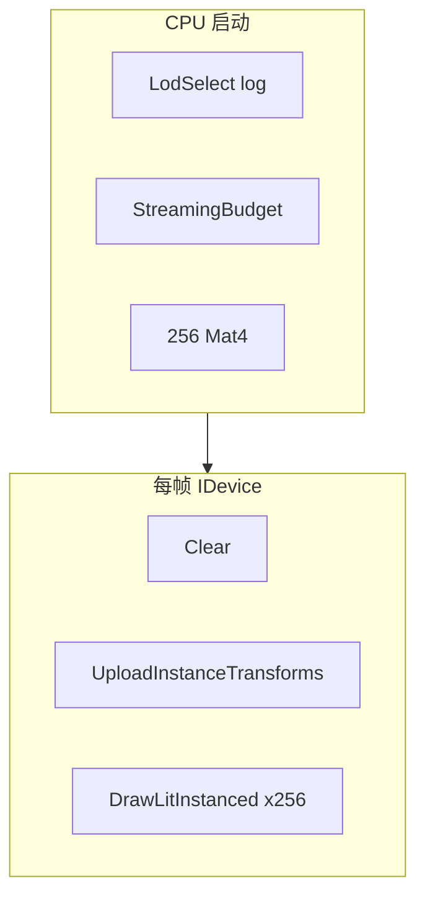

# Learn 22 — LOD / 实例化 / 流式预算

> 在单帧内演示 **LodSelect 距离分档**、**StreamingBudget 驻留记账** 与 **256 实例 GPU Instancing**，理解 M10 P0 性能路径的数据准备与 `DrawLitInstanced` 提交方式。

**前提**：CH06/07 lit 绘制、CH05 上传概念。  
**对齐里程碑**：M10 P0。

## 怎么跑

```powershell
cmake --build build --config Debug --target sample_22_lod_instancing_streaming
build\samples\learn\22_lod_instancing_streaming\Debug\sample_22_lod_instancing_streaming.exe --headless --headless_frames=2
```

窗口模式从 `(0,12,22)` 俯视 16×16 实例网格。

| 预期日志 | 含义 |
|---|---|
| `LOD level near=0 far=2` | 距离 4 vs 80 的 LOD 等级（视 ranges） |
| `Streaming used=524288 budget=1048576` | 512KB 驻留 / 1MB 预算 |
| `Instance buffer bytes=...` | `BuildInstanceBuffer` 大小 |
| `gpu_instancing=0\|1` | Feature 探测 |

CMake target：**`sample_22_lod_instancing_streaming`**。

## 知识点

1. **LodSelect 纯 CPU**：`SelectLevel(distance, lod_ranges)` 按阈值 `{8,24,64}` 分档。
2. **StreamingBudget 记账**：`Resident(id, bytes, handle)` 增加 `used()`；真实 IO 在 CH20。
3. **InstanceData**：至少含 `world` 矩阵；`BuildInstanceBuffer` 打包 CPU 字节。
4. **UploadInstanceTransforms**：RHI 上传 256 个 `Mat4`；与 instanced draw 配对。
5. **DrawLitInstanced**：一份 `LitDrawItem` proto + count=256 → 一次 draw call。
6. **帧路径注意**：`RenderSystem::Init` 已调用，但 **Run 内未 `DrawFrame`**，直接 `IDevice` 路径。
7. **相机预设**：俯视大网格，便于窗口模式看见实例排列。
8. **阴影关闭**：简化 pass；instancing + shadow 见 CH12/24。
9. **AssetId 字符串**：`mesh/cube_lod0` 仅为流式记账示例，本 demo 不加载真实 LOD 网格。
10. **QueryFeature("gpu_instancing")**：每帧日志；headless stub 常为 0。

## 名词解释

| 术语 | 含义 |
|---|---|
| **LOD** | Level of Detail；远距更低模。 |
| **LodSelect** | 距离 → 等级索引。 |
| **Instancing** | 同 mesh 多实例一次 draw。 |
| **InstanceData** | 每实例数据（world 矩阵等）。 |
| **LitDrawItem** | 单次 lit draw 的材质/颜色参数 proto。 |
| **StreamingBudget** | 字节预算与驻留表。 |
| **AssetHandle** | 引用计数句柄。 |
| **AssetId** | 逻辑资产名。 |
| **gpu_instancing** | Feature 标志。 |
| **SoA** | 矩阵数组连续存储，利于上传。 |

详见 [GLOSSARY.md](../../docs/learn/GLOSSARY.md) 中 AssetHandle、Manifest、in-flight。

## 原理

### 启动（帧外）

```text
lod_ranges = {8, 24, 64}
LodSelect(4)  → near level
LodSelect(80) → far level

StreamingBudget(1MB).Resident("mesh/cube_lod0", 512KB, handle)

for i in 0..255:
  grid (x,z) → Transform → Mat4 → InstanceData
inst_buf = BuildInstanceBuffer(instances)
```

### 每帧 Run（注意：非 DrawFrame）

```text
SetFrameLighting(camera view_proj, eye, sun...)
Clear(0.12, 0.14, 0.18, 1)
UploadInstanceTransforms(worlds)
DrawLitInstanced(proto, 256)
Log gpu_instancing feature
```

### LOD 阈值扫描（示意）

| distance | ranges {8,24,64} | level |
|---|---|---|
| 4 | d≤8 | 0 |
| 80 | d>64 | 2 |

### 流式（stub）

- 仅 `Resident` 记账；**SKIP** 异步读盘、evict、Fence 退役。



## 代码地图

| 符号 / 文件 | 说明 |
|---|---|
| `samples/learn/22_lod_instancing_streaming/main.cpp` | 全逻辑 |
| `engine/assets/streaming_budget.h` | `StreamingBudget`、`LodSelect` |
| `engine/render/instance_draw.h` | `InstanceData`、`BuildInstanceBuffer` |
| `engine/core/math.h` | `Mat4::TRS` |
| `IDevice::UploadInstanceTransforms` | 实例矩阵上传 |
| `IDevice::DrawLitInstanced` | instanced lit draw |
| `QueryFeature` | `engine/core/feature.h` |
| `RenderSystem::Init` | 初始化着色器（帧内未 DrawFrame） |
| CMake target | sandbox shaders + engine |

## 必做练习

1. `kInstances=64`，比较 `Instance buffer bytes` 与 draw count。
2. 改 `lod_ranges`，使距离 80 落到 level 1，解释边界判定。
3. 二次 `Resident` 超大资源，读 `used()` 与 budget 关系（clamp/fail）。
4. 对比 256 次 `DrawLitCubes` vs 一次 `DrawLitInstanced` 的 CPU 记录成本（PIX/Profiler）。
5. 把 Run 改为 `render.DrawFrame`，观察 instancing 日志是否仍出现（预期否，除非 RenderScene 支持实例）。
6. 移动相机降低高度，理解为何实例网格需要 instancing。
7. 阅读 `LodSelect` 实现，写出 distance 正好等于 24 时的 level。
8. （口头）流式 evict 时 AssetHandle  refcount 与 GPU Fence 如何配合？

## 常见坑

- **Run 未 DrawFrame**：Lighting 在回调里手动 `SetFrameLighting`；改练习前先读 main。
- **LOD 未接渲染**：只日志 SelectLevel；屏幕 mesh 不随 LOD 变。
- **Streaming 无 IO**：`Resident` 不读盘。
- **Headless gpu_instancing=0**：常见；不代表 D3D12 无 instancing。
- **render 变量未使用**：Init 后未 DrawFrame；编译器可能 `(void)render`。
- **proto 无 mesh 绑定**：instancing 依赖设备侧默认 cube VB；换 mesh 需扩展 API。
- **矩阵未更新**：本 demo 静态 transform；动实例需每帧写 worlds 再 upload。
- **预算单位**：字节；勿传 MB 整数未乘 1024²。
