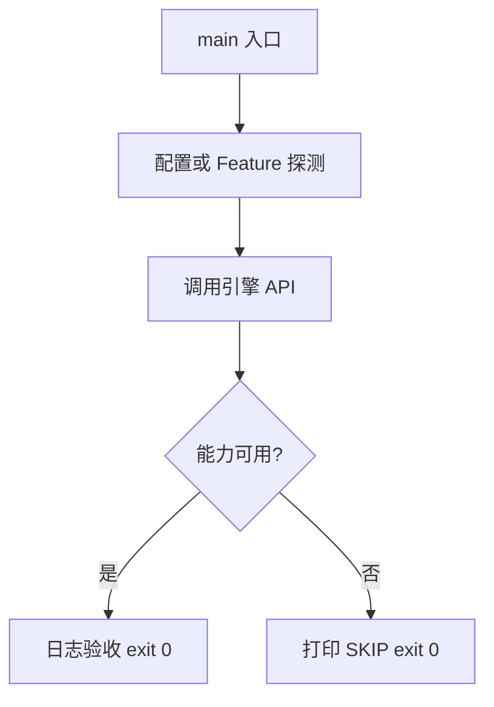

# Learn 23 — 遮挡剔除（CPU HiZ）（选修）

> 配置 OcclusionBuffer，上传 finest 深度并查询 AABB 可见性，理解软 HiZ 金字塔。

**前提**：CH07 剔除概念；矩阵基础。  
**对齐里程碑**：M10

## 怎么跑

```powershell
cmake -B build -DENGINE_BUILD_LEARN_SAMPLES=ON
cmake --build build --config Debug --target sample_23_occlusion_culling
build\samples\learn\23_occlusion_culling\Debug\sample_23_occlusion_culling.exe --headless --headless_frames=2
```

CMake target：**`sample_23_occlusion_culling`**。CPU 侧；无 GPU query。

| 参数 | 作用 |
|---|---|
| `--headless` | 无窗口 / 冒烟模式 |
| `--headless_frames=N` | Application 路径下限制帧数 |

## 知识点

1. **OcclusionBuffer**：frustum + 可选 CPU 深度金字塔。
2. **UploadDepthFinest**：建 max-filter mips。
3. **IsVisible(AABB, view_proj)**：保守测试。
4. **ClearHiZ**：退回仅视锥。
5. **与 GPU HiZ**：Feature hiz；本章是 CPU 教学实现。
6. **保守性**：宁可多画不可漏画。
7. **和 LOD/实例化**：可与 CH22 组合。
8. **深度约定**：更大=更远（实现注释）。
9. **教学用 Identity view_proj**：聚焦 API 非相机严谨性。
10. **金字塔级数**：Configure 后 levels 可日志。
11. **不要每物体重建金字塔**。
12. **Meshlet cull 可传 occ 指针**：见 CH36。

## 名词解释

| 术语 | 含义 |
|---|---|
| **HiZ** | 层次深度缓冲 |
| **Occlusion culling** | 遮挡剔除 |
| **finest mip** | 最高分辨率深度 |
| **max-filter** | 取区域最大深度 |
| **保守可见性** | 不确定则当作可见 |

详见 [GLOSSARY.md](../../docs/learn/GLOSSARY.md)。

## 原理

Configure → 填近处墙深度 → UploadDepthFinest → IsVisible(前/后 AABB) → ClearHiZ。

算法：投影 AABB 到屏幕，在合适 mip 上取 max depth，与 AABB 最近深度比较。



本 demo 的 README 与 `main.cpp` 路径一致；未实现的能力只写 SKIP，不假装画质。

## 代码地图

| 符号 / 文件 | 说明 |
|---|---|
| `main.cpp` | HiZ 上传与查询 |
| `engine/render/occlusion.h` | OcclusionBuffer |
| `UploadDepthFinest` | 建金字塔 |
| `IsVisible` | 可见性查询 |
| CMake `sample_23_occlusion_culling` | 本 sample 目标 |

## 必做练习

1. ★ 改墙深度为 0.05，观察 behind 结果。
2. ★★ 扩大 AABB 覆盖墙边缘。
3. ★★★（选做）接真实相机 view_proj。

## 常见坑

- 深度范围与投影不一致导致全可见/全不可见。
- ClearHiZ 后仍期望遮挡。
- 用非保守测试导致闪烁漏画。
- 每帧重建金字塔却分辨率过高。

## 延伸阅读

- 章节：[docs/learn/chapters/](../../docs/learn/chapters/)
- 路径：[PATH.md](../../docs/learn/PATH.md)
- 规范：[SAMPLES.md](../../docs/learn/SAMPLES.md)
