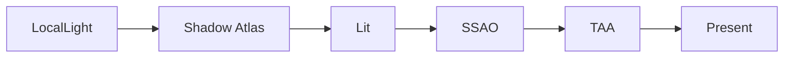

# Learn 24 — 局部光阴影 / TAA / SSAO

> 组合 **局部点光 + cast_shadows**、**SSAO** 与 **TAA**，在 Medium 质量档下跑通 M11 P0 画面稳定性路径，理解局部阴影与屏幕空间效果如何进入同一 `RenderSystem` 帧。

**前提**：CH10/12 阴影基础、CH16 post 栈。  
**对齐里程碑**：M11 P0。

## 怎么跑

```powershell
cmake --build build --config Debug --target sample_24_local_shadows_taa_ao
build\samples\learn\24_local_shadows_taa_ao\Debug\sample_24_local_shadows_taa_ao.exe --headless --headless_frames=2
```

日志：`SSAO+TAA+local shadow lights=1`。

CMake target：**`sample_24_local_shadows_taa_ao`**。

## 知识点

1. **LocalLight**：`position/color/intensity/range/cast_shadows`；经 `set_local_lights` 注入。
2. **局部阴影**：`cast_shadows=true` + `enable_shadows=true` 进入 shadow atlas 路径。
3. **SSAO + TAA 同栈**：quality 与 `EffectTuning` 双开；shader `post_ssao_taa`。
4. **shadow_cascades=1**：简化方向光 CSM；重点在局部光 atlas。
5. **与 CH16 对比**：CH16 开 bloom/关 TAA；本章开 TAA/SSAO、无 bloom 强调。
6. **DrawFrame 标准路径**：全 Pass 由 RenderSystem/FG 编排。
7. **单点光场景**：`(2,2,1)` 暖色光，range=6，intensity=3。
8. **TAA 需要历史**：引擎内部分配 history/MV；静态相机时效果 subtle。
9. **Headless**：验证 pass 不 crash；拖影/锯齿需窗口动相机。
10. **Transparent 策略 SKIP**：PATH 提透明；本 demo 仅 opaque cube。

## 名词解释

| 术语 | 含义 |
|---|---|
| **LocalLight** | 点光/聚光 runtime 描述。 |
| **Shadow Atlas** | 多局部光 shadow map 打包。 |
| **SSAO** | 屏幕空间环境光遮蔽。 |
| **TAA** | 时域抗锯齿；混合历史色。 |
| **Jitter** | 投影抖动；TAA 子像素采样。 |
| **History buffer** | 上一帧颜色/深度复用。 |
| **EffectTuning** | 运行时 FX 覆盖。 |
| **CSM** | 方向光级联；本章=1。 |
| **cast_shadows** |  per-light 阴影开关。 |
| **GTAO** | 更高质量 AO；**本 demo 为 SSAO 路径**。 |

详见 [GLOSSARY.md](../../docs/learn/GLOSSARY.md) 中 TAA、Shadow Atlas、CSM。

## 原理

### LitDesc

```text
enable_shadows = true
quality: Medium, enable_ssao=true, enable_taa=true, shadow_cascades=1
post: post_ssao_taa.*
```

### 光源与 FX

```text
LocalLight point @ (2,2,1), cast_shadows=true
render.set_local_lights({point})

fx.enable_ssao / enable_taa / enable_shadows = true
fx.shadow_cascades = 1
render.set_effect_tuning(fx)
```

### 帧 Pass 概览

```text
Shadow (CSM 1 + local atlas slot)
  → Lit (cube + local lighting)
  → SSAO (depth-derived)
  → TAA (history + current)
  → Tonemap 等（Medium 默认栈）
  → Present
```

### 局部光阴影（概念）

1. 为 casting light 分配 atlas 区域。
2. 从 light 位置渲染 depth 到 atlas。
3. Lit PS 采样 shadow compare。



## 代码地图

| 符号 / 文件 | 说明 |
|---|---|
| `samples/learn/24_local_shadows_taa_ao/main.cpp` | 局部光 + effect |
| `engine/render/local_lights.h` | `LocalLight` |
| `engine/render/shadow_atlas.h` | atlas 分配 |
| `engine/render/shadow_csm.h` | 单 cascade |
| `engine/render/render_system.cpp` | DrawFrame 编排 |
| `post_ssao_taa.vs/ps.cso` | 组合 post |
| `engine/render/quality.h` | Medium 模板 |

## 必做练习

1. `cast_shadows=false`，PIX 对比 shadow pass 是否减少。
2. 关 TAA 留 SSAO，动相机看边缘差异。
3. 增加第二个 LocalLight，仅一个 cast shadow，观察 atlas 压力。
4. 对比 CH12：`shadow_cascades=4` 与本课 `=1` 日志 `cascade_count()`。
5. 抓帧标 depth → SSAO → TAA history 的 barrier。
6. 把点光 `range` 改小，看 cube 受光范围变化。
7. 开 CH16 bloom 到本工程（合并 quality），观察 TAA+bloom 亮度。
8. （口头）TAA 鬼影何时出现？与 MV 错误的关系？

## 常见坑

- **TAA 鬼影**：相机瞬移或 MV 缺失；静态 demo 不易见。
- **SSAO 不明显**：单 cube 接触面少；加地面 mesh 做实验。
- **Headless 不验画质**：只验 DrawFrame 成功。
- **range vs intensity**：强度不扩大光照半径。
- **与 CH16 混淆**：本章 TAA **默认开**。
- **局部光 shadow 分辨率**：atlas 有限；光太多会降分辨率或 fail（视实现）。
- **方向光阴影仍执行**：enable_shadows=true 即使用 1 cascade；非仅局部光 pass。
- **GTAO 假设**：勿以为已是 GTAO；shader 名 ssao_taa。

## 验收清单（作者自测）

- [ ] headless 2 帧 exit 0，无 DrawFrame Error  
- [ ] 日志 `local shadow lights=1`  
- [ ] 窗口模式：关 TAA 可见锯齿，开 TAA 边缘更稳（相机微动）  
- [ ] 关 `cast_shadows` 后局部阴影消失  
- [ ] 能口头解释 shadow atlas 与 CSM 1 级联在同一帧的分工
