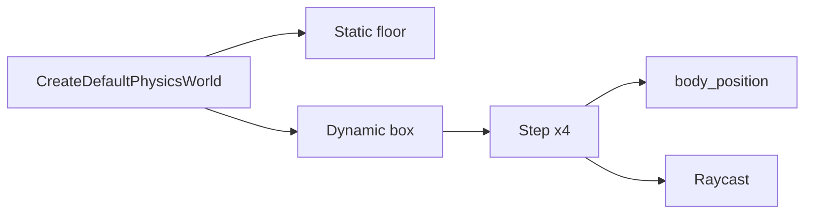

# Learn 25 — 物理世界（刚体 / 查询）

> 用 **IPhysicsWorld** 创建静态地面与动态盒子、步进仿真并 **Raycast**，理解 M12 物理封装与渲染解耦；本课无窗口、无网格同步。

**前提**：CH07 场景 Transform 概念（同步在本 demo 外）。  
**对齐里程碑**：M12（Jolt 封装 + builtin fallback）。

## 怎么跑

```powershell
cmake --build build --config Debug --target sample_25_physics
build\samples\learn\25_physics\Debug\sample_25_physics.exe
```

成功日志：

```text
Physics backend: builtin|Jolt
Body y after sim=<float>
Raycast hit=true|false
```

CMake target：**`sample_25_physics`**。无 Application、无 shader。

## 知识点

1. **CreateDefaultPhysicsWorld**：优先 Jolt（`ENGINE_WITH_JOLT=1`），否则 builtin。
2. **RigidBodyDesc**：`half_extents` 定义盒子；`mass=0` → 静态 floor。
3. **Step(1/60) × 4**：固定步；产品应用 accumulator 与渲染帧解耦。
4. **body_position**：读回动态体位置；本 demo 只日志 y。
5. **Raycast**：`(origin, dir, max_dist)` → `RayHit`；竖直向下测地面。
6. **MoveCharacter SKIP**：API 存在，本 demo 未调用。
7. **渲染解耦**：无 `DrawFrame`；游戏应在 Run 里 sync transform。
8. **trigger SKIP**：`is_trigger` 字段未演示。
9. **headless CLI**：ParseHeadless 统一参数，无帧循环。
10. **backend_name 诊断**：CI 区分 Jolt vs builtin 行为差异。

## 名词解释

| 术语 | 含义 |
|---|---|
| **IPhysicsWorld** | 物理世界抽象接口。 |
| **RigidBodyDesc** | 刚体创建描述。 |
| **Step** | 仿真推进 dt 秒。 |
| **Raycast** | 射线场景查询。 |
| **RayHit** | hit、point、normal、body_id。 |
| **Jolt** | 第三方物理库 adapter。 |
| **Builtin physics** | 无 Jolt 时简化后端。 |
| **Static body** | mass=0，不响应力。 |
| **MoveCharacter** |  kinematic 角色位移 API。 |
| **Fixed timestep** | 固定 1/60 步进策略。 |

详见 [GLOSSARY.md](../../docs/learn/GLOSSARY.md) 中 IPhysicsWorld。

## 原理

### 场景搭建

```text
world = CreateDefaultPhysicsWorld()
CreateBox(floor): pos (0,-0.5,0), half (10,0.5,10), mass=0
body = CreateBox(box): pos (0,3,0), half (0.5,0.5,0.5), mass=1 default
```

地板顶面约在 y=0（中心 -0.5 + half_y 0.5）。

### 仿真

```text
repeat 4: Step(1/60)
pos = body_position(body)
Log y
```

四步约 66ms 仿真时间；盒子下落但未必静止在地面。

### Raycast

```text
Raycast((0,5,0), (0,-1,0), 20)
Log hit
```

应命中 floor 或下落中的 box，取决于位置。

### 与渲染同步（未实现）

```text
// 产品伪代码
physics.Step(dt)
for each dynamic body:
  scene.set_local_transform(id, physics.body_position(id))
render.DrawFrame(...)
```



## 代码地图

| 符号 / 文件 | 说明 |
|---|---|
| `samples/learn/25_physics/main.cpp` | 创建、步进、查询 |
| `engine/physics/i_physics_world.h` | 接口与工厂 |
| `CreateDefaultPhysicsWorld` | Jolt 优先 |
| `CreateBuiltinPhysicsWorld` | 无 Jolt 回退 |
| `CreateJoltPhysicsWorld` | 显式 Jolt |
| CMake `sample_25_physics` | physics 模块 |
| `ENGINE_WITH_JOLT` | CMake 选项 |

## 必做练习

1. 初始 y=10，记录 4 步后 y；解释为何未完全落地。
2. 增加 20 步 Step，观察 y 是否趋稳。
3. 第二动态 box 叠放，Raycast 命中哪一 body？
4. Jolt vs builtin 的 y 差异是否在合理范围（若两种构建可用）。
5. 写 `Application::Run` 内 sync 伪代码（Transform ← body_position）。
6. 读 `MoveCharacter` 签名，对比 dynamic `Step` 适用场景。
7. 把 floor `mass` 误设为 1，观察 floor 是否下落（应动）。
8. （口头）物理步进与渲染帧率不等时如何插值？

## 常见坑

- **无 3D 窗口**：纯逻辑 sample。
- **Jolt 未开仍应成功**：builtin 必须可用。
- **mass=0 语义**：静态；非「无碰撞」。
- **步数太少**：4 步不足以平衡；y 只表示在下降。
- **Raycast dir 长度**：实现通常归一化或按 max_dist 截断；读 adapter。
- **body_id 含义**：命中后 index；删除 body 后 id 可能失效。
- **与 CH07 混淆**：场景 Transform 本 demo 不自动更新。
- **headless_frames 无效**：单次运行无 Application 循环。

## Jolt vs Builtin（对照）

| 方面 | Builtin | Jolt（若启用） |
|---|---|---|
| 构建 | 默认总有 | `ENGINE_WITH_JOLT=1` |
| 仿真精度 | 教学简化 | 更接近产品 |
| CI | 必须绿 | 可选矩阵 |
| backend_name() | `"builtin"` 类字符串 | `"Jolt"` 类字符串 |

两后端均应满足：4 步后 box y 下降、向下 Raycast 在合理配置下 hit。
