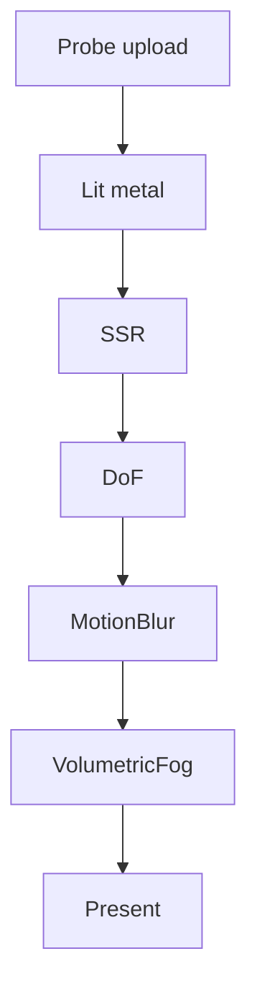

# Learn 26 — P1 后处理与反射（SSR / DoF / 雾）

> 在 **ReflectionProbe + metal 网格** 上叠加 **SSR、DoF、MotionBlur、VolumetricFog** 等 P1 效果，理解 M13 高配后处理与反射探针如何同时写入 `EffectTuning` 与 `PostStack`。

**前提**：CH15 reflection probe、CH16 post 栈。  
**对齐里程碑**：M13 P1。

## 怎么跑

```powershell
cmake --build build --config Debug --target sample_26_p1_post_reflect
build\samples\learn\26_p1_post_reflect\Debug\sample_26_p1_post_reflect.exe --headless --headless_frames=2
```

日志：`P1 FX: SSR DoF MotionBlur Fog + reflection probe`。

CMake target：**`sample_26_p1_post_reflect`**（链 `engine_gi`）。

## 知识点

1. **ReflectionProbe 复用 CH15**：CPU cubemap → `UploadReflectionCubemap`。
2. **metal mesh**：`mesh_id="metal"` 高 specular，利于 SSR/probe 对比。
3. **P1 Pass 名**：`SSR`、`DoF`、`MotionBlur`、`VolumetricFog` 经 `set_post_enabled`。
4. **quality.enable_ssr=true**：栈初始条件。
5. **EffectTuning 多项**：probe intensity、ssr、dof、motion blur、fog 布尔与标量。
6. **DrawFrame 全路径**：与 CH16/24 相同 RenderSystem 编排。
7. **SSR 局限**：屏幕空间；屏幕外信息缺失，probe 可兜底。
8. **DoF/MB 需 depth/velocity**：简单场景效果 subtle；动相机更明显。
9. **VolumetricFog**：体积雾 pass；与 `enable_fog` 配合。
10. **IBL 路径 SKIP**：未填 Environment IBL 三件套；反射主要靠 probe+SSR。

## 名词解释

| 术语 | 含义 |
|---|---|
| **SSR** | Screen Space Reflection。 |
| **DoF** | 景深；focus + scale。 |
| **Motion Blur** | 运动模糊；velocity buffer。 |
| **VolumetricFog** | 体积雾 post pass。 |
| **ReflectionProbe** | 局部 cubemap 反射。 |
| **P1** | 标配优先级（非 P0 刚需）。 |
| **EffectTuning** | 统一 FX 旋钮。 |
| **specular** | 金属 mesh 高镜面反射。 |
| **ssr_thickness** | 射线厚度容差。 |
| **reflection_intensity** | probe 混合权重。 |

详见 [GLOSSARY.md](../../docs/learn/GLOSSARY.md) 中 IBL、Motion Vectors、Environment。

## 原理

### Probe 准备

```text
ReflectionProbe.Configure({0,1.5,0}, 32)
UpdateFromEnvironment(sun_dir, sun_color, sun_intensity, ambient)
UploadReflectionCubemap(...)
```

### LitDesc + FX

```text
Medium + enable_ssr=true

fx.enable_reflection_probe=true, reflection_intensity=0.55
fx.enable_ssr / enable_dof / enable_motion_blur / enable_fog = true
set_post_enabled(SSR, DoF, MotionBlur, VolumetricFog)
```

### Pass 链（概念）

```text
Lit metal (probe + direct)
  → SSR (screen hits)
  → DoF (depth blur)
  → MotionBlur (velocity)
  → VolumetricFog
  → Tonemap 等
  → Present
```

### 反射合成（口头）

- Probe：稳定环境 specular（cubemap）。
- SSR：近距离屏幕内反射。
- 冲突：`reflection_intensity` vs `ssr_intensity` 调和。



## 代码地图

| 符号 / 文件 | 说明 |
|---|---|
| `samples/learn/26_p1_post_reflect/main.cpp` | probe + P1 FX |
| `engine/gi/reflection_probe.h` | CPU cubemap |
| `engine/render/render_system.h` | `EffectTuning` 全字段 |
| `engine/post/post_stack.h` | Pass 启停 |
| `mesh_id = "metal"` | 高金属变体 |
| `engine/render/render_system.cpp` | DrawFrame |
| CMake | engine_gi + app + d3d12 |

## 必做练习

1. 关 SSR 只留 probe，对比金属高光。
2. `reflection_intensity` 0→1 扫描。
3. 关 `VolumetricFog` pass 但留 `enable_fog`，观察差异。
4. PIX 数 full-screen pass，与 CH16 对比增量。
5. 动相机看 MotionBlur 是否增强（窗口模式）。
6. 对比 CH09 IBL：三件套 vs 单 probe 分工。
7. 读 `ssr_thickness` 注释，口头解释 thickness 过大/过小现象。
8. （设计）SSR miss 时 fallback 到 probe 的 shader 逻辑（伪代码）。

## 常见坑

- **P1 在简单场景不明显**：DoF/MB 需深度与运动。
- **SSR 破碎/缺失**：单 cube 占屏小；非未启用。
- **Headless stub no-op**：部分 pass 可能空操作；看 Status。
- **每启动上传 probe**：动态场景应 dirty 重传。
- **post 顺序敏感**：改顺序可能改变 DoF 对 SSR 影响。
- **Fog 与 Tonemap**：雾颜色受 exposure 影响；调参一次一个。
- **DXR 反射 SKIP**：真实 RT 反射在 CH19/35，非本章。
- **metal mesh 依赖资产**：缺 metal 变体可能回退 cube shading。

## P1 效果参数速查（本 demo 写入值）

| 字段 | 本 demo | 作用 |
|---|---|---|
| `reflection_intensity` | 0.55 | probe 混合权重 |
| `enable_ssr` | true | 屏幕空间反射 |
| `enable_dof` | true | 景深 |
| `enable_motion_blur` | true | 运动模糊 |
| `enable_fog` | true | 雾（配合 VolumetricFog pass） |
| `dof_focus` | 默认 8 | 清晰距离 |
| `motion_blur_strength` | 默认 0.35 | 模糊强度 |

调参建议：一次只改一行，窗口模式下动相机观察 MotionBlur/DoF。
