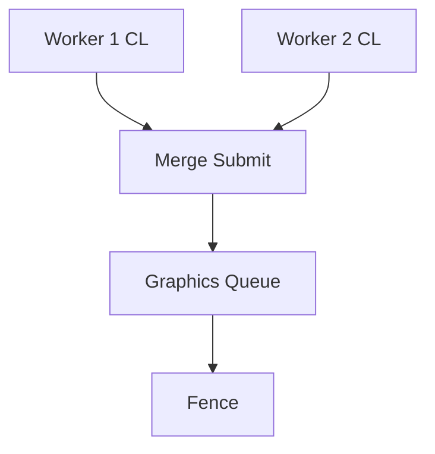

# Learn 27 — GPU 多线程提交（Submit MT）

> 通过 **SubmitConfig** 与 **QualitySettings::multithread_submit** 开启并行命令录制骨架，理解 M14「多线程 record → 单点 submit」的配置面；本 demo 画面仍为单 cube 标准帧。

**前提**：CH11 FG、Fence/in-flight 概念。  
**对齐里程碑**：M14 P1。**Bindless/间接绘制 SKIP**（PATH 标题含但未在本 demo）。

## 怎么跑

```powershell
cmake --build build --config Debug --target sample_27_gpu_submit_mt
build\samples\learn\27_gpu_submit_mt\Debug\sample_27_gpu_submit_mt.exe --headless --headless_frames=2
```

日志：`SetSubmitConfig multithread=true workers=2`。

CMake target：**`sample_27_gpu_submit_mt`**。

## 知识点

1. **SubmitConfig**：`multithread` + `worker_count` → `IDevice::SetSubmitConfig`。
2. **ValidateSubmitConfig**：非法 worker → Fail；本 demo workers=2。
3. **multithread_submit quality 标志**：与 RenderSystem LitDesc 一致。
4. **Init 顺序**：SetSubmitConfig **先于** `RenderSystem::Init`。
5. **DrawFrame 接口不变**：并行在 RHI/FG 内部；业务无感。
6. **single-thread fallback 安全**：注释标明不支持时回退单线程。
7. **与 CH22 分工**：CH22 实例数据；本章命令录制并行。
8. **Morph/Bindless SKIP**：PATH M14 其它主题未演示。
9. **Profiler 验收**：单 cube 看不出帧时间差，需 PIX/CPU trace。
10. **Fence 仍必需**：MT record 后 submit 合并，资源释放仍等 GPU fence。

## 名词解释

| 术语 | 含义 |
|---|---|
| **SubmitConfig** | 多线程录制与 worker 数。 |
| **Command List** | GPU 命令缓冲。 |
| **Submit** | CL 提交到 Queue。 |
| **multithread_submit** | quality 布尔。 |
| **Worker** | 录制并行度（CPU 线程）。 |
| **ExecuteCommandLists** | D3D12 合并提交点（概念）。 |
| **Barrier** | MT 合并后仍需正确资源状态。 |
| **in-flight** | 已提交未完成帧。 |
| **Record vs Execute** | CPU 录制与 GPU 执行分离。 |
| **Fallback** | 不支持 MT 时单线程。 |

详见 [GLOSSARY.md](../../docs/learn/GLOSSARY.md) 中 Command List、Queue、Fence。

## 原理

### 启动序列

```text
Application::Create
SubmitConfig { multithread=true, worker_count=2 }
device.SetSubmitConfig(cfg)  // fail → exit 1

RenderSystem.Init(LitDesc with multithread_submit=true)
Run → DrawFrame(cube) each frame
```

### 并行录制（概念）

```text
Worker0: Record CL0 (e.g. shadow subset)
Worker1: Record CL1 (e.g. lit subset)
Main:    Barrier + ExecuteCommandLists([CL0, CL1, ...])
Fence signal
```

### 与 instancing 无关

- 本 demo 单 cube；MT 收益在大 pass 多、draw 多场景（见 CH22 256 实例联想）。



## 代码地图

| 符号 / 文件 | 说明 |
|---|---|
| `samples/learn/27_gpu_submit_mt/main.cpp` | SetSubmitConfig + DrawFrame |
| `engine/rhi/submit_config.h` | 结构与 Validate |
| `IDevice::SetSubmitConfig` | RHI 入口 |
| `engine/render/quality.h` | `multithread_submit` |
| `engine/render/render_system.cpp` | 帧录制 |
| `engine/render/frame_graph.h` | Pass 划分（并行边界） |

## 必做练习

1. `worker_count=0` 或负数，观察 SetSubmitConfig Fail。
2. `multithread=false` 但 quality 仍 true，PIX 对比 CL 数量。
3. 标 DrawFrame 内哪些 pass 可并行 record（shadow vs lit）。
4. 解释 record 可并行、submit 需同步的原因。
5. 与 CH22 256 实例联想：瓶颈若在 CPU record，MT 收益在哪。
6. 读 ValidateSubmitConfig 规则，写 workers>CPU 核数 的风险。
7. headless stub 下 MT 是否 no-op；日志仍应成功。
8. （口头）Bindless 如何改变 root signature 与 MT 录制分工？

## 常见坑

- **画面无差异**：CPU 优化，需 profiler。
- **SetSubmitConfig 太晚**：Init 后可能不生效首帧策略。
- **headless 单线程**：SetSubmitConfig 仍应 Ok。
- **worker 过多**：同步开销抵消收益。
- **误以为 Bindless 已演示**：本 sample **SKIP**。
- **忽略 Fail 路径**：main 在 SetSubmitConfig 失败 return 1。
- **与 GPU Driven SKIP**：间接 draw 在 M14 其它 sample。
- **Barrier 竞态**：MT 下合并 CL 顺序必须满足 FG 依赖。

## 延伸阅读（可选）

- [DEBUG_WORKFLOW.md](../../docs/learn/DEBUG_WORKFLOW.md)：PIX 中查看 command queue 与 CL 数量。  
- [RUNTIME_FOUNDATIONS.md](../../docs/RUNTIME_FOUNDATIONS.md)：Fence 与 in-flight 资源退役。  
- CH22 `22_lod_instancing_streaming`：大实例数 + 本课 MT 配置联想的性能实验。
