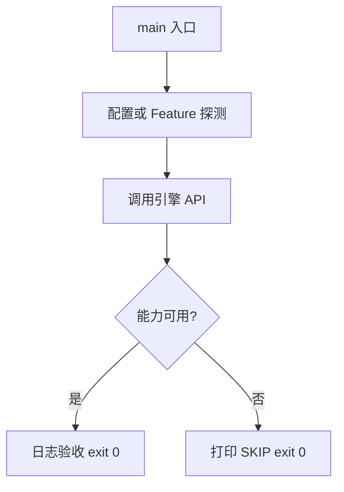

# Learn 28 — HDR 输出与色彩管理（选修）

> 请求 DeviceDesc.enable_hdr_output，并查询 FeatureSet.hdr_output；headless 常 SKIP 显示 HDR。

**前提**：CH16 Post/Tonemap。  
**对齐里程碑**：M14

## 怎么跑

```powershell
cmake -B build -DENGINE_BUILD_LEARN_SAMPLES=ON
cmake --build build --config Debug --target sample_28_hdr_color_sandbox
build\samples\learn\28_hdr_color_sandbox\Debug\sample_28_hdr_color_sandbox.exe --headless --headless_frames=2
```

CMake target：**`sample_28_hdr_color_sandbox`**。CreateHeadlessDevice；可能 SKIP。

| 参数 | 作用 |
|---|---|
| `--headless` | 无窗口 / 冒烟模式 |
| `--headless_frames=N` | Application 路径下限制帧数 |

## 知识点

1. **显示 HDR ≠ 场景 HDR RT**：中间浮点 RT 与 swapchain HDR10 不同。
2. **enable_hdr_output**：创建设备时请求；offscreen 常忽略。
3. **Feature hdr_output**：运行时能力位。
4. **Tonemap 仍在 Post**：LDR 显示器需要映射；HDR 显示另有传递路径。
5. **色彩管理**：本章点到；完整 ICC/色域在产品加深。
6. **教学验收**：日志写清请求与 feature。
7. **Sandbox**：窗口路径才能真实验证 HDR 显示器。
8. **与曝光**：exposure 在 EffectTuning。
9. **不要假称已输出 HDR10** 当 feature 为 false。
10. **验证层**：可开 enable_validation。
11. **Vulkan 色空间**：另见 CH32。
12. **可失败得漂亮**：SKIP exit 0。

## 名词解释

| 术语 | 含义 |
|---|---|
| **HDR10** | 常见显示 HDR 传递 |
| **swapchain** | 呈现交换链 |
| **Scene HDR** | 离屏浮点颜色缓冲 |
| **Tonemap** | HDR→显示范围 |
| **Feature hdr_output** | 能力位 |

详见 [GLOSSARY.md](../../docs/learn/GLOSSARY.md)。

## 原理

DeviceDesc.enable_hdr_output=true → CreateHeadlessDevice → QueryFeatures → 日志。  
无交换链时通常无法真正打开显示 HDR，故 SKIP 说明是预期。



本 demo 的 README 与 `main.cpp` 路径一致；未实现的能力只写 SKIP，不假装画质。

## 代码地图

| 符号 / 文件 | 说明 |
|---|---|
| `main.cpp` | HDR 请求与 Feature 日志 |
| `DeviceDesc::enable_hdr_output` | 创建参数 |
| `FeatureSet::hdr_output` | 能力位 |
| `CreateHeadlessDevice` | 头less 设备 |
| CMake `sample_28_hdr_color_sandbox` | 本 sample 目标 |

## 必做练习

1. ★ 阅读日志中的 feature.hdr_output。
2. ★★ 在有 HDR 屏的机器用 Sandbox 对照。
3. ★★★（选做）梳理 tonemap_mode 与 HDR 输出关系。

## 常见坑

- 把场景 HDR RT 当成显示器 HDR。
- headless 期望 HDR10 成功。
- 关 tonemap 直接 Present 浮点到 LDR。
- 忽略色域导致过饱和。

## 延伸阅读

- 章节：[docs/learn/chapters/](../../docs/learn/chapters/)
- 路径：[PATH.md](../../docs/learn/PATH.md)
- 规范：[SAMPLES.md](../../docs/learn/SAMPLES.md)
