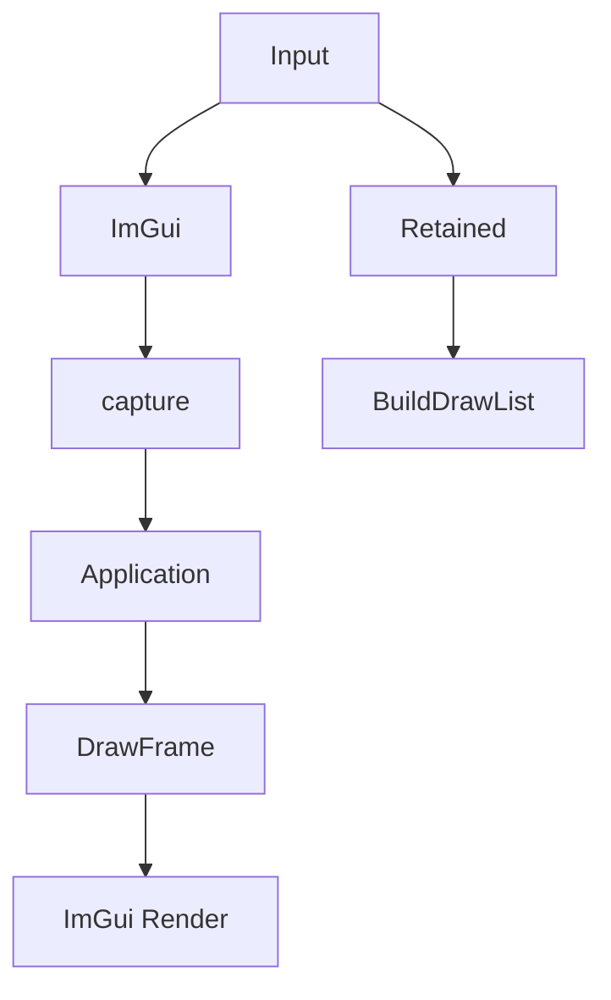

# Learn 29 — UI 双轨（ImGui + Retained）（选修）

> 在同一场景中初始化 **ImmediateUi（Dear ImGui）** 与 **RetainedUi 后端**，演示 HUD 布局、输入捕获与 3D 帧后 UI 提交顺序，理解 M8/M15 UI 与 ActionMap 的分工边界。

**选修说明**：与 CH07b Input/ActionMap 配合阅读；RmlUi 深度集成 **SKIP**（仅 backend 查询）。  
**对齐里程碑**：M8/M15。

## 怎么跑

```powershell
cmake --build build --config Debug --target sample_29_ui
build\samples\learn\29_ui\Debug\sample_29_ui.exe --headless --headless_frames=2
```

窗口模式：ImGui 「Debug」窗 + retained HUD 矩形；日志 `ImmediateUi available=`、`Retained backend:`。

UI 着色器：`ui_imgui.vs/ps.cso`。CMake target：**`sample_29_ui`**。

## 知识点

1. **ImmediateUi**：每帧 BeginFrame → 窗口/控件 → RefreshCapture → Render。
2. **RetainedUi**：Panel/Label/Toggle 声明式；`BuildDrawList` → `UiDrawRect`。
3. **输入捕获**：`want_capture_mouse/keyboard` → `set_ui_want_capture`。
4. **帧顺序**：DrawFrame(3D) → ImGui Render；retained 本 demo 仅 BuildDrawList。
5. **Init 容错**：ImGui 缺 shader → Warn，不 crash。
6. **WindowInputSnapshot**：每帧输入快照喂 ImGui。
7. **DrawFrame ui_quads 参数 SKIP**：retained 矩形未传入 DrawFrame（练习可接）。
8. **delta_time**：ImGui BeginFrame 需要，用于动画/重复键。
9. **与 ActionMap 分层**：UI capture true 时 gameplay 应 suppressed（InputSystem 层）。
10. **Low quality 3D**：UI 与 lit 解耦；3D 用 Low 减干扰。

## 名词解释

| 术语 | 含义 |
|---|---|
| **ImmediateUi** | 即时模式 UI（ImGui 封装）。 |
| **RetainedUi** | 保留模式；控件持久存在。 |
| **UI Pass** | 3D 之后绘制 UI。 |
| **Want capture** | UI 消费输入事件。 |
| **UiDrawRect** | retained 填充矩形列表。 |
| **WindowInputSnapshot** | 键鼠状态快照。 |
| **ActionMap** | 逻辑动作绑定（CH07b）。 |
| **ScreenQuad** | DrawFrame 可选 UI 几何参数。 |
| **Dear ImGui** | 第三方即时 UI 库。 |
| **HitTest / Pump** | retained 命中与事件泵。 |

详见 [GLOSSARY.md](../../docs/learn/GLOSSARY.md) 中 ImmediateUi、RetainedUi、UI Pass、ActionMap。

## 原理

### Init

```text
ImmediateUi.Init(device, ui_imgui.vs/ps)
RetainedUi: Panel("hud") + Label + Toggle("opt_ssao", default true)
Log Retained backend name (QueryRetainedUiBackend)
RenderSystem.Init(LitDesc Low)
```

### 每帧

```text
imgui.BeginFrame(input, w, h, delta_time)
if BeginWindow("Debug"): Text; EndWindow
imgui.RefreshCapture()
app.set_ui_want_capture(mouse || keyboard)

render.DrawFrame(...)   // 3D

imgui.Render(device)
retained.BuildDrawList()   // 未接 DrawFrame ui_quads
```

### 输入流（概念）

```text
Raw Input → ImGui/Retained Pump
         → want_capture?
         → if true: suppress ActionMap
         → if false: gameplay actions
```



## 代码地图

| 符号 / 文件 | 说明 |
|---|---|
| `samples/learn/29_ui/main.cpp` | 双 UI + 帧循环 |
| `engine/ui/immediate_ui.h/cpp` | ImGui 封装 |
| `engine/ui/retained_ui.h` | Panel/Label/Toggle |
| `engine/ui/rml_ui.h` | `QueryRetainedUiBackend` |
| `Application::set_ui_want_capture` | 输入路由钩子 |
| `RenderSystem::DrawFrame` | 可选 `ui_quads` |
| `ui_imgui.vs/ps.cso` | UI 着色器 |

## 必做练习

1. ImGui 加 Checkbox，观察 capture 时相机是否仍动（若接 ActionMap）。
2. 设计 `opt_ssao` Toggle → `RenderSystem` quality 的接线伪代码。
3. 删除 `ui_imgui.vs.cso`，确认 Warn + `available()==false`。
4. 将 `BuildDrawList` 转 `ScreenQuad` 传入 DrawFrame（API 允许时）。
5. 对比 Immediate vs Retained 各适合工具面板还是游戏 HUD。
6. 读 `ImmediateUi::Render` 需要的 GPU 状态（blend/depth off）。
7. Retained `Pump` 与鼠标点击 Toggle 状态（窗口模式）。
8. （口头）为何 UI Pass 通常在 3D **之后**？

## 常见坑

- **Retained 不显示**：只 BuildDrawList 未绘制；分步教学非 bug。
- **ImGui 在 3D 前 Render**：会被覆盖；以 main 顺序为准。
- **Headless 无 UI 像素**：看 Init 日志。
- **rml_ui 命名**：以 `QueryRetainedUiBackend` 为准。
- **与 CH07b 混淆**：本章只 `set_ui_want_capture`。
- **缺 ui shader 仍 Run**：3D 可跑，ImGui Render 可能 Fail silently 视实现。
- **want_capture 未 Refresh**：BeginFrame 后须 RefreshCapture。
- **RmlUi 完整集成 SKIP**：勿假设 HTML/CSS 引擎已嵌入。

## ActionMap 分工（对照 CH07b）

| 层级 | 职责 |
|---|---|
| Raw Input | 键鼠/手柄原始状态 |
| ImmediateUi / RetainedUi | 控件命中、capture |
| Application::ui_want_capture | 告知输入系统 UI 消费 |
| ActionMap | gameplay 逻辑动作（Move/Jump） |

本 demo 只演示第三行钩子；完整 suppression 在 InputSystem 实现。练习：当 ImGui Debug 窗开启时，FPS 相机 WASD 是否应暂停？应由哪层决定？
