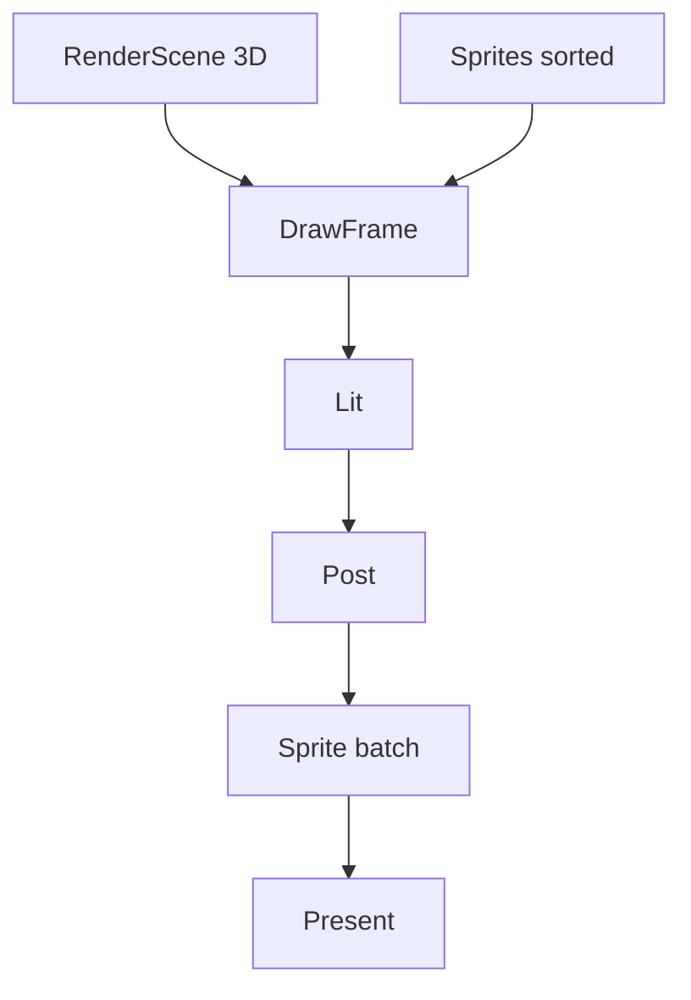

# Learn 30 — 2D/像素混合（Sprite + 3D）（选修）

> 在 **3D lit cube** 帧上叠加 **nearest 采样 Sprite 列表**，理解 M16 混合管线中 sort layer、Y-sort 与 `DrawFrame(sprites)` 参数如何进入同一 Present。

**选修说明**：Tilemap、整数缩放 viewport **SKIP**（sprite.h 有 API 未在本 demo 调用）。  
**对齐里程碑**：M16。增量见 CH34。

## 怎么跑

```powershell
cmake --build build --config Debug --target sample_30_pixel_hybrid
build\samples\learn\30_pixel_hybrid\Debug\sample_30_pixel_hybrid.exe --headless --headless_frames=2
```

窗口：左上角三枚 32×32 精灵（`pixel` atlas 帧 0/1/2）。日志：`Sorted sprites count=3`。

CMake target：**`sample_30_pixel_hybrid`**。

## 知识点

1. **Sprite 字段**：atlas_id、frame、position、size、sort_layer、sort_y、nearest、color。
2. **SortSprites**：先 sort_layer 后 sort_y；决定叠放顺序。
3. **DrawFrame 重载**：第五参数 `&sprites` 进入 FG sprite batch。
4. **nearest=true**：点采样像素风；产品配合整数缩放。
5. **3D+2D Hybrid**：RenderScene cube + sprite 列表同一 Present。
6. **atlas_id="pixel"**：依赖资产系统识别；缺则 Fail 可诊断。
7. **sort_layer=1**：三 sprite 同层，靠 sort_y 区分前后。
8. **alpha 混合**：sprite color.a=0.9；与 3D 合成顺序在 sprite pass。
9. **Tilemap SKIP**：`LoadTiledJson` 未调用。
10. **Billboard SKIP**：本章纯 2D 屏幕空间 sprite。

## 名词解释

| 术语 | 含义 |
|---|---|
| **Sprite** | 2D 精灵实例。 |
| **SpriteAtlas** | 图集与帧矩形。 |
| **SortLayer** | 整数绘制层。 |
| **Y-sort** | sort_y 模拟深度。 |
| **Nearest** | 最近邻过滤。 |
| **Pixel pipeline** | Nearest + 整数缩放 + 对齐。 |
| **Hybrid** | 3D 与 2D 同帧。 |
| **frame** | 图集内帧索引。 |
| **Tilemap** | 瓦片地图；**SKIP**。 |
| **Alpha blend** | 精灵透明合成。 |

详见 [GLOSSARY.md](../../docs/learn/GLOSSARY.md) 中 Sprite、Tilemap、Y-sort、Pixel pipeline。

## 原理

### Sprite 构造

```text
3 sprites:
  atlas_id="pixel", frame=0,1,2
  position (40+i*48, 40), size 32x32
  sort_layer=1, sort_y=i, nearest=true
SortSprites(sprites)
```

### 每帧

```text
DrawFrame(device, render_scene, env, aspect, &sprites)
  → Lit 3D cube
  → Post（Low 可能简化）
  → Sprite batch（nearest sample atlas）
  → Present
```

### 排序规则（概念）

1. `sort_layer` 升序（低层先画？以实现为准，读 `SortSprites`）。
2. 同 layer 按 `sort_y` 排序俯视角前后。



## 代码地图

| 符号 / 文件 | 说明 |
|---|---|
| `samples/learn/30_pixel_hybrid/main.cpp` | sprite + DrawFrame |
| `engine/render2d/sprite.h` | `Sprite`、`SortSprites` |
| `engine/render/render_system.h` | sprites 参数 |
| `engine/render/frame_graph.h` | sprite pass 节点 |
| `Application::render_scene()` | 3D cube 来源 |
| CMake | render2d + sandbox shaders |

## 必做练习

1. 改第三 sprite `sort_y` 最小，确认绘制顺序。
2. `nearest=false` 对比边缘（放大 atlas 时更明显）。
3. 增 layer 0 与 2 各一 sprite，验证层优先。
4. 读 `SortSprites` 实现，相等键是否稳定排序。
5. 俯视角 RPG 何时 Y-sort 失效？举反例。
6. 故意错 `atlas_id`，读 DrawFrame Status。
7. 设计整数缩放 viewport 伪代码（Pixel pipeline）。
8. （对比 CH29）Sprite pass vs ImGui pass 输入差异。

## 常见坑

- **看不见 sprite**：atlas 未加载、position 出屏、post 盖住。
- **Headless 不验像素**：count=3 日志即可。
- **Tilemap 未演示**：勿假设 Tiled 已加载。
- **与 UI 混淆**：CH29 走 ImGui/quads；本章 render2d。
- **3D 深度忽略**：简单混合可能不写深度；CH34 谈 2D 深度。
- **sort_y 方向约定**：以实现为准；改值前读 SortSprites。
- **单帧 frame 动画 SKIP**：未演示时间轴换 frame。
- **color 默认绿系**：与 atlas 叠加可能偏色；调 color 做实验。

## 与 CH34 的增量（预告）

| 主题 | CH30 本 demo | CH34 增量 |
|---|---|---|
| Sprite 排序 | SortSprites | 深度/拣选策略 |
| Tilemap | SKIP | LoadTiledJson 接入 |
| 整数缩放 | 概念 | viewport 整数倍 |
| Motion Vectors | SKIP | 2D MV 与 TAA 交互 |

完成本章后应能口头回答：**为何 pixel 游戏要 Nearest + 整数缩放？** 以及 **Y-sort 在侧视平台关卡何时不够？**
