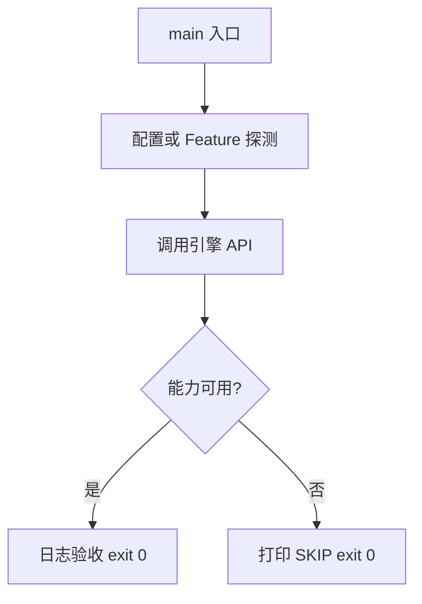

# Learn 31 — 网络 Loopback 与 Net.Pump（选修）

> NetSystem HTTP 回调必须经 Pump；并探测 MsQuic loopback（缺库 SKIP）。

**前提**：主循环概念；与图形后端无关。  
**对齐里程碑**：M19

## 怎么跑

```powershell
cmake -B build -DENGINE_BUILD_LEARN_SAMPLES=ON
cmake --build build --config Debug --target sample_31_net_loopback
build\samples\learn\31_net_loopback\Debug\sample_31_net_loopback.exe --headless --headless_frames=2
```

CMake target：**`sample_31_net_loopback`**。链接 `engine_net`；故意连无效端口观察回调。

| 参数 | 作用 |
|---|---|
| `--headless` | 无窗口 / 冒烟模式 |
| `--headless_frames=N` | Application 路径下限制帧数 |

## 知识点

1. **回调进主循环**：完成只在 Net.Pump 后投递。
2. **与图形后端无关**：HTTP/WS/QUIC 不依赖 D3D/VK。
3. **IHttpClient / IWebSocket / IQuicEndpoint**：三分抽象。
4. **MsQuic 可选**：Probe；不静默安装。
5. **TryQuicConnectStub / Loopback**：缺库 Unavailable。
6. **Application::set_net**：可挂到 app 主循环。
7. **教学用 127.0.0.1:9**：预期失败也触发回调路径。
8. **线程安全**：业务状态在 Pump 回调里改。
9. **HTTPS/OpenSSL**：可选编译开关。
10. **可靠流**：QUIC 场景见 ADR 0031/0036。
11. **不要在网络线程调 RHI**。
12. **验收**：http_done 与 MsQuic 日志。

## 名词解释

| 术语 | 含义 |
|---|---|
| **NetSystem** | 网络中枢 |
| **Pump** | 主线程排空完成队列 |
| **MsQuic** | 微软 QUIC 实现 |
| **loopback** | 本机回环测试 |
| **IHttpClient** | HTTP 抽象 |

详见 [GLOSSARY.md](../../docs/learn/GLOSSARY.md)。

## 原理

Get(url, cb) → 循环 Pump → 回调日志；同时 Probe MsQuic。  
设计目标：网络完成与帧同步，避免竞态。



本 demo 的 README 与 `main.cpp` 路径一致；未实现的能力只写 SKIP，不假装画质。

## 代码地图

| 符号 / 文件 | 说明 |
|---|---|
| `main.cpp` | HTTP + Quic 探测 |
| `engine/net/net_system.h` | NetSystem |
| `engine/net/quic.h` | MsQuic 探测与 stub |
| `Pump` | 排空回调 |
| CMake `sample_31_net_loopback` | 本 sample 目标 |

## 必做练习

1. ★ 解释为何必须 Pump。
2. ★★ 若有本地 HTTP 服务，改 URL 验证成功回调。
3. ★★★（选做）阅读 TryQuicLoopbackReliableSendRecv。

## 常见坑

- 忘记 Pump 导致回调永不执行。
- 把缺 MsQuic 当编译失败。
- 在回调里做重 GPU 工作。
- 假设网络与 Present 同线程即安全——仍要 Pump 契约。

## 延伸阅读

- 章节：[docs/learn/chapters/](../../docs/learn/chapters/)
- 路径：[PATH.md](../../docs/learn/PATH.md)
- 规范：[SAMPLES.md](../../docs/learn/SAMPLES.md)
