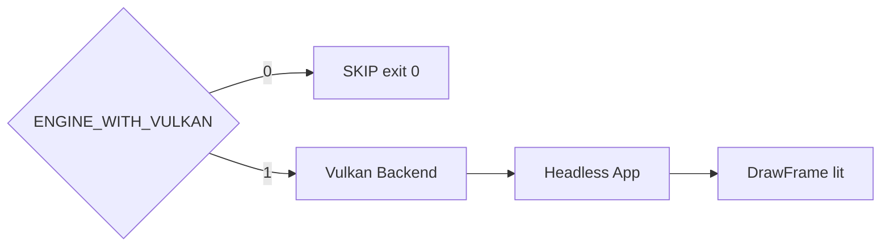

# Learn 32 — Vulkan 后端对照（选修）

> 在 **ENGINE_WITH_VULKAN=1** 时以 `Backend::Vulkan` 创建 Application，默认 **headless** 跑 `DrawFrame` lit cube，理解 M17 双后端切换与 D3D12 学习路径的对照关系；未启用 Vulkan 时 **SKIP** 并退出 0。

**选修说明**：PATH 亦建议对照 `01_clear` / `02_triangle` / `06_rhi_triangle` 的 `--backend=vulkan`。  
**对齐里程碑**：M17。Post/UI parity 可能 L1 **TBD**。

## 怎么跑

**Vulkan ON：**

```powershell
cmake -B build -DENGINE_WITH_VULKAN=ON -DENGINE_BUILD_LEARN_SAMPLES=ON
cmake --build build --config Debug --target sample_32_vulkan_backend
build\samples\learn\32_vulkan_backend\Debug\sample_32_vulkan_backend.exe --headless --headless_frames=2
```

日志：`Vulkan path headless=true`，DrawFrame 无 Error。

**Vulkan OFF：**

```powershell
build\samples\learn\32_vulkan_backend\Debug\sample_32_vulkan_backend.exe
# SKIP sample_32_vulkan_backend (ENGINE_WITH_VULKAN=0), exit 0
```

CMake target：**`sample_32_vulkan_backend`**（条件链 `engine_vulkan`）。

## 知识点

1. **编译期门控**：`#if !ENGINE_WITH_VULKAN` → SKIP 日志 + return 0。
2. **ApplicationDesc.backend = Vulkan**：与 CH01 CLI `--backend=vulkan` 同语义。
3. **默认 headless**：desc 启动即 headless；适合 CI 无显示器。
4. **ENGINE_SHADER_DIR_A**：仍指向 sandbox `.cso` 路径字符串；Vulkan 设备层映射 SPIR-V/cache。
5. **Post 简化**：LitDesc 关 SSAO/TAA，先验证 lit L0。
6. **is_headless() 日志**：确认 Application 路径。
7. **Feature L0/L1/L2**：lit 应对齐 L0；post 可能 L1（见 ADR 0024）。
8. **与 CH01 差异**：CH01 清屏+CLI；本章 RenderSystem 全帧+固定 headless。
9. **Linux 桌面 SKIP**：headless 默认；WSI 见 CH33。
10. **双路径 main**：同一 target 在 OFF 构建仍产生 exe，行为 SKIP。

## 名词解释

| 术语 | 含义 |
|---|---|
| **Vulkan** | 跨平台图形 API。 |
| **Backend** | D3D12 / Vulkan / Headless。 |
| **ENGINE_WITH_VULKAN** | CMake 开关。 |
| **Feature L0/L1/L2** | 双后端对齐级别。 |
| **SPIR-V** | Vulkan 着色器 IR。 |
| **Headless** | 无 swapchain 窗口验证。 |
| **SKIP** | 能力缺失可诊断 + exit 0。 |
| **WSI** | Window System Integration。 |
| **Parity** | 两后端行为一致程度。 |
| **Shader 路径 .cso** | 逻辑路径名；后端解析非字面 DXIL。 |

详见 [GLOSSARY.md](../../docs/learn/GLOSSARY.md) 中 Vulkan、RHI、Barrier、Swapchain。

## 原理

### Vulkan ON 路径

```text
ApplicationDesc:
  backend = Vulkan
  headless = true, window.headless = true
  headless_frames = 2 (default)

Create → Log is_headless
cube scene
RenderSystem.Init(LitDesc: Low, SSAO/TAA off)
Run → DrawFrame
```

### Vulkan OFF 路径

```text
Log: SKIP sample_32_vulkan_backend (ENGINE_WITH_VULKAN=0)
return 0
```

### 设备创建（概念）

```text
Backend::Vulkan → Create Vulkan IDevice
  headless: 无 swapchain 或 null surface
  lit: SetupLitMesh + DrawFrame 内部 SPIR-V PSO
```

### L0 验收清单

| 能力 | 本 demo |
|---|---|
| Application Create | ✓ |
| DrawFrame lit cube | ✓ |
| SSAO/TAA post | 关（简化） |
| UI | SKIP |



## 代码地图

| 符号 / 文件 | 说明 |
|---|---|
| `samples/learn/32_vulkan_backend/main.cpp` | 双路径 main |
| `engine/rhi/backend.h` | `Backend::Vulkan` |
| `engine/app/application.h` | `ApplicationDesc` |
| `engine_vulkan` | Vulkan RHI 实现 |
| CMakeLists | `if(ENGINE_WITH_VULKAN)` link |
| `docs/VULKAN_PARITY.md` | 差异对照（若存在） |
| CH01 `01_clear` | CLI vulkan 对照 sample |

## 必做练习

1. Vulkan ON 下跑本 sample 与 `01_clear --backend=vulkan`，对比 Init 日志。
2. 改 `desc.headless=false` 试窗口 swapchain（需显示环境）。
3. 列 lit cube 在 parity 文档属 L0 还是 L1。
4. Vulkan OFF 构建确认 SKIP + exit 0（CI 矩阵）。
5. 对比 D3D12 CH07 sample：DrawFrame 何处 backend 分叉。
6. 读 CMake `ENGINE_WITH_VULKAN` 传递宏到 `main.cpp`。
7. 故意缺 SPIR-V，观察 Init Fail 消息是否可诊断。
8. （口头）为何 CH32 默认 headless 而 CH01 默认窗口？

## 常见坑

- **SKIP 当失败**：exit 0 是预期；读日志字符串。
- **无 SDK 仍开选项**：链接/运行失败；关选项或装 SDK。
- **post_ssao 以为会跑**：LitDesc 显式关 SSAO/TAA。
- **.cso 路径字面理解**：后端映射，勿混 D3D12-only API 到 Vulkan main。
- **Linux 显示**：headless 默认；桌面需 CH33。
- **shader 未编译 SPIR-V**：Init 失败；查 sandbox shader 构建链。
- **与 CH33 混淆**：CH33 Linux 窗口；本章 Windows/通用 headless。
- **Feature parity 过度预期**：L1 post 可能 stub；先验 L0 lit。
