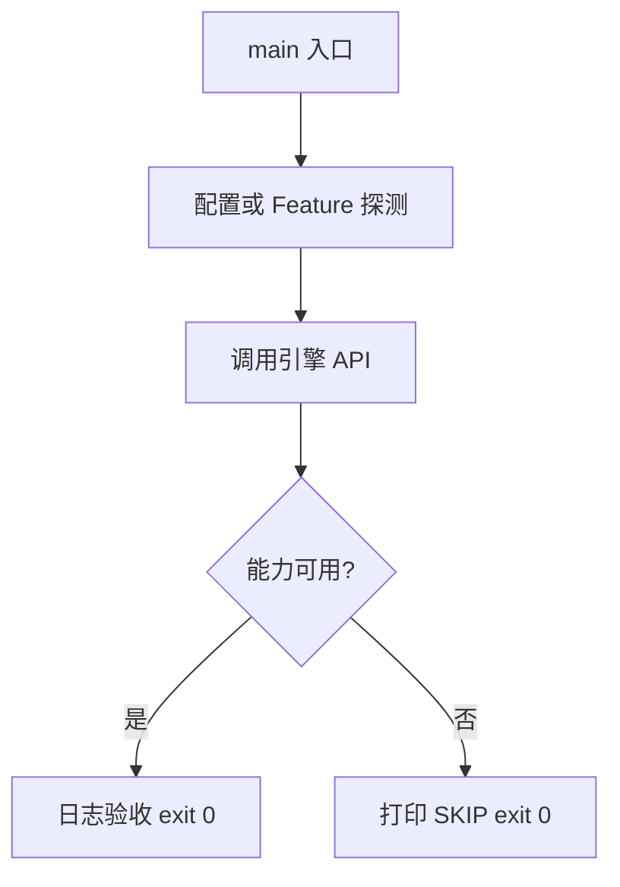

# Learn 34 — 混合打磨与 2D 深度（选修）

> SortSprites、IntegerScale、Path2D 填充与统一 Pick，相对 CH30 的增量打磨。

**前提**：CH30 像素混合。  
**对齐里程碑**：M20–M21

## 怎么跑

```powershell
cmake -B build -DENGINE_BUILD_LEARN_SAMPLES=ON
cmake --build build --config Debug --target sample_34_hybrid_2d_depth
build\samples\learn\34_hybrid_2d_depth\Debug\sample_34_hybrid_2d_depth.exe --headless --headless_frames=2
```

CMake target：**`sample_34_hybrid_2d_depth`**。CPU 侧；无窗口。

| 参数 | 作用 |
|---|---|
| `--headless` | 无窗口 / 冒烟模式 |
| `--headless_frames=N` | Application 路径下限制帧数 |

## 知识点

1. **相对 CH30 增量**：排序/拣选/Path2D 填充/整数缩放强调。
2. **SortSprites**：layer 再 Y。
3. **Y-sort 失效**：透视相机或 3D 交叉时需别策略。
4. **IntegerScale**：像素艺术整数倍缩放。
5. **Pick 统一**：3D AABB 优先，否则顶层 Sprite。
6. **Path2D TessellateFillFan**：闭合轮廓扇形填充。
7. **深度分层**：2D 常用 sort_layer 而非真实 Z-buffer。
8. **Motion Vector**：混合场景 MV 另见后处理章。
9. **Nearest 采样**：像素风默认。
10. **不要用卡片式 UI 思路硬套世界精灵**。
11. **与 UI 章分工**：ImGui/Rml 是屏幕 UI；Sprite 是世界/游戏 2D。
12. **验收**：排序日志 + Pick kind。

## 名词解释

| 术语 | 含义 |
|---|---|
| **sort_layer** | 图层优先级 |
| **sort_y** | 同层 Y 排序键 |
| **IntegerScale** | 整数缩放因子 |
| **Pick** | 统一拣选 |
| **Path2D** | 矢量路径网格化 |

详见 [GLOSSARY.md](../../docs/learn/GLOSSARY.md)。

## 原理

构造多 Sprite → SortSprites → IntegerScale → Path2D 填充 → Pick 屏幕点。

2D「深度」常是排序键；与 3D 深度缓冲混合时需明确通道与 Pass 顺序。



本 demo 的 README 与 `main.cpp` 路径一致；未实现的能力只写 SKIP，不假装画质。

## 代码地图

| 符号 / 文件 | 说明 |
|---|---|
| `main.cpp` | 排序/缩放/Path/Pick |
| `SortSprites` | 稳定排序 |
| `engine/mixed/pick.h` | 统一拣选 |
| `engine/render2d/path2d.h` | Path2D |
| `IntegerScale` | 像素整数缩放 |
| CMake `sample_34_hybrid_2d_depth` | 本 sample 目标 |

## 必做练习

1. ★ 交换 sort_layer 观察顺序日志。
2. ★★ 改 Pick 坐标命中另一 sprite。
3. ★★★（选做）EarClipSimple 对比 FillFan。

## 常见坑

- Y-sort 用于透视场景导致错误前后关系。
- 非整数缩放导致像素闪烁。
- Pick 未排序时「顶层」语义不清。
- Path 未闭合导致填充退化。

## 延伸阅读

- 章节：[docs/learn/chapters/](../../docs/learn/chapters/)
- 路径：[PATH.md](../../docs/learn/PATH.md)
- 规范：[SAMPLES.md](../../docs/learn/SAMPLES.md)
