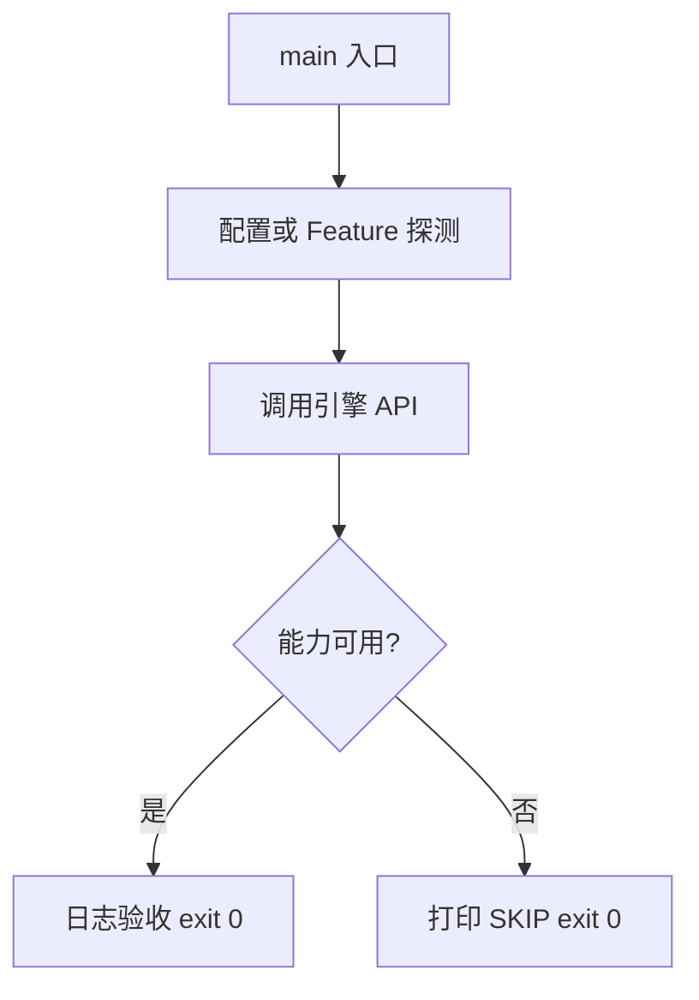

# Learn 36 — Mega-W9 加深冒烟（选修）

> 一次冒烟 ADR 0036：meshlet/MS、GPU 蒙皮探测、Weather、MsQuic loopback、Feature 位。

**前提**：选修末章；建议完成必修并浏览 CH22+。  
**对齐里程碑**：Mega-W9 / ADR 0036

## 怎么跑

```powershell
cmake -B build -DENGINE_BUILD_LEARN_SAMPLES=ON
cmake --build build --config Debug --target sample_36_w9_deepen
build\samples\learn\36_w9_deepen\Debug\sample_36_w9_deepen.exe --headless --headless_frames=2
```

CMake target：**`sample_36_w9_deepen`**。多模块链接；能力缺失打印 Unavailable/SKIP，仍 exit 0。

| 参数 | 作用 |
|---|---|
| `--headless` | 无窗口 / 冒烟模式 |
| `--headless_frames=N` | Application 路径下限制帧数 |

## 知识点

1. **W9 边界见 ADR 0036**：真 MS、tile CS、VT feedback、GI/RT 加深等。
2. **MeshletizePreferMeshoptimizer**：有库用 meshoptimizer，否则 AABB。
3. **TryMeshShaderPath**：D3D12 MS PSO；失败 Unavailable。
4. **ProbeMeshShaderSupportVk**：扩展探测。
5. **GpuSkinningAvailable**：C12。
6. **WeatherSystem**：状态机 + curtain/precip。
7. **TryQuicLoopbackReliableSendRecv**：缺 MsQuic SKIP。
8. **仍外置**：Nanite、真 DDGI、蓝图、XR 等。
9. **学习轨收口**：本 sample 对应 CH36。
10. **不要把冒烟当画质验收**。
11. **Feature virtual_texture**：默认能力位。
12. **与 Sandbox**：完整开关在 Sandbox/F1，不在本最小 main。

## 名词解释

| 术语 | 含义 |
|---|---|
| **Meshlet** | 网格子集 + AABB |
| **Mesh Shader** | MS 管线 |
| **WeatherSystem** | 天气状态机 |
| **ADR 0036** | W9 边界决策 |
| **SKIP** | 能力缺失的可诊断退出 |

详见 [GLOSSARY.md](../../docs/learn/GLOSSARY.md)。

## 原理

顺序探测：cook meshlet → MS → skin → weather → quic → 打 Feature 日志。  
每步独立，单步失败不阻断后续探测。



本 demo 的 README 与 `main.cpp` 路径一致；未实现的能力只写 SKIP，不假装画质。

## 代码地图

| 符号 / 文件 | 说明 |
|---|---|
| `main.cpp` | W9 冒烟入口 |
| `engine/gpu_driven/meshlet.h` | cook/MS |
| `engine/render/weather.h` | 天气 |
| `engine/net/quic.h` | loopback |
| `GpuSkinningAvailable` | 蒙皮探测 |
| CMake `sample_36_w9_deepen` | 本 sample 目标 |

## 必做练习

1. ★ 列出本机日志中哪些为 Ok/Unavailable。
2. ★★ 对照 ADR 0036 十条决策打勾。
3. ★★★（选做）在 Sandbox 打开对应 Feature 复现。

## 常见坑

- 把 Unavailable 当编译错误。
- 宣称 Nanite/DDGI 已完成。
- 忽略「仍外置」清单。
- 只跑本 sample 不读 ADR。

## 延伸阅读

- 章节：[docs/learn/chapters/](../../docs/learn/chapters/)
- 路径：[PATH.md](../../docs/learn/PATH.md)
- 规范：[SAMPLES.md](../../docs/learn/SAMPLES.md)
