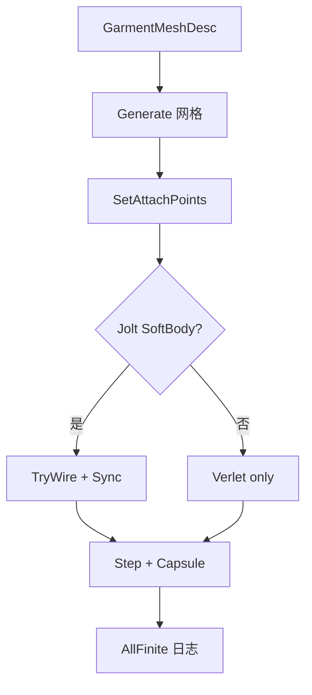

# Learn 37 — 演示级服装 / 披风裙摆（选修）

> 用 `GarmentCloth` 生成披风/裙摆网格，跑 CPU Verlet，并可选挂接薄 SoftBody（非 DCC 服装管线）。

**前提**：建议先完成 CH25 物理与 CH14 蒙皮概念；本课无窗口。  
**对齐里程碑**：Mega-W10 / ADR 0037（修订 ADR 0029：允许演示级挂接）

## 怎么跑

```powershell
cmake -B build -DENGINE_BUILD_LEARN_SAMPLES=ON
cmake --build build --config Debug --target sample_37_clothing
build\samples\learn\37_clothing\Debug\sample_37_clothing.exe --headless --headless_frames=2
```

CMake target：**`sample_37_clothing`**。链接 `engine_clothing` + `engine_physics`。  
builtin 物理下 SoftBody 为 SKIP，仍用 Verlet，exit 0。

| 参数 | 作用 |
|---|---|
| `--headless` | 冒烟 / 无窗口 |
| `--headless_frames=N` | 预留 Application 帧数（本 demo 无窗口循环） |

## 知识点

1. **ADR 0037 边界**：演示披风/裙摆 ≠ 服装产品管线；禁止把本课当成 Marvelous Designer 替代。
2. **GarmentKind**：`Cape` / `Skirt` 两种程序化拓扑。
3. **Generate**：按 rows×cols 建网格，顶行钉住（pin）。
4. **SetAttachPoints**：每帧更新钉点（肩/腰），模拟跟角色走。
5. **Step(dt, capsule)**：Verlet + 拉伸约束 + 胶囊碰撞。
6. **TryWirePhysicsSoftBody**：Jolt 可用时创建薄 SoftBody 立方；失败则 CPU 路径。
7. **SyncFromPhysics**：可选把物理顶点盖回（演示立方同步，披风仍以 Verlet 为准）。
8. **AllFinite**：数值健康检查，冒烟必看。
9. **与 possess**：人物开关见 `40_possess_third_person` / CH39。
10. **Sandbox**：完整 SoftBody DebugDraw 在 Sandbox，不在本最小 main。
11. **Feature**：无单独 clothing Feature 位；能力以物理后端为准。
12. **学习目标**：能口头区分「演示挂接」与「服装管线」。

## 名词解释

| 术语 | 含义 |
|---|---|
| **GarmentCloth** | 演示级布料网格 + Verlet |
| **Verlet** | 用位置差分积分，无需显式速度缓冲也可阻尼 |
| **Pin / Attach** | 固定顶点跟随骨骼/挂点 |
| **CapsuleCollider** | 简易身体碰撞体 |
| **SoftBody（薄）** | `IPhysicsWorld` 上的 C22 API |
| **ADR 0029 / 0037** | SoftBody 边界与 W10 演示修订 |
| **SKIP** | 后端不支持时的可诊断降级 |

详见 [GLOSSARY.md](../../docs/learn/GLOSSARY.md)、[ADR 0037](../../docs/learn/adr/0037-mega-w10-deepen.md)。

## 原理

```text
Generate(Cape|Skirt)
  → SetAttachPoints(肩/腰)
  → optional TryWirePhysicsSoftBody
  → loop: world.Step + cloth.Step(+capsule) + SyncFromPhysics?
  → AllFinite / tip y 日志
```



本 demo 路径与 `main.cpp` 一致：不上传 GPU 网格、不画帧。

## 代码地图

| 符号 / 文件 | 说明 |
|---|---|
| `samples/learn/37_clothing/main.cpp` | 冒烟入口 |
| `engine/clothing/garment_cloth.h` | API |
| `GarmentCloth::Generate/Step` | 网格与积分 |
| `TryWirePhysicsSoftBody` | 薄 SoftBody 挂接 |
| `IPhysicsWorld` | 物理工厂 |
| CMake `sample_37_clothing` | 本目标 |

## 必做练习

1. ★ 对比 Cape / Skirt 日志中 verts 数量差异。
2. ★★ 改 `solver_iterations` / `stretch_stiffness`，观察 tip y 变化趋势。
3. ★★★（选做）在 Sandbox 打开 SoftBody DebugDraw，对照本课 SKIP 口径。

## 常见坑

- 把 Unavailable SoftBody 当成编译失败。
- 宣称「已有完整服装管线」。
- 忘记钉点导致整片布自由落体。
- 只跑本 sample 不读 ADR 0037「仍外置」。

## 延伸阅读

- 章节：[CH37_clothing.md](../../docs/learn/chapters/CH37_clothing.md)
- 路径：[PATH.md](../../docs/learn/PATH.md)
- 规范：[SAMPLES.md](../../docs/learn/SAMPLES.md)
- ADR：[0037](../../docs/learn/adr/0037-mega-w10-deepen.md)、[0029](../../docs/learn/adr/0029-physics-softbody-boundary.md)
