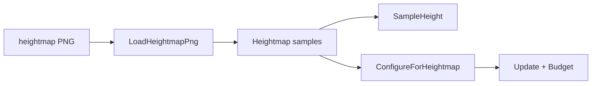

# Learn 38 — 大地形高度图 + ChunkStream（选修）

> 加载仓内 CC0 程序化 `heightmap_512.png`，用 `LoadHeightmapPng` 转 `Heightmap`，并以 `TerrainChunkStreamer` 按相机做驻留预算。

**前提**：CH22 流式预算概念；地形网格构建见 Sandbox / heightmap API。  
**对齐里程碑**：Mega-W10 / ADR 0037

## 怎么跑

```powershell
cmake -B build -DENGINE_BUILD_LEARN_SAMPLES=ON
cmake --build build --config Debug --target sample_38_large_terrain
build\samples\learn\38_large_terrain\Debug\sample_38_large_terrain.exe --headless
```

需存在：`content/scenes/large_terrain/heightmap_512.png`（本仓自带，≈72KB，CC0）。

CMake target：**`sample_38_large_terrain`**。定义 `ENGINE_CONTENT_DIR_A`。

| 参数 | 作用 |
|---|---|
| `--headless` | 冒烟 |
| `--headless_frames=N` | 预留 |

## 知识点

1. **内容布局**：`content/scenes/large_terrain/` + `LICENSE.txt` + README。
2. **LoadHeightmapPng**：stb_image 解码；R/灰度 → float × `height_scale`。
3. **尺寸**：512/1024+ 均可；世界边长 ≈ `(width-1)*cell`。
4. **SampleHeight**：双线性采样，供角色/植被贴地。
5. **TerrainChunkStreamer**：XZ chunk 环 + `StreamingBudget`。
6. **ConfigureForHeightmap**：按短轴切成 N 个 chunk。
7. **EstimateHeightChunkBytes**：估算 float tile 字节。
8. **移动相机**：触发 load/unload 计数。
9. **大图策略**：2k–4k 可 gitignore + `download_large_terrain.ps1`（无密码）。
10. **非 Nanite**：本课不做几何虚拟化。
11. **Sandbox**：完整地形网格上传在 Sandbox，本课侧重加载+流式。
12. **失败可诊断**：缺图 / 无 stb 时打印 Fail 信息。

## 名词解释

| 术语 | 含义 |
|---|---|
| **Heightmap** | 规则格点高度场 |
| **LoadHeightmapPng** | PNG → Heightmap 助手 |
| **ChunkStream** | 按 chunk 键驻留/卸载 |
| **StreamingBudget** | 资产内存预算 |
| **CC0** | 公有领域放弃版权声明 |
| **cell** | 相邻采样点世界间距 |
| **height_scale** | 灰度 0–1 映射到世界高度 |

详见 [content/scenes/large_terrain/README.md](../../content/scenes/large_terrain/README.md)。

## 原理

```text
path = content/scenes/large_terrain/heightmap_512.png
map = LoadHeightmapPng(path, cell=2, height_scale=40)
SampleHeight(center)
streamer.ConfigureForHeightmap(map, 8, radius=1, bytes)
Update(camera) → resident / load
Update(camera+offset) → load/unload
```



ChunkStream 本波驻留的是预算句柄（asset id），不是立刻上传整图 GPU mesh——与「大场景可流」教学点一致。

## 代码地图

| 符号 / 文件 | 说明 |
|---|---|
| `38_large_terrain/main.cpp` | 加载 + 流式冒烟 |
| `heightmap.h` / `LoadHeightmapPng` | 文件加载 |
| `chunk_stream.h` | Streamer + 尺寸助手 |
| `content/scenes/large_terrain/` | 资产与许可证 |
| `download_large_terrain.ps1` | 大图拉取说明 |
| CMake `sample_38_large_terrain` | 本目标 |

## 必做练习

1. ★ 改 `cell`/`height_scale`，记录 worldXZ 与 center 高度。
2. ★★ 把 load_radius 改为 2，对比 resident_count。
3. ★★★（选做）用脚本拉一张更大 CC0 图（gitignore），改 path 再跑。

## 常见坑

- 工作目录不对导致找不到 PNG（依赖 `ENGINE_CONTENT_DIR_A`）。
- 把 ChunkStream 误当成已画完整地形。
- 将多兆原图强行 commit。
- 忽略 LICENSE / 上游归属。

## 延伸阅读

- 章节：[CH38_large_terrain.md](../../docs/learn/chapters/CH38_large_terrain.md)
- ADR：[0037](../../docs/learn/adr/0037-mega-w10-deepen.md)
- 规范：[SAMPLES.md](../../docs/learn/SAMPLES.md)
