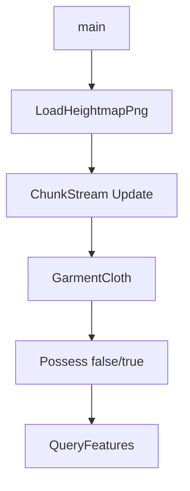

# Learn 39 — Mega-W10 加深冒烟（选修）

> 一次冒烟 ADR 0037：大地形加载 + ChunkStream、演示服装、`possess_character` 开关、Feature 日志。

**前提**：选修末章；建议已浏览 CH36/CH37/CH38。  
**对齐里程碑**：Mega-W10 / ADR 0037

## 怎么跑

```powershell
cmake -B build -DENGINE_BUILD_LEARN_SAMPLES=ON
cmake --build build --config Debug --target sample_39_w10_deepen
build\samples\learn\39_w10_deepen\Debug\sample_39_w10_deepen.exe --headless --headless_frames=2
```

CMake target：**`sample_39_w10_deepen`**。多模块链接；单步失败打印 SKIP/日志，尽量 exit 0（高度图缺失则 return 前已 LogInfo SKIP）。

| 参数 | 作用 |
|---|---|
| `--headless` | 冒烟 |
| `--headless_frames=N` | 预留 |

## 知识点

1. **W10 边界见 ADR 0037**：C02 灯上限、VT 近默认、DDGI-lite、possess、大地形、Linux 冒烟等。
2. **LoadHeightmapPng + ChunkStream**：同 CH38。
3. **GarmentCloth**：同 CH37，最小 Step。
4. **possess_character=false**：自由视角，Step 不改位移。
5. **possess_character=true**：贴地走跳；第三人称相机助手。
6. **SampleHeight 回调**：角色脚底高度。
7. **QueryFeatures**：virtual_texture / bindless 等能力位。
8. **仍外置**：Nanite、真 NVIDIA DDGI、节点图、蓝图、XR、C17 等。
9. **与 40**：第三人称细节在 `40_possess_third_person`。
10. **不要把冒烟当画质验收**。
11. **学习轨收口**：对应 CH39。
12. **Linux**：实机冒烟记录另见 LINUX.md / ADR，不在本 Windows 默认路径强制。

## 名词解释

| 术语 | 含义 |
|---|---|
| **ADR 0037** | Mega-W10 决策边界 |
| **possess_character** | 附身角色 vs 自由相机 |
| **ChunkStream** | 地形 chunk 驻留 |
| **GarmentCloth** | 演示布料 |
| **DDGI-lite** | 探针邻域级联，非 NVIDIA DDGI |
| **SKIP** | 能力缺失可诊断退出 |

详见 [GLOSSARY.md](../../docs/learn/GLOSSARY.md)。

## 原理

顺序探测：高度图 → ChunkStream → 披风 Step → possess 关/开 → Feature。



每步独立；高度图失败只跳过地形段，不阻断服装/附身探测。

## 代码地图

| 符号 / 文件 | 说明 |
|---|---|
| `39_w10_deepen/main.cpp` | W10 冒烟 |
| `LoadHeightmapPng` / `TerrainChunkStreamer` | 大地形 |
| `GarmentCloth` | 服装 |
| `PossessController` | 附身 |
| `QueryFeatures` | 能力位 |
| CMake `sample_39_w10_deepen` | 本目标 |

## 必做练习

1. ★ 列出日志中 Ok / SKIP / true-false。
2. ★★ 对照 ADR 0037 决策条目打勾。
3. ★★★（选做）在 Sandbox 打开对应开关复现。

## 常见坑

- 把 SKIP 当编译错误。
- 宣称 Nanite / 真 DDGI 已完成。
- 忽略「仍外置」清单。
- 只跑本 sample 不读 ADR。

## 延伸阅读

- 章节：[CH39_w10_deepen.md](../../docs/learn/chapters/CH39_w10_deepen.md)
- PATH：[PATH.md](../../docs/learn/PATH.md)
- ADR：[0037](../../docs/learn/adr/0037-mega-w10-deepen.md)
