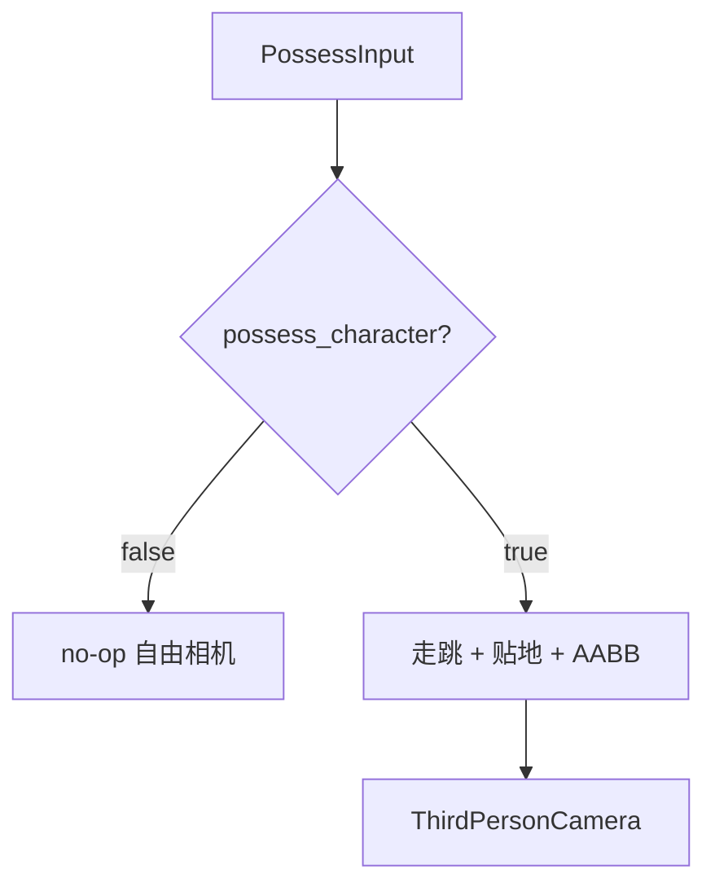

# Learn 40 — Possess 第三人称（选修）

> 切换 `possess_character`：关=自由相机（位移 no-op）；开=走/跳/AABB 障碍 + 第三人称相机眼点。

**前提**：CH25 角色概念；贴地用 `SampleHeight`。无大角色资产，胶囊程序化网格。  
**对齐里程碑**：Mega-W10 / ADR 0037（附身走跳）

## 怎么跑

```powershell
cmake -B build -DENGINE_BUILD_LEARN_SAMPLES=ON
cmake --build build --config Debug --target sample_40_possess_third_person
build\samples\learn\40_possess_third_person\Debug\sample_40_possess_third_person.exe --headless --possess
```

CMake target：**`sample_40_possess_third_person`**。无窗口。

| 参数 | 作用 |
|---|---|
| `--possess` | 默认：开启附身 |
| `--free-camera` | `possess_character=false` |
| `--headless` / `--headless_frames=N` | 冒烟 |

## 知识点

1. **默认产品口径**：自由视角；开旗后才走跳碰撞（ADR 0037）。
2. **PossessController**：CPU、可单测。
3. **SetSampleHeight**：脚底贴地。
4. **PossessInput**：move_x/z、jump、yaw。
5. **AddObstacle(Aabb)**：水平推开。
6. **BuildCapsuleCharacterMesh**：演示网格，无 glTF 角色。
7. **ThirdPersonCameraPosition / LookAt**：相机助手。
8. **关附身**：Step 不改 position（自由相机由宿主控）。
9. **与服装**：披风挂点可跟 `CapsuleCenter`（见 37）。
10. **与大地形**：可用 `LoadHeightmapPng` 的 SampleHeight（见 38/39）。
11. **重力 / jump_speed**：`PossessParams`。
12. **本课不做**：动画状态机、网络复制、完整 CharacterController 产品化。

## 名词解释

| 术语 | 含义 |
|---|---|
| **possess_character** | 是否附身角色 |
| **PossessController** | 走跳控制器 |
| **Third-person** | 肩后相机偏移 |
| **Capsule mesh** | 程序化胶囊 |
| **ground_skin** | 贴地容差 |
| **AabbObstacle** | 轴对齐障碍 |

## 原理

```text
BuildCapsuleCharacterMesh
ctrl.possess_character = flag
SetSampleHeight / AddObstacle
loop Step(input)  // jump at frame 20
ThirdPersonCameraPosition(yaw)
toggle free-cam → Step 冻结位移
```



## 代码地图

| 符号 / 文件 | 说明 |
|---|---|
| `40_possess_third_person/main.cpp` | 开关与走跳冒烟 |
| `possess_controller.h` | API |
| `BuildCapsuleCharacterMesh` | 网格 |
| `SampleHeight` | 地形高度 |
| CMake `sample_40_possess_third_person` | 本目标 |

## 必做练习

1. ★ 分别跑 `--possess` 与 `--free-camera`，对比位移日志。
2. ★★ 改 `jump_speed`，观察跳跃峰值 y。
3. ★★★（选做）把 SampleHeight 换成 38 的 PNG 高度图。

## 常见坑

- 未设 SampleHeight 导致脚底为 0。
- 把本课当成完整第三人称射击控制器。
- 忘记关附身后应由宿主移动相机。

## 延伸阅读

- 相关章：[CH37](../../docs/learn/chapters/CH37_clothing.md)、[CH39](../../docs/learn/chapters/CH39_w10_deepen.md)
- ADR：[0037](../../docs/learn/adr/0037-mega-w10-deepen.md)
- 规范：[SAMPLES.md](../../docs/learn/SAMPLES.md)
